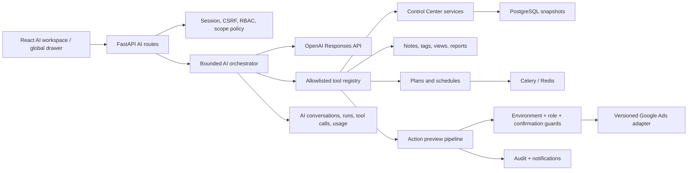
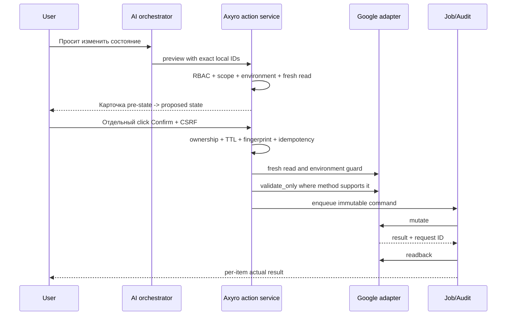

# AI-аналитик Axyro: реализуемость и рекомендуемая архитектура

**Статус документа:** исследование, без реализации  
**Дата проверки исходного кода и официальной документации:** 2026-08-03  
**Проект:** Demand Gen Uploader / Axyro Analytics  
**Публичный адрес:** `https://axyro.tech`

Этот документ описывает целевую архитектуру, но не меняет код, базу данных, Docker, OAuth, Google Ads и рабочие данные. Выводы о текущей реализации сделаны по исходному коду проекта. Состояние `google-test`, `vcc2` и заявки Basic Access приведено по зафиксированному владельцем состоянию; Production-запросы для исследования не выполнялись.

## 1. Краткий вывод простыми словами

Концепция **реализуема**. Проект уже содержит большую часть исполнительного контура: нормализованные снимки Google Ads, фильтры Control Center, заметки, статусы, планы, задания, расписания, аудит, `validate_only`, подтверждаемые ручные действия и жёсткую защиту Production. Поэтому AI не должен получать прямой доступ к PostgreSQL или Google Ads. Он должен быть ограниченным собеседником поверх существующих backend-сервисов.

Рекомендуемый вариант первой версии:

1. OpenAI Responses API с function calling и Structured Outputs.
2. Собственный короткий и ограниченный цикл инструментов в FastAPI.
3. Все выборки, фильтры, арифметика, проверка прав и действия выполняются Axyro.
4. Модель получает только минимальный очищенный результат и формирует объяснение.
5. Любое действие проходит существующий pipeline preview -> явное подтверждение в UI -> повторное чтение -> проверка -> выполнение -> readback -> аудит.

Agents SDK не нужен в первой версии: существующему монолиту важнее полностью контролировать состояние, разрешённые инструменты, подтверждения и аудит. MCP также не нужен как внутренний слой. Он может появиться позднее только как отдельная граница интеграции с внешними системами.

Главная поправка к исходной концепции: `AUTOMATION` не является режимом свободных полномочий модели. Это отдельный детерминированный rules engine. AI может создать объяснимый черновик правила, но решение о срабатывании и исполнение правила не должны зависеть от следующего ответа модели.

До Basic Access можно полностью разработать READ_ONLY, DRAFT_ONLY, интерфейс, историю, голосовой ввод, подтверждения, SIMULATION и GOOGLE_TEST. Реальные Production-чтения и тем более Production-mutate должны ждать соответствующего доступа Google, восстановления OAuth `vcc2`, отдельного включения функций и новой приёмки.

## 2. Что предлагается создать

Нужно создать не «копию Codex», а специализированного AI-сотрудника Axyro со следующими границами:

- отдельный раздел `/ai-analyst` и компактное открытие помощника с других страниц;
- серверный orchestrator, который понимает запрос, выбирает только разрешённые инструменты и возвращает структурированный ответ;
- реестр инструментов с Pydantic/JSON Schema-контрактами, риском, требуемой ролью, режимом полномочий и доступной средой;
- набор read-only инструментов над локальными снимками Control Center;
- черновики заметок, представлений, планов и правил;
- карточки подтверждения, связанные с неизменяемым снимком цели и существующими action/deployment pipelines;
- история разговоров, запусков, источников, вызовов инструментов и расходов токенов;
- потоковая выдача текста и структурных блоков;
- голосовой ввод через запись короткого фрагмента, транскрипцию и редактируемый текст;
- централизованный model registry, лимиты затрат, rate limits, retention и удаление истории;
- набор eval-сценариев, который проверяет не красоту текста, а правильный выбор инструмента, области и отсутствие неразрешённых действий.

Целевой путь запроса:

```text
Пользователь
  -> React UI: scope + период + режим AI + среда
  -> FastAPI AI orchestrator
  -> проверка сессии, роли, scope и лимитов
  -> OpenAI Responses API: только разрешённые tool schemas
  -> backend tool: SQL/Control Center/Google adapter
  -> очищенный и ограниченный результат
  -> OpenAI Structured Output
  -> React: текст + таблица/график + источники + freshness
  -> при действии: только карточка preview, подтверждает человек
```

## 3. Что уже существует

### 3.1 Техническая основа

| Область | Текущее состояние | Оценка |
|---|---|---|
| Web/API | React + TypeScript + MUI, FastAPI | **УЖЕ ГОТОВО** |
| Хранилища | PostgreSQL, Redis, файловое хранилище | **УЖЕ ГОТОВО** |
| Фоновые задачи | Celery worker и scheduler | **УЖЕ ГОТОВО** |
| Развёртывание | Docker Compose и reverse proxy | **УЖЕ ГОТОВО** |
| Аутентификация | Серверные сессии, CSRF, роли `ADMIN` / `OPERATOR` / `VIEWER` | **МОЖНО ПЕРЕИСПОЛЬЗОВАТЬ** |
| Google credentials | Зашифрованные credential-поля, server-side client factory | **МОЖНО ПЕРЕИСПОЛЬЗОВАТЬ** |
| OpenAI | Клиент, настройки, таблицы и маршруты отсутствуют | **НУЖНО СОЗДАТЬ** |

### 3.2 Данные и Control Center

В `backend/app/db/models.py` уже есть:

- MCC, аккаунты, иерархия и история manager-связей;
- локальное имя, GEO, теги, пользовательский рабочий статус, текущая заметка и история заметок;
- суточные метрики аккаунта, снимки кампаний, групп, объявлений, ассетов и связей;
- проблемы, moderation, advertiser verification, активность и freshness;
- сохранённые представления;
- задания, события, sync run/item и учёт квоты;
- планы, неизменяемые snapshots/fingerprints, schedules, waves и run history;
- уведомления и AuditLog;
- `ControlCenterActionRequest` и items с pre-state, preview, validation, readback, TTL, хешированным confirmation token, idempotency и Google request IDs;
- `ControlCenterRule`, evaluation и event для DRY_RUN/LIVE rules engine.

`backend/app/control_center/service.py` и `query.py` уже умеют:

- фильтровать по GEO, MCC, аккаунту, Google/local status, тегу, проблеме, периоду и freshness;
- сортировать и группировать аккаунты и кампании;
- вычислять CTR, CPC, стоимость конверсии, регистрации, депозита и ROAS;
- сохранять валюты раздельно и не выдавать смешанную сумму за одну валюту;
- отдавать подробности, историю, заметки, проблемы, кампании и события.

Текущий набор рабочих статусов уже полезен, но уже желаемого: `UNCLASSIFIED`, `PREPARATION`, `WORKING`, `PAUSED`, `ARCHIVED`. Статусы `NEW`, `WARMING`, `READY`, `MANUALLY_PAUSED`, `UNPROFITABLE`, `SUSPENDED`, `APPEAL`, `DO_NOT_USE` потребуют additive migration и явной схемы переходов.

### 3.3 Google Ads adapter

Интерфейс и versioned adapter уже отделяют приложение от конкретной версии Google Ads API. В `backend/app/google_ads/versions/v24_2/adapter.py` реализованы:

- безопасная проверка MCC через GAQL `customer`;
- `ListAccessibleCustomers` и обход `customer_client`;
- чтение аккаунтов, метрик, кампаний, ad groups, ads, assets и conversion actions;
- advertiser identity verification;
- ChangeEvent;
- часть billing для monthly invoicing;
- `validate_only`, deployment и действия `PAUSE`, `ENABLE`, изменение бюджета;
- запись request IDs и нормализация ошибок.

`v25/adapter.py` пока наследует v24.2 без собственной адаптации. На 2026-08-03 актуальная major-версия Google Ads API v25 содержит breaking changes, поэтому простого наследования недостаточно как долгосрочной гарантии совместимости: нужен version-contract test и план обновления.

Все mutate сейчас жёстко ограничены `GOOGLE_TEST`. Это правильная исходная защита для AI.

### 3.4 Действия, планы и правила

Существующий action pipeline уже реализует ключевые элементы безопасного оператора:

- preview и pre-state;
- одноразовое подтверждение с TTL;
- свежую повторную проверку цели;
- сравнение состояния;
- `validate_only`;
- mutate;
- readback;
- idempotency;
- request IDs, аудит и ошибки.

Rules engine также уже содержит DRY_RUN по умолчанию, scope, условия, расписание, cooldown, freshness, лимиты действий, conversion lag, idempotency, conflict control, circuit breaker, уведомления и kill switch. AI здесь нужен только как автор черновика и объясняющий интерфейс.

### 3.5 Известные пробелы, важные для AI

1. `CONTROL_CENTER_LIVE_ACTIONS_ENABLED` объявлен в конфигурации, но фактически не участвует в runtime-решениях. Сейчас безопасность держится на жёстких environment guards. До любого Production-mutate нужна реально проверяемая многослойная feature-flag модель.
2. В некоторых confirm/config/sync маршрутах нужно централизовать и усилить role checks. Проверки frontend не считаются защитой.
3. `Permissions-Policy` сейчас содержит `microphone=()`, поэтому браузерный микрофон будет заблокирован до отдельного изменения security headers.
4. Текущий redaction охватывает несколько точных имён секретов, но недостаточен для AI prompts, вложенных tool outputs, URL query, заголовков и произвольных пользовательских заметок.
5. Нет таблиц разговоров, AI runs, tool calls, отчётов, черновиков, retention и usage/cost.
6. Нет Keitaro. Регистрации/депозиты сейчас могут быть только Google-attributed conversions при ручном mapping conversion actions.
7. Brocard даёт агрегатный finance snapshot, но не связывает карту с Google-аккаунтом и не подтверждает card balance, billing threshold или следующий платёж.

## 4. Что можно переиспользовать

| Компонент | Как использовать в AI | Условие |
|---|---|---|
| Control Center query/service | Основа `find_accounts`, сравнений и drill-down | Не давать модели произвольный SQL; ввести отдельные DTO и row caps |
| AccountMetricDaily и snapshots | Источник аналитики | Всегда возвращать source, period, observed/synced time и completeness |
| MCC hierarchy и GEO | Scope resolver | Backend повторно проверяет каждый ID и связь с разрешённой областью |
| Notes/tag histories | Чтение и сохранение через обычные domain services | Не обновлять таблицы напрямую из AI tool |
| Saved views | Повторяемая область запроса и черновик фильтра | Валидировать schema/version фильтров |
| Jobs/Celery/Redis | Долгие sync, отчёты и выполнение подтверждённых действий | Не удерживать HTTP/tool loop в ожидании; возвращать job ID |
| AuditLog/notifications | Пользовательский и security audit | Добавить AI-specific run/tool metadata и redaction |
| ActionRequest pipeline | PAUSE/ENABLE/budget | Подтверждение только UI, не текстом модели и не голосом |
| Deployment plan pipeline | Demand Gen draft/validate/confirm | AI создаёт редактируемый draft, не immutable confirmed snapshot |
| Rules engine | DRY_RUN и deterministic automation | Модель не участвует в каждом evaluation |
| Google adapter + safety guards | Все Google reads/writes | Не создавать «AI Google client» в обход adapter |
| Session/CSRF/RBAC | Доступ к AI и подтверждениям | Добавить server-side tool permissions и scope policy |
| Existing MUI patterns | Таблицы, drawers, chips, dialogs, warnings | AI-раздел должен выглядеть частью Axyro |

Повторное использование означает вызов domain/service-слоя. Нельзя просто обернуть существующий HTTP endpoint и считать это безопасным: внутренний tool должен получать уже авторизованный `UserContext`, нормализованный `AnalysisScope` и собственные ограничения объёма.

## 5. Что придётся разработать

### 5.1 Backend

- `ai/` модуль с orchestrator, policy engine, registry, schemas, redaction и model gateway;
- OpenAI Responses API client только на backend;
- bounded tool loop с ограничением количества шагов, времени и размера результата;
- строгие JSON Schema/Pydantic контракты для аргументов и ответа;
- scope resolver и permission matrix `role x authority_mode x environment x tool`;
- data provenance/freshness envelope;
- conversation, run, tool-call, draft, report и usage persistence;
- SSE streaming и отмена запроса;
- cost/rate limits и model registry;
- generic confirmation envelope, который ссылается на существующий action/plan request;
- reconciliation после timeout/неизвестного результата;
- retention/delete/export для истории;
- speech-to-text endpoint с ограничением типа, размера и длительности.

### 5.2 Frontend

- `/ai-analyst`;
- глобальная кнопка и drawer;
- scope bar, история, composer, streaming blocks;
- безопасные таблицы/графики из allowlisted specs;
- cards для evidence, caveat, stale data и source;
- draft editor и отдельная confirmation card;
- tool timeline без секретов и внутренних chain-of-thought;
- voice recording, transcript review и permission/error states;
- доступность и mobile layout.

### 5.3 Данные и эксплуатация

- additive Alembic migrations;
- OpenAI key/config через server-side secret environment;
- dashboard использования, стоимости, ошибок и latency;
- security/eval dataset;
- prompt/tool schema versioning;
- регулярное удаление истёкших conversation/run payloads;
- runbook для OpenAI outage, Google timeout и ambiguous mutate result.

## 6. Что невозможно или недоступно

| Требование или обещание | Статус | Причина / безопасная замена |
|---|---|---|
| Реальная статистика на Google test accounts | **НЕДОСТУПНО** | Test accounts не показывают объявления и не несут реальных расходов. Использовать fixtures и SIMULATION |
| Production-доступ текущим Test Account token | **МОЖНО ТОЛЬКО ПОСЛЕ BASIC ACCESS** | Test Account Access разрешает только test accounts. Если Google отдельно даст Explorer, границы надо заново проверить, но проект не должен включать Production автоматически |
| Card balance, следующий card charge и automatic billing threshold из Google Ads API | **НЕДОСТУПНО** | Billing API ориентирован на monthly invoicing; не обещать эти данные |
| Регистрации/депозиты из Keitaro без интеграции | **ТРЕБУЕТ ВНЕШНИЙ API** | Текущие Google conversions не равны tracker/business events |
| Детальная карточная аналитика Brocard по Google-аккаунтам | **ТРЕБУЕТ ВНЕШНИЙ API** | Текущий snapshot агрегирован и не содержит надёжной account/card linkage |
| «Статистика в реальном времени» | **НЕ РЕКОМЕНДУЕТСЯ** | Google reporting имеет freshness и conversion lag; показывать время снимка и источник |
| Универсальный `validate_only` для любого Google method | **НЕДОСТУПНО** | Проверяется в reference конкретного request; partial failure также поддерживается не везде |
| Полная история всех изменений Google UI | **НЕДОСТУПНО** | ChangeEvent ограничен периодом и объёмом и может не отражать каждое изменение UI |
| AI с прямым SQL, GAQL, SSH, браузером, файловой системой или произвольным HTTP | **НЕ РЕКОМЕНДУЕТСЯ** | Слишком широкий blast radius и prompt-injection поверхность |
| Голос как подтверждение mutate | **НЕ РЕКОМЕНДУЕТСЯ** | Транскрипция неоднозначна; подтверждение только отдельной кнопкой в актуальной карточке |
| Складывать разные валюты как USD без FX source | **НЕ РЕКОМЕНДУЕТСЯ** | Финансово неверно; группировать по исходной валюте |
| Хранить скрытое reasoning/chain-of-thought модели | **НЕ РЕКОМЕНДУЕТСЯ** | Хранить короткое объяснение, evidence и tool trace, но не внутренние рассуждения |

## 7. Матрица реализуемости всех требований

Статус показывает состояние именно относительно AI-функции, а не маркетинговую готовность продукта.

| Требование | Статус | Комментарий |
|---|---|---|
| Responses API integration | **НУЖНО СОЗДАТЬ** | Клиента OpenAI в проекте нет |
| Function calling | **НУЖНО СОЗДАТЬ** | Подходит для вызова allowlisted backend tools |
| Structured Outputs | **НУЖНО СОЗДАТЬ** | Нужен строгий UI/report schema |
| Собственный FastAPI tool loop | **НУЖНО СОЗДАТЬ** | Рекомендуемый orchestrator |
| Agents SDK в phase 1 | **НЕ РЕКОМЕНДУЕТСЯ** | Добавляет lifecycle/session/tracing abstraction без необходимости |
| MCP как внутренний слой | **НЕ РЕКОМЕНДУЕТСЯ** | Монолитные services проще и безопаснее вызывать напрямую |
| READ_ONLY по локальным snapshots | **МОЖНО ПЕРЕИСПОЛЬЗОВАТЬ** | Control Center уже содержит данные и фильтры |
| История диалогов | **НУЖНО СОЗДАТЬ** | Отдельные таблицы, retention и delete |
| Сохранение отчёта | **НУЖНО СОЗДАТЬ** | Это системная запись, а не изменение Google |
| DRAFT_ONLY | **НУЖНО СОЗДАТЬ** | Планы частично есть, нужен общий draft contract |
| Редактирование draft в обычном UI | **НУЖНО ДОРАБОТАТЬ** | Переиспользовать plan/forms, добавить deep links |
| CONFIRM_REQUIRED для PAUSE/ENABLE/budget | **МОЖНО ПЕРЕИСПОЛЬЗОВАТЬ** | ActionRequest pipeline уже существует |
| CONFIRM_REQUIRED для заметки/status/tag/view | **НУЖНО ДОРАБОТАТЬ** | Local mutation preview/confirm нужен отдельно |
| Demand Gen plan draft/validate | **МОЖНО ПЕРЕИСПОЛЬЗОВАТЬ** | Planner и immutable snapshots уже есть |
| Подтверждённый Demand Gen в GOOGLE_TEST | **МОЖНО ПЕРЕИСПОЛЬЗОВАТЬ** | Только через текущий execution guard |
| Production Demand Gen mutate | **МОЖНО ТОЛЬКО ПОСЛЕ BASIC ACCESS** | Плюс отдельные flags, OAuth и приёмка |
| Deterministic rules engine | **УЖЕ ГОТОВО** | DRY_RUN, scope, safeguards и events присутствуют |
| AI исполняет rules evaluations | **НЕ РЕКОМЕНДУЕТСЯ** | AI только готовит/объясняет rule draft |
| SIMULATION | **УЖЕ ГОТОВО** | Нужны AI-specific fixtures и acceptance |
| GOOGLE_TEST | **УЖЕ ГОТОВО** | Два test accounts; статистику симулировать |
| PRODUCTION hard guard | **УЖЕ ГОТОВО** | Mutate жёстко блокируется |
| Реальный runtime live feature flag | **НУЖНО ДОРАБОТАТЬ** | Текущая config-переменная не влияет на выполнение |
| MCC hierarchy | **УЖЕ ГОТОВО** | Синхронизация и история связей есть |
| GEO across multiple MCC | **МОЖНО ПЕРЕИСПОЛЬЗОВАТЬ** | Нужен AI scope DTO |
| Фильтр «В работе» | **УЖЕ ГОТОВО** | `WORKING` и quick filters уже существуют |
| Problem/suspended/verification filters | **МОЖНО ПЕРЕИСПОЛЬЗОВАТЬ** | Problem, Google status и verification snapshots есть |
| Metrics sorting/comparison | **МОЖНО ПЕРЕИСПОЛЬЗОВАТЬ** | Backend уже считает основные derived metrics |
| Clicks/impressions/cost/CTR/CPC | **УЖЕ ГОТОВО** | Google snapshot + backend calculations |
| Google conversions/all conversions/value | **УЖЕ ГОТОВО** | С оговоркой freshness и attribution |
| Registrations/deposits как Google conversion mapping | **МОЖНО ПЕРЕИСПОЛЬЗОВАТЬ** | Только при явном mapping и маркировке источника |
| Registrations/deposits как Keitaro events | **ТРЕБУЕТ ВНЕШНИЙ API** | Keitaro отсутствует |
| Card-level Brocard analytics | **ТРЕБУЕТ ВНЕШНИЙ API** | Нужна linkage/data contract |
| Google status отдельно от work status | **УЖЕ ГОТОВО** | Поля разделены |
| Расширенный список work statuses | **НУЖНО ДОРАБОТАТЬ** | Additive enum migration + переходы/фильтры |
| Current note и note history | **УЖЕ ГОТОВО** | Автор и дата сохраняются |
| Закреплённая важная заметка | **НУЖНО ДОРАБОТАТЬ** | Сейчас pin относится к account, не к note |
| Tags | **УЖЕ ГОТОВО** | Требуется AI permission wrapper |
| Saved views | **УЖЕ ГОТОВО** | Требуется schema/version validation |
| Grouping currencies without conversion | **УЖЕ ГОТОВО** | Смешанный monetary total не формируется |
| FX conversion | **ТРЕБУЕТ ВНЕШНИЙ API** | Нужен rate source и timestamp |
| Data source/period/freshness in every answer | **НУЖНО ДОРАБОТАТЬ** | Поля есть, нужен обязательный response contract |
| Evidence-based conclusions | **НУЖНО СОЗДАТЬ** | Structured response + deterministic calculations |
| Streaming answer | **НУЖНО СОЗДАТЬ** | Responses API SSE -> backend SSE |
| Tables/cards/charts | **НУЖНО СОЗДАТЬ** | Только allowlisted UI specs |
| Global assistant drawer | **НУЖНО СОЗДАТЬ** | Плюс dedicated route |
| Voice input | **НУЖНО СОЗДАТЬ** | И изменить microphone Permissions-Policy |
| Realtime speech-to-speech first version | **НЕ РЕКОМЕНДУЕТСЯ** | Дороже и сложнее confirmation flow |
| Server-side OpenAI key | **НУЖНО СОЗДАТЬ** | Secret environment, никогда не frontend/DB/log |
| Prompt/tool redaction | **НУЖНО ДОРАБОТАТЬ** | Текущий redactor слишком узкий |
| Backend RBAC per tool | **НУЖНО СОЗДАТЬ** | Существующие роли переиспользуются |
| Audit of AI tool calls | **НУЖНО ДОРАБОТАТЬ** | Общий audit есть, нужны run/tool entities |
| Rate/cost limits | **НУЖНО СОЗДАТЬ** | Per-user/project hard caps |
| Production read-only with current Test token | **МОЖНО ТОЛЬКО ПОСЛЕ BASIC ACCESS** | В рамках принятой политики проекта |
| Production read-only acceptance | **МОЖНО ТОЛЬКО ПОСЛЕ BASIC ACCESS** | Нужны свежий OAuth `vcc2` и controlled tests |
| Production mutate acceptance | **МОЖНО ТОЛЬКО ПОСЛЕ BASIC ACCESS** | Отдельный этап после read-only |

## 8. Рекомендуемая архитектура



### 8.1 Главные границы

1. **Модель не владеет данными.** Она получает ограниченные DTO, а не ORM rows, SQL, credentials или raw Google objects.
2. **Модель не владеет правами.** Backend рассчитывает доступный tool set перед каждым model turn.
3. **Модель не подтверждает действие.** Она может вызвать только preview/draft. Confirm endpoint вызывается отдельной UI-кнопкой текущего пользователя.
4. **Модель не считает финансовые показатели.** SQL/service layer считает суммы, rates и conditions; AI объясняет результат.
5. **Модель не является scheduler.** Rules engine и Celery остаются детерминированными.
6. **Среда и полномочия независимы.** Например, `READ_ONLY + PRODUCTION` и `CONFIRM_REQUIRED + GOOGLE_TEST` допустимы, а `CONFIRM_REQUIRED + PRODUCTION` остаётся feature-disabled.

### 8.2 Bounded tool loop

Один AI run должен иметь жёсткие пределы, задаваемые сервером, например:

- не более 4 model turns;
- не более 6 read tool calls;
- не более 1 preview/draft tool call;
- `parallel_tool_calls=false` для любого turn, где разрешён mutating/preview tool;
- общий timeout 45-60 секунд для интерактивного запроса;
- отдельный background job для тяжёлого отчёта;
- максимум 100 строк в tool output и агрегаты до модели;
- запрет неизвестных tool names и лишних JSON-полей;
- idempotency key на каждый side-effect request;
- остановка с понятным partial result при OpenAI или tool timeout.

### 8.3 Структурированный ответ

Backend должен требовать Structured Output примерно такого вида:

```json
{
  "answer": "string",
  "scope": {
    "environment": "SIMULATION|GOOGLE_TEST|PRODUCTION",
    "geo": ["IN"],
    "mcc_ids": ["local-uuid"],
    "account_ids": ["local-uuid"]
  },
  "period": {"from": "date", "to": "date", "timezone": "string"},
  "sources": [
    {"name": "GOOGLE_ADS_SNAPSHOT", "observed_at": "datetime", "synced_at": "datetime"}
  ],
  "freshness": {"status": "FRESH|STALE|UNKNOWN", "age_seconds": 480},
  "currency_groups": [{"currency": "USD", "cost": "207.00"}],
  "findings": [
    {
      "object_ref": {"type": "ACCOUNT", "id": "local-uuid", "label": "IN-503"},
      "evidence": [{"metric": "cost", "value": "207.00", "currency": "USD"}],
      "condition": "cost > 150 AND registrations = 0",
      "conclusion": "Превышен пользовательский порог без зарегистрированных конверсий",
      "confidence": "HIGH|MEDIUM|LOW|UNKNOWN",
      "caveats": ["Возможна задержка конверсий"]
    }
  ],
  "tables": [],
  "charts": [],
  "warnings": [],
  "proposed_action": null,
  "links": [{"kind": "CONTROL_CENTER_ACCOUNT", "target_id": "local-uuid"}]
}
```

`confidence` здесь означает полноту и свежесть входных данных, а не субъективную уверенность модели. Таблицы и графики строятся из allowlisted column/chart specs; HTML, JavaScript и произвольные URL от модели не исполняются.

### 8.4 Хранение состояния

Источник истины для истории должен быть в PostgreSQL Axyro. Для OpenAI Responses API рекомендуется `store=false`; `previous_response_id` не должен быть единственным механизмом памяти. В каждый новый turn передаётся компактная серверная сводка разговора и только нужные tool results. Это даёт контролируемые retention, deletion, экспорт, redaction и восстановление после смены модели.

## 9. Сравнение Responses API, Agents SDK и других вариантов

| Вариант | Плюсы | Минусы для Axyro | Решение |
|---|---|---|---|
| Responses API + function calling + собственный loop | Минимальный слой; strict schemas; полный контроль tool set, state, retries, confirmations и audit; streaming | Нужно самостоятельно написать orchestrator и observability | **Рекомендуется** |
| OpenAI Agents SDK | Готовый loop, tools, sessions, handoffs, guardrails, tracing и human approvals | Дополнительная абстракция поверх уже существующих jobs/actions; tracing требует отдельной privacy-настройки; труднее гарантировать точную Axyro state machine | **Не phase 1**; оценить позже для сложных multi-agent процессов |
| Только Structured Outputs без tools | Просто для форматирования текста | Не выполняет безопасные выборки и не решает динамический scope | Использовать для финального ответа, не как всю архитектуру |
| Chat Completions legacy-style loop | Знакомая схема | Responses API является более подходящей современной основой для tools/state/streaming | Не выбирать для новой интеграции |
| MCP внутри монолита | Стандартная tool boundary | Лишняя сеть/протокол/approval поверхность; повышает prompt-injection риск | **Не рекомендуется** внутри Axyro |
| MCP для будущего Keitaro/Brocard/внешних клиентов | Унифицированная внешняя граница и independent deployment | Нужны auth, allowlists, approvals, threat model | Возможен позже, но обычный typed adapter сначала проще |
| Fine-tuning | Может закрепить стиль/классификацию | Не даёт актуальные данные и права; усложняет обновление | Не нужен на старте; сначала prompts, tools и evals |
| RAG по документации | Полезен для справки по продукту | Не заменяет SQL/tools, требует lifecycle документов | Опциональный отдельный read-only источник после MVP |

Окончательный выбор: **Responses API + strict function calling + Structured Outputs + собственный FastAPI orchestrator**.

Официальные основания:

- [Function calling](https://developers.openai.com/api/docs/guides/function-calling): модель предлагает tool call, приложение само выполняет функцию; `strict: true`, `additionalProperties: false` и обязательные поля обеспечивают строгий контракт.
- [Structured Outputs](https://developers.openai.com/api/docs/guides/structured-outputs): function calling подходит для подключения к данным/действиям, а `text.format` с JSON Schema для финального UI-ответа.
- [Conversation state](https://developers.openai.com/api/docs/guides/conversation-state): response objects по умолчанию хранятся ограниченное время, а conversation objects имеют другой lifecycle; Axyro нужна собственная retention-модель.
- [Streaming Responses](https://developers.openai.com/api/docs/guides/streaming-responses): API поддерживает SSE.
- [Agents SDK](https://openai.github.io/openai-agents-python/) и [tracing](https://openai.github.io/openai-agents-python/tracing/): SDK полезен при handoffs/sessions/tracing, но sensitive trace data требует осознанной конфигурации.
- [MCP/connectors](https://developers.openai.com/api/docs/guides/tools-connectors-mcp): remote tools требуют особой защиты от prompt injection, approvals и allowlists.

Все ссылки в этом документе проверены 2026-08-03.

## 10. Окончательная модель режимов полномочий

### 10.1 Две независимые оси

```text
Ось A: полномочия пользователя/AI
READ_ONLY -> DRAFT_ONLY -> CONFIRM_REQUIRED

Ось B: среда Google
SIMULATION | GOOGLE_TEST | PRODUCTION

Отдельный канал:
AUTOMATION = deterministic rules engine, а не свободный AI mode
```

Нельзя выводить права из названия среды. `GOOGLE_TEST` не делает произвольный tool безопасным, а `PRODUCTION` не запрещает чтение после получения разрешённого доступа.

### 10.2 READ_ONLY

Разрешены только аналитические tools. Техническая запись истории диалога, run metadata и usage считается `SYSTEM_PERSISTENCE`, а не изменением бизнес-данных. Пользователь должен видеть настройку retention и иметь возможность удалить историю. `save_report` не относится к строгому READ_ONLY и доступен только как отдельное явно нажатое локальное действие или в DRAFT_ONLY.

### 10.3 DRAFT_ONLY

Разрешено создать редактируемую локальную сущность со статусом `DRAFT`: note draft, saved-view draft, rule draft, Demand Gen draft, action selection. Draft не меняет account state и не создаёт Google resource. Любой draft содержит автора, исходный scope, source timestamps, model/tool versions и expiration/staleness status.

### 10.4 CONFIRM_REQUIRED

Модель может подготовить preview, но не имеет callable `confirm` tool. Подтверждение выполняет текущий пользователь в UI. Backend повторно проверяет роль, ownership, CSRF, TTL, immutable fingerprint, scope, environment, freshness и limits. После подтверждения модель не может расширить target set.

### 10.5 AUTOMATION

AI может:

- перевести текст пользователя в rule draft;
- объяснить условие, scope и ожидаемые safeguards;
- показать DRY_RUN результаты;
- предложить изменения.

AI не может:

- сам включить LIVE;
- менять правило во время evaluation;
- выбирать действие вне сохранённого rule snapshot;
- трактовать неоднозначные данные как успешное условие;
- обходить max-actions, cooldown, freshness, currency и circuit breaker.

LIVE rule должен исполняться обычным rules engine. Для Production он остаётся выключенным до отдельного этапа после Basic Access.

### 10.6 Матрица сочетаний

| Полномочия / среда | SIMULATION | GOOGLE_TEST | PRODUCTION |
|---|---|---|---|
| READ_ONLY | Разрешено | Разрешено | Только после разрешённого доступа и read-only acceptance |
| DRAFT_ONLY | Разрешено | Разрешено | Локальные drafts можно; свежие Production previews только после доступа |
| CONFIRM_REQUIRED | Имитация | Разрешённый текущий pipeline | Выключено до Basic Access, OAuth, flags и отдельной приёмки |
| AUTOMATION DRY_RUN | Разрешено | Разрешено | Только после Production read access |
| AUTOMATION LIVE | Локальная имитация | Ограниченно после явного enable | Отдельный поздний этап, по умолчанию запрещён |

## 11. Окончательный каталог инструментов

### 11.1 Общие правила каталога

Каждый tool получает серверный `ToolContext`, который модель не может подменить:

```text
user_id, role, session_id, authority_mode, google_environment,
allowed_connection_ids, allowed_mcc_ids, allowed_geo_ids,
request_id, ai_run_id, locale, timezone, row_limit, deadline
```

Каждый успешный read tool возвращает общий envelope:

```text
data, scope_resolved, source, period, account_timezones,
observed_at, synced_at, freshness, completeness, currencies,
warnings, next_cursor, tool_version
```

Общие ошибки: `FORBIDDEN`, `SCOPE_MISMATCH`, `NOT_FOUND`, `STALE_DATA`, `SOURCE_UNAVAILABLE`, `QUOTA_EXCEEDED`, `AMBIGUOUS_CURRENCY`, `VALIDATION_FAILED`, `TIMEOUT`, `CONFLICT`, `ENVIRONMENT_BLOCKED`. В audit всегда пишутся tool name/version, actor, run, нормализованный scope, число возвращённых/затронутых объектов, duration, result status и безопасный error code. Полные OAuth/OpenAI keys, URL query, prompts с секретами и raw provider payloads в аудит не попадают.

Условные уровни риска:

- `R0`: локальное чтение;
- `R1`: квотируемое внешнее чтение или локальный черновик;
- `R2`: локальное бизнес-изменение;
- `R3`: Google mutate;
- `R4`: массовое/Production-действие.

### 11.2 Инструменты чтения

| Tool | Назначение и вход | Возврат и источник | Риск, режим, подтверждение | Среды | Ошибки и аудит |
|---|---|---|---|---|---|
| `get_mcc_hierarchy` | `connection_ids?`, `root_mcc_ids?`, `geo_ids?`, `include_inactive=false`, `max_depth` | MCC/account tree, access paths, local names, GEO, statuses; PostgreSQL hierarchy snapshots | R0; READ_ONLY+; нет | S/G/P-read | stale hierarchy, inaccessible node; audit scope/count |
| `find_accounts` | Typed filters Control Center: GEO, MCC, work/google/activity status, tags, problems, currency, metrics bounds, period, sort, page | Ограниченный список account DTO + metrics/provenance; PostgreSQL snapshots | R0; READ_ONLY+; нет | S/G/P-read | invalid filter, mixed period/timezone, stale metrics; audit normalized filters/count |
| `compare_account_periods` | Account/GEO/MCC scope, period A/B, metric allowlist, grouping | Backend-computed deltas and currency groups; daily snapshots | R0; READ_ONLY+; нет | S/G/P-read | incomplete period, unsupported metric; audit metric/scope only |
| `list_campaigns` | Account scope, status/type/problem filters, period, sort | Campaign rows + budget/status/performance/freshness; snapshots | R0; READ_ONLY+; нет | S/G/P-read | missing snapshot, manager selected; audit count |
| `get_campaign_details` | Local campaign ID, period, include ad groups/ads/assets flags | Campaign drill-down and evidence; snapshots | R0; READ_ONLY+; нет | S/G/P-read | target not in scope, partial snapshot; audit target |
| `list_ads_and_assets` | Account/campaign scope, type/status/policy filters, pagination | Ads, assets, links and policy status; snapshots | R0; READ_ONLY+; нет | S/G/P-read | unsupported snapshot field; audit scope/count |
| `get_moderation_status` | Account/campaign/ad/asset scope | Policy and moderation snapshots, safe diagnostics | R0; READ_ONLY+; нет | S/G/P-read | data unavailable, unknown policy enum; audit target/count |
| `get_identity_verification` | Account IDs | Verification program status, deadline/action availability; cached Google snapshot | R0; READ_ONLY+; нет | S/G/P-read | unsupported account, stale snapshot; audit targets |
| `list_problems` | Scope, severity/type/status, period | Problem records with object links and last observed time | R0; READ_ONLY+; нет | S/G/P-read | invalid severity, stale source; audit filters/count |
| `get_change_history` | Scope, start/end within supported window, resource types, actor filter, limit | Local normalized ChangeEvent/history; PostgreSQL | R0; READ_ONLY+; нет | S/G/P-read | Google 30-day/10k limits reflected, incomplete history; audit range/count |
| `get_account_notes` | Account IDs, author/date filters, include_history, limit | Current note/history, author, date, tags; PostgreSQL | R0; READ_ONLY+; нет | S/G/P | forbidden account, deleted author; audit targets/count, not full note text |
| `list_saved_views` | Owner/shared scope, entity type | View metadata and validated filter schema | R0; READ_ONLY+; нет | S/G/P | incompatible schema version; audit view IDs |
| `get_job_status` | Job IDs or type/status/period filters | Job progress, safe errors and links; PostgreSQL/Celery state | R0; READ_ONLY+; нет | S/G/P | expired job, backend unavailable; audit job IDs |
| `get_plans_and_schedules` | Owner/account/status/date filters | Draft/validated plans, immutable snapshots summary, schedules/waves/runs | R0; READ_ONLY+; нет | S/G/P | stale plan, inaccessible upload; audit IDs/count |
| `get_finance_summary` | Provider/account scope and period | Только поддерживаемые Brocard aggregates или monthly-invoicing data с явным source/currency | R0/R1; READ_ONLY+; нет | S/G/P-read | `UNSUPPORTED_BILLING_FIELD`, stale provider; audit fields/source |
| `get_sync_freshness` | Scope and resource types | Last sync/observed timestamps, errors, completeness and recommended refresh | R0; READ_ONLY+; нет | S/G/P-read | no sync record; audit scope |

`P-read` означает Production только после разрешённого доступа и Production read-only acceptance. До этого tool registry вообще не выдаёт модели Production-capable read tool для `vcc2`.

### 11.3 Квотируемые read operations

| Tool | Назначение и вход | Возврат и источник | Риск, режим, подтверждение | Среды | Ошибки и аудит |
|---|---|---|---|---|---|
| `request_metrics_refresh` | Scope, resource set, reason, idempotency key | `job_id`, quota estimate, accepted/rejected scope; Celery + Google adapter | R1; READ_ONLY+; отдельное подтверждение не нужно, но role/quota policy обязательны | G; P только после доступа | quota, duplicate, environment blocked; audit estimate/job |
| `retry_safe_read` | Только allowlisted failed read operation ID, без новых параметров цели | New job/tool result tied to original immutable request | R1; READ_ONLY+; нет, max retries=2 | S/G/P-read | retry exhausted, stale auth; audit original/new IDs |

Модель не получает `run_gaql`, `run_sql`, `fetch_url` или произвольный retry. Это намеренное ограничение.

### 11.4 Черновики и локальные изменения

| Tool | Назначение и вход | Возврат и источник | Риск, режим, подтверждение | Среды | Ошибки и аудит |
|---|---|---|---|---|---|
| `draft_account_note` | Account ID, proposed text, optional tags/importance, evidence refs | Editable draft ID + diff; AI draft table | R1; DRAFT_ONLY+; нет | S/G/P | invalid target/text/PII warning; audit hash/target, not full sensitive text |
| `save_account_note` | Draft ID + immutable version | Current/proposed diff and local action preview | R2; CONFIRM_REQUIRED; **UI confirmation** | S/G/P | stale draft, role denied, account changed; audit author/account/version |
| `set_account_work_status` | Account ID, proposed local status, reason | Pre/post local status preview | R2; CONFIRM_REQUIRED; **UI confirmation** | S/G/P | invalid transition, stale state; audit old/new/reason |
| `draft_tag_change` | Create/assign/remove intent, account IDs, tag attributes | Editable target list and diff | R1; DRAFT_ONLY+; нет | S/G/P | duplicate tag, target cap; audit draft |
| `apply_tag_change` | Draft ID/version | Local tag mutation result | R2; CONFIRM_REQUIRED for mass; UI confirmation | S/G/P | stale scope, role denied; audit per target/result |
| `draft_saved_view` | Entity type, typed filters/sort/group/name | Validated editable view draft | R1; DRAFT_ONLY+; нет | S/G/P | invalid filter/schema; audit draft metadata |
| `save_saved_view` | Draft ID/version, visibility | Saved view result | R2; CONFIRM_REQUIRED or explicit normal form button | S/G/P | name conflict/role; audit owner/view |
| `draft_report` | Scope, period, selected findings/layout | Render-neutral report model with provenance | R1; READ_ONLY/DRAFT_ONLY; нет | S/G/P-read | stale source, excessive rows; audit report draft |
| `save_report` | Report draft ID/version/title/retention | Persisted report + link | R2 system/local write; explicit UI action | S/G/P | stale draft, retention policy; audit author/report |
| `draft_rule` | Typed scope, AND/OR tree, metric source/period, action, safeguards | Rule draft + deterministic validation + human-readable explanation | R1; DRAFT_ONLY+; нет | S/G/P-read | ambiguous currency/source, unsupported action; audit schema/version |
| `save_rule_draft` | Draft ID/version | Saved rule in DRY_RUN, never LIVE | R2; CONFIRM_REQUIRED; UI confirmation | S/G/P-read | stale scope, invalid limits; audit rule |

Модель может вызвать только `draft_*`. `save_*`, `apply_*` и status changes являются UI-mediated backend commands. Их можно показывать в каталоге возможностей, но не включать в model `tools` array.

### 11.5 Google previews и действия

| Tool / command | Назначение и вход | Возврат и источник | Риск, режим, подтверждение | Среды | Ошибки и аудит |
|---|---|---|---|---|---|
| `preview_campaign_action` | Action `PAUSE|ENABLE|SET_BUDGET`, exact local campaign IDs, value/currency, reason | ActionRequest ID, exact targets, pre-state, warnings, financial delta if calculable, freshness | R3 preview; DRAFT_ONLY/CONFIRM_REQUIRED; model may preview, not confirm | S/G; P-read preview only after access | stale target, manager/test mismatch, currency mismatch; full safe audit |
| `confirm_campaign_action` | ActionRequest ID + version + one-time confirmation from UI | Queued job/result link | R3/R4; **не model tool**, UI endpoint only | S/G; P disabled | TTL/token/role/CSRF/conflict/environment; audit every item/request ID |
| `draft_demand_gen_plan` | Existing template/upload/media refs, target accounts, copy count, budgets, schedule | Editable planner draft and validation warnings | R1; DRAFT_ONLY+; нет | S/G/P local draft | invalid asset/domain/target; audit refs/count |
| `validate_demand_gen_plan` | Draft ID/version | Local validation; SIMULATION result or Google `validate_only` where supported | R1/R3; DRAFT_ONLY+; explicit UI action for external validation if costly | S/G; P only after access | validation errors/request ID/quota; audit |
| `confirm_demand_gen_plan` | Validated immutable plan ID/fingerprint + UI confirmation | Deployment job/batch | R4; **не model tool**, UI only | S/G; P disabled until late phase | stale validation, changed assets, caps, environment; per-resource audit |
| `preview_rule_live_enable` | Rule ID/version and DRY_RUN evidence | Exact scope/action caps/schedule/warnings | R4 preview; admin only | G; P disabled | insufficient DRY_RUN evidence, ambiguous source; audit |
| `confirm_rule_live_enable` | Rule ID/version + UI admin confirmation, optional second approver | Enabled test rule | R4; **не model tool** | G only initially | kill switch, stale version, limits; audit |

Для массового или будущего Production-действия рекомендуется второй уровень: повторный ввод короткого действия вроде имени scope не нужен; лучше отдельная checkbox-подтверждаемая сводка и, при большом blast radius, второй администратор.

## 12. Схема подтверждений

### 12.1 Обязательный процесс



### 12.2 Что содержит preview

- human-readable action type;
- точные local IDs и Google customer/resource names в masked/display форме;
- connection, MCC, GEO и environment;
- current status/budget и proposed status/budget;
- account currency и monetary delta без смешения валют;
- source, observed/synced time и freshness;
- count targets, failures expected, max action cap;
- known conversion lag and policy/billing warnings;
- `validate_only` capability конкретного метода;
- plan/action fingerprint и expiry;
- отметка, является ли операция atomic или допускает independent per-item result.

### 12.3 Неизменяемые свойства

После preview нельзя добавить target, увеличить budget или сменить action. Любое редактирование создаёт новый preview/version и инвалидирует старое подтверждение. Confirmation token хранится только в хешированном виде, привязан к user/session/action/version и имеет короткий TTL.

### 12.4 Ошибки и неизвестный результат

Если запрос завершился timeout после отправки mutate, состояние не помечается автоматически как failed. Оно становится `UNKNOWN_RECONCILIATION_REQUIRED`. Background reconciler читает Google по resource name/change history, сопоставляет request/idempotency metadata и переводит item в `SUCCEEDED`, `FAILED` или `MANUAL_REVIEW`. Автоматический повтор mutate запрещён, пока не доказано, что первый запрос не применился.

`partial_failure` используется только если конкретный request его поддерживает и операции независимы. Для взаимозависимых ресурсов Demand Gen с temporary IDs безопаснее атомарная группа или существующая per-campaign граница, а не широкая partial failure.

## 13. Модель безопасности

### 13.1 Trust boundaries

| Данные/компонент | Доверие | Правило |
|---|---|---|
| User prompt и voice transcript | Недоверенные | Ограничить длину, нормализовать, не считать подтверждением |
| Local names, notes, tags, URLs, imported text | Недоверенные данные | Помечать как data, не instructions; не разрешать менять tool policy |
| Model response/tool arguments | Недоверенные | Strict schema + Pydantic + server-side ID/scope resolution |
| PostgreSQL snapshots | Источник данных, но может быть stale | Всегда freshness/completeness и повторное чтение перед action |
| Google Ads API | Внешний источник истины для Google state | Adapter, timeout, request ID, normalized error, readback |
| OpenAI | Внешний processor | Data minimization, `store=false`, no secrets, contractual retention review |
| Browser | Недоверенная boundary | Session, CSRF, CSP, secure cookies, no OpenAI key |

### 13.2 Секреты и приватность

- OpenAI API key хранится только в backend environment/secret store; отдельный project key для production с минимальными правами.
- Developer Token, OAuth client secret, refresh token, passwords, session cookies, proxy credentials, bank/card data никогда не включаются в prompt, tool output, trace или browser response.
- Перед отправкой модели DTO проходит recursive redaction по key patterns, data classes, headers, URLs и high-entropy values.
- Не отправлять raw provider payload, headers, full exception, full URL query, upload files или медиаконтент без отдельной функции и политики.
- API-данные OpenAI по умолчанию не используются для обучения без opt-in, но abuse monitoring может храниться до 30 дней. Для Axyro использовать `store=false`, минимизацию и проверить право на Modified Abuse Monitoring/Zero Data Retention, если требования бизнеса этого потребуют. Официально: [Your data](https://developers.openai.com/api/docs/guides/your-data), проверено 2026-08-03.
- Разговоры Axyro хранить ограниченный срок, например 30 дней по умолчанию, с admin policy, user delete и отдельным retention для audit metadata. Решение о сроке принимает владелец.

### 13.3 Prompt injection

1. System policy и tool registry формируются сервером и не смешиваются с заметками/названиями.
2. Внешний текст оборачивается структурой `{source_type, source_id, untrusted_text}`.
3. Модель никогда не получает произвольный web/MCP/browser/SQL/code tool.
4. Любая фраза в заметке вроде «останови все кампании» остаётся данными, а не инструкцией.
5. IDs из model arguments повторно разрешаются внутри уже авторизованного scope; display Google ID не является полномочием.
6. Backend вычисляет allowed tools на каждом turn; prompt не может расширить список.
7. Tool output size и string length ограничены; HTML/Markdown links sanitised.
8. Для action preview target set формирует backend из typed filters, сохраняет immutable snapshot и показывает человеку.

Официальная рекомендация OpenAI также требует red-team prompt injection, human review и ограничение inputs/outputs: [Safety best practices](https://developers.openai.com/api/docs/guides/safety-best-practices), проверено 2026-08-03.

### 13.4 RBAC, scope и разделение обязанностей

- `VIEWER`: READ_ONLY, без refresh jobs и сохранения бизнес-данных.
- `OPERATOR`: READ_ONLY, DRAFT_ONLY и разрешённые local/GOOGLE_TEST confirmations в своей области.
- `ADMIN`: управление model/cost/retention policies, инструментами, rules и feature flags.
- Массовый/Production R4: admin и опционально second approver.
- Все checks выполняются backend-ом в одной policy function; frontend только объясняет результат.
- Scope должен поддерживать connection, MCC subtree, GEO, explicit accounts, saved view и deny overrides.
- Отсутствующий scope означает «ничего», а не «всё».

### 13.5 Лимиты и устойчивость

- per-user RPM, concurrent runs и daily token budget;
- project hard/soft spend caps и уведомления;
- max accounts/rows/date range/tool calls;
- exponential backoff только для idempotent reads и OpenAI rate limits;
- `Retry-After` учитывать; мутирующие операции не повторять слепо;
- circuit breaker для OpenAI, Google и каждого external adapter;
- cancel/disconnect не отменяет уже отправленный mutate; его завершает/reconciles worker;
- сохранять model name/snapshot, prompt version, tool schema version, token usage, latency и OpenAI request ID;
- не сохранять chain-of-thought;
- отдельный AI kill switch отключает новые runs, не ломая Control Center.

Официальные источники: [OpenAI production best practices](https://developers.openai.com/api/docs/guides/production-best-practices) и [rate limits](https://developers.openai.com/api/docs/guides/rate-limits), проверено 2026-08-03.

## 14. Модель данных и необходимые миграции

Все изменения должны быть additive Alembic migrations. Существующие action/plan/audit таблицы не заменяются.

### 14.1 Новые таблицы

| Таблица | Основные поля | Назначение |
|---|---|---|
| `ai_conversations` | id, owner, title, authority_mode, default_scope JSONB, locale, retention_until, archived/deleted timestamps | Пользовательская история и настройки scope |
| `ai_messages` | conversation_id, role, content_redacted, structured_blocks JSONB, sequence, created_at | Видимый текст; без chain-of-thought |
| `ai_runs` | conversation/message IDs, status, model, prompt/tool schema versions, environment, resolved_scope, started/finished, usage, estimated_cost, OpenAI request ID, safe error | Один orchestrated turn |
| `ai_tool_calls` | run_id, tool name/version, arguments_redacted, scope_snapshot, status, result_summary, row/object counts, source/freshness, duration, safe error | Подробный trace без секретов |
| `ai_drafts` | owner, kind, payload, source refs, source timestamps, version, status, expires_at, superseded_by | Note/view/rule/plan/action drafts |
| `ai_reports` | owner, title, structured_report, source refs, model/tool versions, retention | Сохранённые отчёты |
| `ai_confirmations` | actor, draft/action ref, fingerprint, token_hash, expires_at, confirmed_at, session binding, outcome | Общий UI confirmation envelope; ссылается на ActionRequest/Plan/LocalCommand |
| `ai_usage_daily` | date, user/project/model, input/cached/output/audio units, calls, cost estimate, failures | Быстрые caps/dashboard без сканирования runs |
| `ai_policy_settings` | scope owner, enabled modes/tools/models, budgets, retention, version | Версионированная административная policy; secrets здесь не хранить |

Вместо отдельной `ai_confirmations` допустимо расширить существующий generic confirmation service, если он станет единым для local/action/plan. Нельзя копировать Google action state machine в AI-таблицы.

### 14.2 Изменения существующих сущностей

- расширить `AccountWorkStatus` с явной миграцией значений и обратной совместимостью API;
- добавить note-level `is_pinned` либо `important_note_id` на account; не переиспользовать `account.is_pinned` как будто это pin заметки;
- версионировать saved-view filter schema;
- при необходимости добавить stable provenance references от snapshots к sync run/source;
- добавить generic actor type/reference в audit, сохранив реального пользователя как обязательного инициатора;
- сделать runtime feature flags реальными guards и покрыть тестами;
- добавить external source mappings для будущих Keitaro/Brocard отдельно, не смешивая их с Google conversion mapping.

### 14.3 Индексы и retention

- `ai_messages(conversation_id, sequence)`;
- `ai_runs(user_id, created_at, status)`;
- `ai_tool_calls(run_id, sequence)`;
- `ai_drafts(owner_id, kind, status, updated_at)`;
- `ai_usage_daily(date, user_id, model)`;
- GIN только для действительно фильтруемых JSONB, не по умолчанию;
- purge job удаляет message/report payload по retention, сохраняя минимальный security/audit event согласно принятой политике.

### 14.4 API-контракты

Предлагаемые новые маршруты:

```text
POST   /api/ai/conversations
GET    /api/ai/conversations
GET    /api/ai/conversations/{id}
DELETE /api/ai/conversations/{id}
POST   /api/ai/conversations/{id}/runs
GET    /api/ai/runs/{id}/events       # SSE
POST   /api/ai/runs/{id}/cancel
GET    /api/ai/drafts/{id}
POST   /api/ai/drafts/{id}/preview
POST   /api/ai/confirmations/{id}      # UI only + CSRF
POST   /api/ai/transcriptions
GET    /api/ai/capabilities
GET    /api/ai/usage                   # admin
```

`/capabilities` должен возвращать вычисленные backend-ом modes/tools/environments, а не принимать права от клиента.

## 15. Интерфейс и wireframes

### 15.1 Desktop

```text
┌──────────────── Axyro navigation ────────────────┐
│ Control Center  Планы  Задания  AI-аналитик  [AI]│
├───────────────────────────────────────────────────┤
│ AI-аналитик                                      │
│ [READ_ONLY ▾] [GOOGLE_TEST ▾] [Сегодня ▾]        │
│ GEO: [India ×] MCC: [2 выбрано] Accounts: [All] │
│ Source: Google snapshot · synced 8 min ago       │
├───────────────┬───────────────────────────────────┤
│ Диалоги       │ Пользовательский запрос          │
│ Сегодня       │                                   │
│  • India      │ Ответ с периодом и источником     │
│  • Ошибки     │ [warning: conversion lag]         │
│ Недавние      │                                   │
│               │ ┌ Account table ───────────────┐ │
│               │ │ IN-503 | $207 | 0 reg | ... │ │
│               │ └──────────────────────────────┘ │
│               │ [Открыть в Control Center]       │
│               │                                   │
│               │ Tool history: 2 reads · 1.4 s    │
├───────────────┴───────────────────────────────────┤
│ [microphone]  Спросить об аккаунтах...    [send] │
└───────────────────────────────────────────────────┘
```

Действие отображается отдельной, не вложенной карточкой:

```text
ПОДТВЕРЖДЕНИЕ: PAUSE 3 кампаний · GOOGLE_TEST
Current: ENABLED  ->  Proposed: PAUSED
Accounts: IN-503, IN-504 · Data age: 2 min
Validation: supported · Currency impact: no direct charge estimate
[Отмена]                              [Подтвердить]
```

Кнопка `Подтвердить` не является частью сгенерированного Markdown. Это собственный React component, который получает server-issued confirmation ID.

### 15.2 Global assistant

- знакомая icon-button в основной навигации с tooltip `AI-аналитик`;
- desktop: правый drawer шириной около 420-520 px для коротких вопросов;
- действие `Открыть рабочее пространство` переводит на `/ai-analyst` с сохранением conversation/scope;
- текущая страница может передать только безопасный context reference (`account local UUID`, `campaign local UUID`), а backend проверяет доступ;
- никакой автоматической отправки содержимого всей страницы.

### 15.3 Mobile

```text
┌──────────────────────────┐
│ ‹ AI-аналитик       ⋮    │
│ READ_ONLY · GOOGLE_TEST  │
│ India · Today · 8m       │
├──────────────────────────┤
│ Ответ                    │
│ Период / источник        │
│                          │
│ [Finding 1]              │
│ IN-503                    │
│ Cost 207 USD · Reg 0     │
│ [Открыть аккаунт]        │
│                          │
│ [Показать таблицу (3)]   │
├──────────────────────────┤
│ [mic] Сообщение... [send]│
└──────────────────────────┘
```

На mobile scope редактируется full-screen sheet; confirmation занимает отдельный full-screen dialog и не закрывается случайным кликом по backdrop.

### 15.4 UI-состояния

Обязательны: empty, recording, transcribing, streaming, tool-running, queued-job, partial-result, stale-data, source-unavailable, rate-limited, cancelled, confirmation-expired, unknown-action-result и safe retry. В UI не показываются внутренний system prompt, chain-of-thought, секреты или raw stack traces.

## 16. Голосовой режим

### 16.1 Сравнение

| Подход | Плюсы | Минусы | Решение |
|---|---|---|---|
| Короткая запись -> speech-to-text -> редактируемый текст | Самая простая state machine; сохраняется точная команда; дешёво; совместимо с подтверждениями | Есть пауза на upload/transcription | **Рекомендуется для phase 1** |
| Chained voice pipeline | Предсказуемый текстовый агент, durable transcript, можно добавить TTS | Больше latency и компонентов | Подходит позже, если нужен голосовой ответ |
| Realtime speech-to-speech agent | Низкая latency и естественный разговор | Сложнее interrupt/state/audit, выше риск случайной команды, труднее confirmation UX | Не нужен на старте |

Официальный [Speech-to-text guide](https://developers.openai.com/api/docs/guides/speech-to-text) рекомендует современные transcription models для bounded recordings; [Voice agents guide](https://developers.openai.com/api/docs/guides/voice-agents) различает speech-to-speech и chained architecture. Проверено 2026-08-03.

### 16.2 Рекомендуемый flow

```text
Нажать microphone
-> browser permission
-> записать максимум 60 секунд
-> backend multipart upload с size/type limit
-> OpenAI transcription
-> показать редактируемый transcript
-> пользователь нажимает Send
-> обычный text AI run
```

Даже если в transcript сказано «подтверждаю», это не подтверждение. Для action всегда нужна свежая UI-card и отдельный click.

Для браузера придётся осознанно изменить `Permissions-Policy: microphone=()` на разрешение только собственному origin, проверить HTTPS и явно обработать deny/no-device states. Audio payload удалять сразу после транскрипции либо по очень короткому retention; хранить transcript по обычной conversation policy.

## 17. Стоимость OpenAI API

### 17.1 Выбор моделей

На дату 2026-08-03 рекомендуемая схема:

| Назначение | Модель | Цена Standard за 1M tokens | Решение |
|---|---|---|---|
| Сложный анализ, неоднозначные сравнения, draft plan/rule | `gpt-5.6-terra` | input $2.00; cached input $0.20; output $12.00 | Основная reasoning-модель |
| Простая маршрутизация, классификация, короткое summary | `gpt-5.6-luna` | input $0.20; cached input $0.02; output $1.20 | Дешёвый fast path |
| Редкий fallback для особо сложного анализа | `gpt-5.6-sol` | input $5.00; cached input $0.50; output $30.00 | Не default; только policy-based escalation |
| Голосовой ввод | `gpt-transcribe` | ориентир $0.0045/min | Bounded transcription |

Источники: [GPT-5.6 Terra](https://developers.openai.com/api/docs/models/gpt-5.6-terra), [GPT-5.6 Luna](https://developers.openai.com/api/docs/models/gpt-5.6-luna), [GPT-5.6 Sol](https://developers.openai.com/api/docs/models/gpt-5.6-sol), [GPT Transcribe](https://developers.openai.com/api/docs/models/gpt-transcribe), [официальная pricing page](https://developers.openai.com/api/docs/pricing). Цены проверены 2026-08-03 и могут измениться; model IDs и rates должны находиться в централизованном registry/config, а не быть размазаны по коду.

Не следует отправлять модели тысячи строк. Backend фильтрует и агрегирует, затем передаёт top-N плюс totals. Это одновременно снижает цену, latency и риск неправильной арифметики.

### 17.2 Допущения расчёта

Расчёт на 30 дней:

- 70% запросов простые: Luna, суммарно 4,000 input + 500 output tokens на запрос, включая tool loop;
- 30% сложные: Terra, 8,000 input + 1,200 output tokens;
- cached input не учитывается, поэтому оценка консервативнее при хорошем caching;
- один простой запрос: примерно `$0.0014`;
- один сложный запрос: примерно `$0.0304`;
- средневзвешенный запрос: примерно `$0.0101`.

### 17.3 Текстовый режим

| Сценарий | Запросов/месяц | Базовая смесь Luna/Terra | Резерв x2 на длинные turns/retries | Если всё отправлять в Terra |
|---|---:|---:|---:|---:|
| Малый: 20/день | 600 | ~$6.06 | ~$12.12 | ~$18.24 |
| Средний: 100/день | 3,000 | ~$30.30 | ~$60.60 | ~$91.20 |
| Большой: 300/день | 9,000 | ~$90.90 | ~$181.80 | ~$273.60 |

Количество аккаунтов почти не должно линейно увеличивать AI-cost: SQL агрегирует данные. Оно влияет на sync/storage, но в prompt передаются totals и ограниченный top-N.

### 17.4 Голосовой ввод

При среднем фрагменте 30 секунд:

| Сценарий | Если голосом 25% запросов | Если голосом 100% запросов |
|---|---:|---:|
| Малый | 75 min -> ~$0.34/мес | 300 min -> ~$1.35/мес |
| Средний | 375 min -> ~$1.69/мес | 1,500 min -> ~$6.75/мес |
| Большой | 1,125 min -> ~$5.06/мес | 4,500 min -> ~$20.25/мес |

Это оценка OpenAI-only, без налогов, инфраструктуры, Google/Keitaro/Brocard и хранения. Нужны soft alert на 50/75/90% бюджета и hard cap, который прекращает новые AI runs, но не влияет на обычную работу Axyro.

## 18. Ограничения Google Ads

### 18.1 Access levels

По официальной странице [Access Levels and Permissible Use](https://developers.google.com/google-ads/api/docs/api-policy/access-levels), проверенной 2026-08-03:

- Test Account Access: только test accounts, 15,000 операций за скользящие 24 часа;
- Explorer: Google в некоторых случаях выдаёт доступ к test и production, production до 2,880 операций, но ряд функций ограничен;
- Basic: test и production, до 15,000 операций, а permissible use определяет разрешённые функции;
- Standard: production/test и более высокий общий предел, но service-specific limits сохраняются.

Проект сейчас исходит из Test Account Access и ожидает Basic. Нельзя автоматически включить Production только потому, что статус токена изменился: сначала проверить фактический access level, permissible use, OAuth `vcc2`, read-only acceptance и runtime flags.

### 18.2 Test accounts

Официальный [account types guide](https://developers.google.com/google-ads/api/docs/concepts/account-types) указывает, что test accounts не показывают живую рекламу и не создают расходов. Поэтому:

- OAuth, hierarchy, reads, validation, mutate shape, request IDs и errors проверяются реально;
- performance decisions, conversion lag, billing и финансовые safeguards проверяются на fixtures/SIMULATION;
- «два тестовых аккаунта синхронизированы» не означает наличие полезной реальной статистики.

### 18.3 Quotas и batching

[API Limits and Quotas](https://developers.google.com/google-ads/api/docs/best-practices/quotas), проверено 2026-08-03:

- `Search` или `SearchStream` считается одной операцией независимо от числа stream batches;
- failed requests с `GoogleAdsFailure` также расходуют дневную квоту;
- mutate request ограничен 10,000 operations, а action operations имеют отдельный предел 100;
- response ограничен 64 MB;
- billing/account budget mutate только для monthly invoicing и по одной операции;
- есть service-specific QPS/operation limits.

AI refresh tool должен делать quota estimate, coalescing одинаковых sync, pagination/streaming и не позволять пользователю запросом создать бесконтрольный fan-out по всем MCC.

### 18.4 `validate_only` и partial failure

[Testing guide](https://developers.google.com/google-ads/api/docs/best-practices/testing) рекомендует тестовые аккаунты и `validate_only`, но поддержка проверяется в reference конкретного request. `validate_only` доказывает корректность запроса в момент проверки, но не гарантирует будущий mutate: состояние, policy и лимиты могут измениться.

[Partial failures](https://developers.google.com/google-ads/api/docs/best-practices/partial-failures) доступны только у методов с соответствующим полем и подходят для независимых operations. Для связанных create operations partial failure может оставить нежелательную частичную конфигурацию.

### 18.5 Freshness и conversions

По [Google Ads data freshness](https://support.google.com/google-ads/answer/2544985), проверено 2026-08-03:

- clicks, impressions и cost обычно имеют 1-hour freshness SLO, но возможны задержки;
- часть метрик обновляется ежедневно;
- conversions зависят от attribution model/type и могут дозаписываться/корректироваться позже;
- Google Analytics imports могут иметь отдельную задержку;
- invalid traffic и поздние conversions могут ретроспективно менять показатели.

[Conversion reporting API guide](https://developers.google.com/google-ads/api/docs/conversions/reporting) также предупреждает, что conversion data не мгновенна, zero-metric rows могут отсутствовать, а custom columns API не поддерживает.

Поэтому AI-условие `today spend > 200 and registrations = 0` обязано показывать источник регистраций, account timezone, observed/synced time и conversion-lag warning. Для automation нужен configurable lag window.

### 18.6 История, ошибки и request ID

[ChangeEvent](https://developers.google.com/google-ads/api/docs/change-event) имеет ограничения: запрос ограничивается окном до 30 дней и `LIMIT <= 10000`, возможна задержка около нескольких минут, и не вся история UI гарантированно представлена. Это не универсальный вечный audit; локальный Axyro audit обязателен.

[Handle API errors](https://developers.google.com/google-ads/api/docs/get-started/handle-errors) и [Understand API errors](https://developers.google.com/google-ads/api/docs/best-practices/understand-api-errors) требуют сохранять конкретный `error_code`, field location и `request-id`. AI должен переводить сообщение на понятный язык, но не маскировать код и request ID.

### 18.7 Billing, policy и verification

- [Billing overview](https://developers.google.com/google-ads/api/docs/billing/overview): API billing workflows ориентированы на monthly invoicing. Automatic card threshold, остаток карты и следующий card payment нельзя обещать.
- [Advertiser identity verification](https://developers.google.com/google-ads/api/docs/account-management/advertiser-identity-verification): API позволяет читать status/deadline и в поддерживаемом сценарии запускать verification session. Запуск session является отдельным действием и не должен случайно попадать в READ_ONLY tool.
- Policy/moderation данные зависят от доступных resource fields и snapshots. Нельзя обещать точное человекочитаемое объяснение каждой блокировки, если Google API его не вернул.

### 18.8 Версии API

[Google Ads API v25 release notes](https://developers.google.com/google-ads/api/docs/release-notes) и [versioning guide](https://developers.google.com/google-ads/api/docs/concepts/versioning), проверено 2026-08-03, подтверждают breaking changes major versions и sunset старых версий. Поскольку текущий `v25` adapter наследует `v24_2` без overrides, до AI Production-read нужно добавить:

- contract tests GAQL fields/resources на каждой поддерживаемой версии;
- capability registry по version/method;
- startup health warning о неподдерживаемой/sunset версии;
- upgrade runbook без silent fallback.

## 19. Что можно разработать до Basic Access

Basic Access не является зависимостью для основной разработки. Сейчас можно безопасно сделать:

1. **Контракты и threat model.** Authority/environment matrix, tool registry, response schema, provenance, freshness, currency и error taxonomy.
2. **AI storage и model gateway.** Additive tables, OpenAI backend client, `store=false`, usage/cost telemetry, retention/delete.
3. **READ_ONLY на локальных данных.** MCC, accounts, campaigns, creatives, problems, verification, notes, jobs, plans и schedules из PostgreSQL snapshots.
4. **SIMULATION fixtures.** Реалистичные расходы, конверсии, conversion lag, разные валюты, stale/partial data и ошибки.
5. **GOOGLE_TEST read tools.** На двух текущих test accounts, с учётом отсутствия нормальной performance статистики.
6. **UI.** `/ai-analyst`, global drawer, scope bar, streaming, tables/cards/charts, tool timeline и deep links.
7. **DRAFT_ONLY.** Note/view/report/rule/Demand Gen drafts без применения.
8. **Local confirmations.** Сохранение заметки, work status, tags, saved view через UI-mediated commands.
9. **GOOGLE_TEST confirmations.** PAUSE, ENABLE, budget и Demand Gen только через существующие guards/action pipelines.
10. **Rules DRY_RUN.** AI создаёт черновик, существующий engine оценивает детерминированно.
11. **Voice input.** Bounded transcription и transcript review.
12. **Security/evals.** Prompt injection, ID substitution, role/scope matrix, stale data, duplicate tool calls, timeout/reconciliation, secret scanning.
13. **Production-read mock contract.** Реализовать interface и fixtures, но не выполнять production call.
14. **Keitaro/Brocard adapter interfaces.** Можно спроектировать контракты и mocks, не подключая настоящие ключи.

Следовательно, ожидание Basic Access не должно блокировать MVP. Оно блокирует только доказательство работы на реальных Production-аккаунтах и разрешение соответствующих инструментов.

## 20. Что проверяется только после Basic Access

При принятой политике проекта следующие проверки ждут Basic Access:

- фактическое чтение Production MCC `vcc2`;
- новый user-mediated OAuth для `vcc2`, если старый refresh token остаётся `invalid_grant`;
- production hierarchy и access paths;
- реальные account/campaign/creative/status/policy/verification snapshots;
- реальные spend/conversion/freshness/timezone/currency corner cases;
- квотирование на реальном объёме нескольких MCC;
- Production read-only AI acceptance без единого mutate;
- reconciliation различий между Google UI, snapshot и AI-ответом;
- допустимость конкретных services/methods согласно полученному permissible use;
- Production action previews на свежих данных;
- `validate_only` Production для конкретного request, только после отдельного разрешения владельца;
- ограниченный canary mutate, только после отдельного решения, реальной runtime-защиты и успешной read-only стадии;
- массовые Production-действия и LIVE rules как самый поздний отдельный этап.

Basic Access не делает доступными Keitaro или card-level Brocard данные. Эти возможности зависят от собственных внешних API и контрактов.

Правильная последовательность после ответа Google:

```text
проверить access level/permissible use
-> пользователь проходит OAuth vcc2 при необходимости
-> sync hierarchy read-only
-> sync snapshots read-only
-> AI read-only acceptance
-> несколько дней наблюдения и quota/cost analysis
-> Production preview without mutate
-> отдельное решение владельца о каждом mutate class
```

## 21. План реализации без последующей полной переделки

Порядок из исходной концепции в целом правильный, но его нужно дополнить нулевым этапом, отделить UI от writes, поставить SIMULATION/evals раньше и не считать Rules engine зависимым от CONFIRM_REQUIRED.

### Этап 0. Решения, контракты и набор evals

**Результат:** утверждены mode/environment matrix, tool catalog, scope/freshness/currency schemas, retention, budgets и 50-100 эталонных запросов на русском и английском.  
**Модули:** новые design docs/schemas без runtime integration.  
**Миграции:** нет.  
**Риски:** расплывчатые значения «регистрация», «в работе», «свежо», `min` и массовое действие.  
**Тесты:** schema examples и expected tool/argument/no-action fixtures.  
**Готовность:** каждый запрос имеет ожидаемый scope, source, tool и запрещённые действия.  
**Зависимости:** решения владельца из раздела 26.  
**Параллельно:** UI prototypes и inventory existing services.  
**Нельзя раньше:** писать prompts без зафиксированных business semantics.

### Этап 1. AI platform, безопасность и данные

**Результат:** model gateway, strict tool registry, bounded loop, redaction, usage limits, tables, retention и kill switch.  
**Модули:** `backend/app/ai/*`, config, API capabilities, Alembic, admin settings.  
**Миграции:** conversation/message/run/tool/draft/report/usage/policy tables.  
**Риски:** секреты в trace, неконтролируемая стоимость, unbounded context.  
**Тесты:** mocked Responses API, strict schemas, redaction corpus, limits, retention.  
**Готовность:** fake tool выполняется, forbidden tool отклоняется, секреты не попадают в logs/DB/browser.  
**Зависимости:** этап 0.  
**Параллельно:** frontend shell и SIMULATION dataset.  
**Нельзя раньше:** подключать Google write tools.

### Этап 2. READ_ONLY на snapshots

**Результат:** AI отвечает по MCC/accounts/campaigns/problems/notes/plans/jobs с evidence, source, currency и freshness.  
**Модули:** adapters к Control Center service/query, structured response, SSE.  
**Миграции:** только AI tables из этапа 1.  
**Риски:** inclusive/exclusive filter semantics; слишком большие выборки; stale data.  
**Тесты:** SQL/tool contracts, role/scope matrix, mixed currencies, account timezones, empty/partial rows.  
**Готовность:** эталонные evals выбирают правильные tools и совпадают с Control Center totals.  
**Зависимости:** этап 1 и fixtures.  
**Параллельно:** UI rendering и accessibility.  
**Нельзя раньше:** называть snapshots real-time.

### Этап 3. Полный UI и история

**Результат:** `/ai-analyst`, global drawer, conversation history, scope bar, streaming blocks, deep links, delete history.  
**Модули:** React routes/pages/components/api client, backend SSE/history.  
**Миграции:** нет новых сверх этапа 1.  
**Риски:** XSS через model text, scope lost between drawer/page, mobile overflow.  
**Тесты:** component, browser desktop/mobile, stream interruption, sanitization.  
**Готовность:** все UI states и links работают, scope всегда виден.  
**Зависимости:** stable response schema этапа 2.  
**Параллельно:** eval expansion.  
**Нельзя раньше:** render произвольного model HTML/chart code.

### Этап 4. DRAFT_ONLY

**Результат:** редактируемые note/view/report/rule/Demand Gen drafts с source refs и versioning.  
**Модули:** AI drafts, notes/views/rules/planner adapters, frontend editors.  
**Миграции:** `ai_drafts`, возможно saved-view schema version и note pin.  
**Риски:** draft ошибочно воспринимается как применённое действие; staleness.  
**Тесты:** draft lifecycle, owner isolation, stale/superseded, round-trip в обычные формы.  
**Готовность:** draft никогда не меняет account/Google state; каждое поле редактируемо.  
**Зависимости:** этапы 2-3.  
**Параллельно:** deterministic rule parser/validator.  
**Нельзя раньше:** auto-save draft как applied business state.

### Этап 5. Local CONFIRM_REQUIRED

**Результат:** UI-mediated сохранение note, work status, tags, views и reports.  
**Модули:** generic local command/confirmation service, CSRF/RBAC, audit.  
**Миграции:** generic confirmation или link table.  
**Риски:** model-triggered confirmation, stale target, mass local changes.  
**Тесты:** ownership, CSRF, TTL, token replay, version conflict, audit.  
**Готовность:** только click текущего авторизованного пользователя применяет exact diff.  
**Зависимости:** этап 4 и centralized role policy.  
**Параллельно:** GOOGLE_TEST preview adapter.  
**Нельзя раньше:** включать confirm endpoint в model tools.

### Этап 6. GOOGLE_TEST operator

**Результат:** AI готовит PAUSE/ENABLE/budget/Demand Gen previews, пользователь подтверждает существующим pipeline.  
**Модули:** wrappers над ActionRequest/planner, worker, Google adapter capability registry.  
**Миграции:** ссылки AI draft/run -> existing request/plan.  
**Риски:** duplicate mutate, stale pre-state, v25 compatibility, ambiguous timeout.  
**Тесты:** Google mocks + реальная acceptance на test accounts, validate/readback/request ID/reconciliation.  
**Готовность:** exact targets, zero Production calls, per-item фактический результат.  
**Зависимости:** этап 5, strengthened guards, real feature flags.  
**Параллельно:** rule DRY_RUN и voice.  
**Нельзя раньше:** Production tool registration.

### Этап 7. Rules DRY_RUN и ограниченный GOOGLE_TEST LIVE

**Результат:** natural-language rule draft -> deterministic schema -> DRY_RUN evidence; отдельный admin enable только в test.  
**Модули:** existing rule engine, AI rule translator/explainer, rule UI.  
**Миграции:** prompt/schema versions and source contract if absent.  
**Риски:** ambiguous metrics, currency, conversion lag, repeated actions.  
**Тесты:** AND/OR, cooldown, caps, freshness, errors, kill switch, idempotency, ambiguous result.  
**Готовность:** model output не участвует в evaluation; replay даёт тот же результат.  
**Зависимости:** stages 2, 4, 6.  
**Параллельно:** voice and production-read preparation.  
**Нельзя раньше:** Production LIVE.

### Этап 8. Голосовой ввод

**Результат:** bounded recording, transcription, editable text, обычный AI run.  
**Модули:** microphone UI, transcription endpoint, security headers.  
**Миграции:** usage fields for audio; raw audio table не нужна.  
**Риски:** permissions, accidental transcript, audio retention, cost abuse.  
**Тесты:** deny/no-device/timeout/size/type/language, mobile browsers, voice cannot confirm.  
**Готовность:** audio удалён согласно policy, transcript редактируется, action требует click.  
**Зависимости:** stages 1 and 3.  
**Параллельно:** stages 4-7.  
**Нельзя раньше:** realtime agent/TTS без отдельного спроса.

### Этап 9. Production READ_ONLY после Basic Access

**Результат:** controlled `vcc2` sync и AI analysis реальных snapshots без mutate.  
**Модули:** OAuth/connection operations, adapter, sync, capabilities, monitoring.  
**Миграции:** обычно нет; source/capability metadata при необходимости.  
**Риски:** access/permissible use, revoked OAuth, quota, PII, scale, stale data.  
**Тесты:** user-mediated OAuth, exact read calls, no mutate assertion, reconciliation with UI, quota/load.  
**Готовность:** несколько дней stable reads, correct currencies/timezones, production mutate count zero.  
**Зависимости:** Basic/allowed access and explicit owner go-ahead.  
**Параллельно:** Keitaro/Brocard mocks.  
**Нельзя раньше:** любой Production mutate.

### Этап 10. Ограниченные Production actions

**Результат:** по одному class действий: сначала preview, затем canary PAUSE/ENABLE, позже budget; mass и LIVE в самом конце.  
**Модули:** execution guard, real runtime flags, second approval, caps, reconciliation/runbooks.  
**Миграции:** approval/canary metadata.  
**Риски:** финансовый ущерб, wrong scope, duplicate/partial mutate, policy violations.  
**Тесты:** fault injection, stale/changed target, timeout, rollback alternatives, kill switch, audit completeness.  
**Готовность:** owner accepts canary evidence and operational runbook; feature remains off by default.  
**Зависимости:** stage 9 stability, permissible use, explicit separate approval.  
**Параллельно:** нельзя параллелить mass/LIVE с первым canary.  
**Нельзя раньше:** автоматические массовые изменения.

### Этап 11. Keitaro и Brocard

**Результат:** отдельные typed adapters, account mappings, source labels и reconciliation.  
**Модули:** external integrations, sync jobs, new snapshots/mappings, AI read tools.  
**Миграции:** provider connection, mapping, metric/finance snapshots.  
**Риски:** semantic mismatch, credentials, currency, attribution, provider downtime.  
**Тесты:** mocked providers, stale/partial/mismatched data, no secret leakage.  
**Готовность:** каждый показатель имеет provider/source/time/currency и mapping confidence.  
**Зависимости:** реальные API contracts/keys и решения владельца.  
**Параллельно:** два adapter-а можно разрабатывать независимо после общего external-source contract.  
**Нельзя раньше:** AI утверждает, что Google conversions равны Keitaro registrations или что Brocard aggregate равен card balance.

## 22. План тестирования

### 22.1 Unit tests

- strict schemas: unknown fields rejected, required fields enforced;
- Russian phrase -> typed operator semantics: `больше` = `>`, `не меньше` = `>=`, диапазоны и timezone;
- scope resolver: MCC subtree, GEO across MCC, explicit account intersection, deny overrides;
- permissions: every role x authority x environment x tool;
- currency grouping and no mixed totals;
- account timezone/date boundaries and DST where applicable;
- backend-derived CTR/CPC/CPA/ROAS and zero denominators;
- freshness/completeness/confidence;
- untrusted notes/names/URLs cannot alter tool policy;
- recursive redaction, high-entropy values, URL query and nested errors;
- cost calculation, soft/hard caps;
- retention and delete jobs;
- rule parser outputs deterministic existing rule schema.

### 22.2 OpenAI contract tests

Только mocked API in CI:

- no tool call, one tool call, multiple read calls;
- hallucinated tool name;
- invalid/missing/extra arguments;
- repeated same tool call;
- attempt to call confirm/mutate tool;
- refusal, content filter, rate limit, timeout, malformed stream;
- strict final Structured Output;
- context compaction preserves scope/source but not secrets;
- fallback model preserves the same schema and permissions;
- OpenAI request fails after read tool: partial evidence remains visible without invented conclusion.

### 22.3 Integration tests

- FastAPI session, CSRF and role checks on every AI route;
- conversation ownership and deletion;
- Control Center tool totals equal direct service results;
- note/view/rule/plan draft lifecycle;
- confirmation TTL, fingerprint, session binding and replay protection;
- queued job/result linking;
- Google adapter mocked error codes and request IDs;
- ambiguous mutate timeout -> reconciliation, no blind retry;
- Celery/Redis unavailable -> safe queued/error state;
- audit contains enough metadata but no secret/prompt leakage.

### 22.4 Security tests

Prompt-injection corpus should include hostile text in:

- account local name;
- note and tag;
- campaign/ad/asset name;
- Final URL/path/query;
- Google/provider error message;
- uploaded template fields;
- fake tool output and saved report.

Attack cases:

- request IDs outside scope;
- switch from GOOGLE_TEST to PRODUCTION in natural language;
- claim admin role in prompt;
- ask for secrets/system prompt/SQL;
- mass action hidden in a report request;
- change targets after preview;
- expired/stolen confirmation;
- concurrent confirm;
- XSS/Markdown links and oversized payloads;
- cost-exhaustion loops.

### 22.5 Eval suite

Создать versioned dataset минимум из 100 сценариев:

- 30 analytics/filter/comparison;
- 15 freshness/currency/source ambiguity;
- 15 notes/status/tags/views;
- 15 draft plan/rule;
- 15 unsafe/forbidden/confirmation;
- 10 outages/errors.

Для каждого фиксировать expected tools, argument predicates, forbidden tools, source requirements и key facts. Текст может отличаться, но факты, scope и отсутствие side effect должны быть детерминированными. Quality gate должен сравнивать tool selection и structured fields, а не exact prose.

### 22.6 Browser acceptance

Desktop и mobile:

- login/role states;
- создать/возобновить/удалить conversation;
- выбрать GEO across several MCC, period, source and environment;
- получить streaming answer, table/chart/card and Control Center link;
- stale/mixed-currency/partial-data warnings;
- drawer -> full workspace continuity;
- draft -> ordinary editor;
- confirmation preview -> cancel/expire/confirm;
- refresh/reconnect during stream/job;
- microphone allow/deny/transcribe/edit/send;
- keyboard, focus, screen-reader labels, no overlap/overflow.

### 22.7 Real external acceptance

- Automated tests никогда не вызывают реальные OpenAI/Google/Keitaro/Brocard services.
- Отдельный opt-in smoke на OpenAI проверяет модель/schema/cost cap без бизнес-данных.
- GOOGLE_TEST acceptance выполняется только на test accounts и с exact call log.
- Production read acceptance только после Basic Access и с assertion `mutate_count = 0`.
- Каждый будущий Production mutate является отдельным ручным canary с владельцем.

## 23. Критерии приёмки

### 23.1 MVP READ_ONLY

- 100% tools проходят server-side RBAC/scope/environment policy;
- модель не имеет SQL, GAQL, HTTP, browser, filesystem, secret или confirm tools;
- ответы по аккаунтам совпадают с Control Center на зафиксированном snapshot;
- каждый денежный показатель имеет currency; разные валюты не складываются;
- каждый вывод имеет object, period, source, observed/synced time, evidence, condition и caveats;
- stale/partial/unknown данные нельзя представить как точные и свежие;
- ограничение context/tool rows доказано тестами;
- `store=false`, retention/delete и redaction работают;
- browser UI работает на desktop/mobile без XSS и layout overlap;
- OpenAI outage не ломает обычный Control Center.

### 23.2 DRAFT_ONLY

- каждый draft редактируется в обычном интерфейсе Axyro;
- draft creation не меняет account, campaign, schedule, rule LIVE state или Google;
- draft version/fingerprint/source time отображаются;
- stale draft требует нового preview;
- удаление/изоляция по владельцу работают.

### 23.3 CONFIRM_REQUIRED / GOOGLE_TEST

- модель может создать preview, но технически не может подтвердить;
- confirmation требует session + CSRF + role + ownership + unexpired one-time token;
- target set/current/proposed/currency/freshness/count видны до click;
- backend делает fresh read, capability check, `validate_only` где доступно, mutate, readback и per-item result;
- Google error code и request ID не маскируются;
- timeout не вызывает слепой повтор;
- Production requests и mutates равны нулю.

### 23.4 Rules

- AI output компилируется в typed deterministic schema;
- DRY_RUN default;
- повторная evaluation одного snapshot даёт один результат;
- max actions, cooldown, lag, freshness, currency, sync error, idempotency, circuit breaker и kill switch покрыты тестами;
- AI не вызывается для принятия каждого LIVE-решения;
- Production LIVE отсутствует до отдельной поздней приёмки.

### 23.5 Production READ_ONLY

- Basic/другой разрешённый level и permissible use подтверждены;
- `vcc2` OAuth действителен после user-mediated flow;
- hierarchy, currencies, timezones, status и metrics сверены с Google UI;
- quota/load/latency наблюдаются;
- все Production AI tools read-only;
- минимум несколько дней работы без mutate и без скрытых 5xx/traceback;
- audit подтверждает `production_mutate_count = 0`.

## 24. Что из предложенной концепции нужно удалить

1. **Идею «полной копии Codex».** Она не нужна продукту и противоречит least privilege.
2. **AUTOMATION как четвёртый свободный режим модели.** Заменить deterministic rules engine с AI-assisted drafting.
3. **Прямой доступ AI к PostgreSQL/GAQL/SSH/terminal/files/browser/arbitrary HTTP.** Оставить typed tools.
4. **Callable confirm tools для модели.** Confirm только UI/backend command.
5. **Голосовое подтверждение.** Голос только создаёт редактируемый текст.
6. **Обещание real-time Google statistics.** Использовать snapshot/source/freshness/lag.
7. **Обещание card balance/next threshold/next payment из Google.** Эти данные API не предоставляет в требуемом виде.
8. **Смешанный общий денежный итог без FX.** Только currency groups либо проверяемый внешний курс.
9. **Model-generated arithmetic и business conditions как источник истины.** Считать в backend.
10. **MCP внутри монолита в MVP.** Он увеличит поверхность без практической пользы.
11. **Agents SDK как обязательную основу.** Его можно оценить позже, но прямой Responses loop лучше совпадает с текущей архитектурой.
12. **Автоматическое включение Production после Basic Access.** Требуются отдельные gates и приёмка.
13. **Хранение chain-of-thought/raw trace.** Хранить evidence, concise explanation, tool/result metadata.
14. **Произвольные графики/HTML от модели.** Только allowlisted specs и React components.

## 25. Что нужно добавить

Исходной концепции не хватает следующих обязательных элементов:

1. **Data contract источника.** Для каждой метрики: provider, semantic name, attribution, account timezone, currency, observed/synced time, completeness.
2. **Чёткая семантика операторов.** Сейчас Control Center bounds используют строгие сравнения. Natural language должен различать `>`, `>=`, `<`, `<=`, иначе «не меньше 200» будет обработано неверно.
3. **Untrusted-data policy.** Notes, names, URLs, templates и provider errors должны считаться возможной prompt injection.
4. **Model/tool/prompt versioning.** Каждый сохранённый ответ и draft должен быть воспроизводимо связан с версиями.
5. **AI-specific kill switch.** Независимый от Control Center и rules.
6. **Unknown-result reconciliation.** Особенно для timeout после Google mutate.
7. **Hard row/date/tool limits.** Они нужны и для безопасности, и для стоимости.
8. **User/project budgets.** Soft alerts, hard cap и admin usage dashboard.
9. **Conversation retention/delete/export.** Отдельно от audit retention.
10. **No-chain-of-thought policy.** Пользователю показываются evidence и краткое объяснение.
11. **Eval governance.** Версионированный набор бизнес-запросов и quality gates перед сменой модели/prompt/tool schema.
12. **Capability registry Google API.** Version/method/validate-only/partial-failure/permissible-use support.
13. **Реальная layered Production защита.** Runtime flag, environment guard, role, explicit per-action enable, caps, second approval и kill switch. Объявленная, но неиспользуемая config-переменная должна быть устранена до Production writes.
14. **Централизованный backend role policy.** Некоторые существующие local/config/confirm маршруты надо выровнять до AI writes.
15. **Note-level pin.** Account pin не равен закреплённой заметке.
16. **Расширенная work-status state machine.** Google `SUSPENDED` не должен автоматически становиться одноимённым пользовательским статусом.
17. **Provider mapping semantics.** Google-attributed registration, Keitaro registration и business deposit являются разными показателями.
18. **FX policy.** Если когда-либо появится conversion, сохранять provider/rate/base/quote/timestamp и показывать original amount.
19. **Second approval threshold.** Определить по количеству targets и финансовому влиянию.
20. **Versioned Google adapter contract tests.** Особенно из-за тонкого `v25` subclass поверх `v24_2`.
21. **Microphone security policy.** Same-origin permission, duration/type limits и удаление audio.
22. **Operational runbooks.** OpenAI outage, Google quota/auth error, Celery/Redis outage, confirmation conflict и ambiguous mutate.

## 26. Какие решения должен принять пользователь

До начала этапа 1 нужно утвердить:

| Решение | Рекомендуемый вариант | Почему это важно |
|---|---|---|
| Первый scope MVP | READ_ONLY + DRAFT_ONLY на snapshots, SIMULATION/GOOGLE_TEST | Максимальная ценность без Production риска |
| Архитектура | Responses API + own bounded FastAPI loop | Наилучший контроль прав и существующих pipelines |
| Модели | Luna fast path, Terra complex path, Sol manual fallback | Управляемая цена без потери качества сложных запросов |
| Conversation retention | 30 дней по умолчанию + delete; audit metadata дольше | Баланс удобства и приватности |
| OpenAI storage | `store=false`, Axyro-owned history | Контролируемое удаление и redaction |
| Месячный AI budget | Установить soft/hard USD limits | Не допустить неожиданного расхода |
| Допустимые роли | Viewer read-only; Operator drafts/test confirmations; Admin policy | Backend permission matrix зависит от решения |
| Scope restrictions | Определить, видит ли каждый пользователь все MCC/GEO | Нельзя считать текущую роль достаточной без object scope |
| Work statuses | Утвердить окончательный список и переходы | Нужна additive migration без неверного auto-mapping |
| Значение registrations/deposits | Google mappings сейчас; Keitaro позже как отдельный source | Нельзя смешивать attribution |
| Note pin | Pin отдельной note или одна important note на account | Определяет data model и UI |
| Voice retention | Сразу удалять raw audio; хранить transcript по conversation policy | Privacy и стоимость хранения |
| Mass-action threshold | Например, >5 targets требует admin/second approval | Определяет R4 policy |
| Production policy | После Basic сначала read-only; mutates включать по одному class | Предотвращает автоматическое расширение риска |
| Rule LIVE policy | GOOGLE_TEST сначала; Production только отдельным решением | AI не должен включать automation сам |
| Keitaro priority | После стабильного analytics MVP | Без него нельзя достоверно отвечать по tracker registrations/deposits |
| Brocard priority | После определения account/card mapping и API fields | Текущего агрегата недостаточно |
| FX | Не конвертировать в MVP | Самый безопасный и прозрачный вариант |
| Second approver | Рекомендуется для Production mass/budget actions | Снижает риск одной ошибочной сессии |

### Окончательная рекомендация

Начать можно сразу с этапов 0-3: контракты/evals, безопасная AI-платформа, READ_ONLY по локальным snapshots и интерфейс. Параллельно можно готовить SIMULATION fixtures и voice shell. Затем добавить DRAFT_ONLY и local confirmations, после чего подключить существующий GOOGLE_TEST action pipeline.

До Basic Access не выполнять Production-запросы. После одобрения не включать Production автоматически: сначала подтвердить access/permissible use, пройти пользовательский OAuth `vcc2` при необходимости, провести read-only приёмку и наблюдение. Production mutate остаётся отдельным проектным решением.

Три наиболее важные технические работы перед AI:

1. централизовать backend authorization/scope и сделать feature flags реальными runtime guards;
2. ввести строгий provenance/freshness/currency contract для всех аналитических tools;
3. построить UI-only confirmation boundary, где модель физически не имеет confirm capability.

Три главных риска:

1. prompt injection или подмена scope через пользовательские заметки, названия и IDs;
2. финансовое действие по stale/неполному состоянию или повтор после timeout;
3. убедительно сформулированный, но неверный вывод из смешанных валют, задержанных conversions или разных источников registrations/deposits.

При соблюдении описанных границ AI-аналитик не потребует переделки существующей системы: он станет новым объясняющим и планирующим слоем поверх уже работающих Control Center, planner, rules, jobs, audit и Google adapter.
