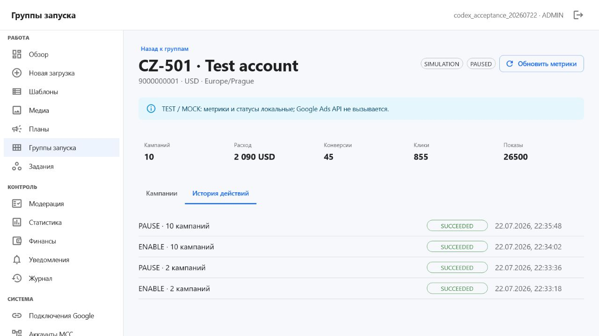
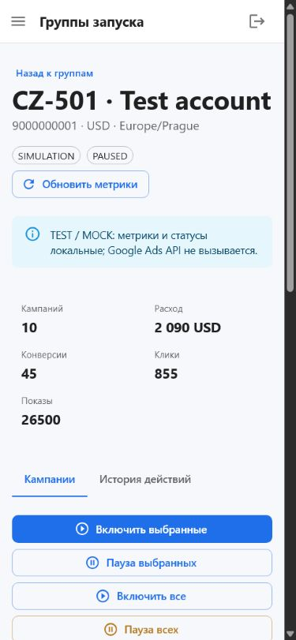
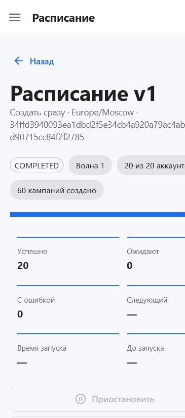

# Demand Gen Uploader: итоговый отчёт приёмки

Дата: 2026-07-26

## Результат

К существующему ручному Campaign Multiplier добавлена полноценная система отложенного и ступенчатого создания. Пользователь задаёт количество копий для каждого аккаунта, проверяет матрицу и расписание, фиксирует immutable plan, выполняет `validate_only`, после чего диспетчер создаёт всю Launch Group аккаунта в назначенное время.

Каждая кампания создаётся в `PAUSED`. Приложение не выбирает победителей, не ранжирует копии, не рекомендует их количество и не принимает решений по статистике. Keitaro в текущем этапе не подключён.

## Реализованный сценарий

- Общее количество копий, индивидуальные значения по аккаунтам, быстрые варианты `1`, `3`, `5`, `7`, `10`, произвольное значение и массовое изменение выделенных аккаунтов.
- Режимы копирования `EXACT_COPY`, одинаковые настройки со случайными бюджетами, случайное подмножество и ротация креативов.
- Бюджеты `FIXED`, `RANGE`, `MANUAL_LIST`, `PER_ACCOUNT_OVERRIDE`, `PER_CAMPAIGN_OVERRIDE`; для диапазона доступны `RANDOM`, `BALANCED_RANDOM` и `SEQUENTIAL`.
- Каждая копия имеет отдельные Campaign Instance ID, sequence, имя, deployment key и non-shared budget.
- Google ValueTrack placeholders сохраняются. Параметр `dgu_instance={campaign_instance_code}` добавляется только по явному выбору пользователя.
- Группы запуска служат только для просмотра, фильтрации, обновления метрик и ручных команд `ENABLE`/`PAUSE` для выбранных или всех кампаний.
- Метрики Google Ads отображаются только для просмотра и не запускают автоматических действий.

## Реализованное расписание

- Новый шаг `Расписание` расположен после Campaign matrix и до фиксации immutable plan.
- Поддерживаются `IMMEDIATE`, `EVEN`, `WAVES` и `MANUAL`, часовой пояс IANA, порядок аккаунтов, лимиты в час/сутки, максимальная параллельность и circuit breaker.
- Единица выполнения — весь дочерний аккаунт с его Launch Group; Campaign Instance одной группы не дробятся между временными точками.
- Ступенчатый режим поддерживает первую тестовую волну, наблюдение, последующие волны, ручное подтверждение по умолчанию и автоматическое продолжение по явному выбору.
- Ручной режим поддерживает массовую установку времени, равномерное распределение, сдвиг, очистку, перетаскивание и перенос между волнами.
- PostgreSQL хранит состояние расписания, волн, аккаунтов и событий. Celery Beat опрашивает базу каждые 15 секунд, worker использует `FOR UPDATE SKIP LOCKED`.
- Перед каждым аккаунтом повторяются проверки MCC, immutable plan, assets и `validate_only`. Вся группа создаётся в `PAUSED`.
- Повторяются только временные ошибки. Серьёзные ошибки включают circuit breaker; после длительного простоя запрещён массовый догоняющий запуск.
- Изменение будущих запусков создаёт новую версию расписания и новый fingerprint; предыдущая история остаётся доступной.
- Страница контроля показывает прогресс, волну, следующий аккаунт, обратный отсчёт, плановое и фактическое время, попытки, request IDs и структурированные ошибки.

## Удалённая автоматизация решений

- Удалены модели и таблицы `winner_decisions`, `evaluation_rules`, `evaluation_runs`.
- Удалены связанные endpoints, фоновые задания, настройки и элементы интерфейса.
- В API изменения статуса разрешены только явными командами `ENABLE` и `PAUSE`.
- Техническая таблица `account_test_bundles` сохранена как нейтральная группа запуска без winner/loser-логики.

## Browser acceptance Campaign Multiplier

Полный сценарий выполнен в интерфейсе на desktop и mobile viewport.

- Выбрано 20 тестовых аккаунтов.
- Количества `[10, 7, 5, 3, 1]` назначены четырём группам аккаунтов; итог составил 104 кампании.
- Матрица содержит 20 групп запуска и 104 Campaign Instance.
- Одна копия вручную переименована; изменение сохранилось после переходов и перезагрузки.
- Immutable plan создан с fingerprint `0b10f8d7676a09b165809b6e8f58a98eaf368df26017a251f6806bdb7bd75a45`.
- Локальная проверка и `validate_only` в режиме SIMULATION прошли успешно.
- Фоновое создание завершилось статусом `SUCCEEDED` и вернуло 104 ресурса.
- Проверка базы после создания: 20 групп, 104 кампании, 104 уникальных имени, 104 уникальных deployment key, все 104 в `PAUSED`.
- Проверены ручные операции: `ENABLE 2`, `PAUSE 2`, `ENABLE 10`, `PAUSE 10`; каждая завершилась `SUCCEEDED`.
- После обновления метрик все 10 кампаний проверяемой группы остались в `PAUSED`.
- В тестовой конфигурации ValueTrack `{campaignid}` сохранён, внутренний `dgu_instance` не добавлен.
- Ошибок и предупреждений в консоли браузера после итогового прогона нет.

## Browser acceptance расписания

- Через интерфейс создано 20 тестовых аккаунтов, 20 Launch Group и 60 Campaign Instance.
- Режим `Создать сразу` рассчитан и зафиксирован в часовом поясе `Europe/Moscow`.
- Расписание вошло в immutable plan; локальная проверка и `validate_only` в `SIMULATION` прошли успешно.
- Фоновый диспетчер завершил расписание со статусом `COMPLETED`: 20 из 20 аккаунтов имеют `SUCCEEDED`.
- В PostgreSQL подтверждено 60 Campaign Instance в `PAUSED`, ноль структурированных ошибок и ноль request IDs в режиме симуляции.
- CSV-отчёт скачан через интерфейс и содержит плановое/фактическое время, попытки, resource names и итог каждого аккаунта.
- Проверены desktop `1440×900` и mobile `390×844`: корневого горизонтального переполнения нет, элементы управления не перекрываются.
- После итоговой пересборки в консоли браузера нет ошибок и предупреждений.
- Созданные для browser acceptance пользователь и данные удалены; исходный администратор и существующая загрузка сохранены.

## Автоматические проверки

- Backend: `ruff` пройден; `pytest` — 51 тест пройден.
- Campaign Multiplier: 18 отдельных сценариев, включая разные количества копий, бюджеты, стабильность генерации, retry, `PAUSED`, ручные статусы и отсутствие автоматических решений.
- Расписание: 19 сценариев с управляемым временем, включая 50 аккаунтов за 24 часа, первую волну из 5 аккаунтов, наблюдение, ручное/автоматическое продолжение, лимиты, параллельность, retry/backoff, circuit breaker, restart/idempotency и восстановление после простоя.
- Frontend: Vitest — 5 тестов пройдено.
- TypeScript и production-сборка Vite пройдены, преобразовано 1052 модуля.
- Vite оставляет неблокирующее предупреждение о размере основного minified chunk: около 754 KB.
- Alembic: `202607260006 (head)`.
- Docker Compose: `postgres`, `redis`, `api`, `worker`, `scheduler`, `frontend`, `reverse-proxy` имеют статус `healthy`.
- HTTP: `/`, `/api/health`, `/api/ready`, `/api/setup/status` возвращают `200`.
- В журналах `api`, `worker`, `scheduler` и `reverse-proxy` после итогового запуска нет `ERROR`, traceback или ответов 5xx.

## Скриншоты

## Граница live-проверки

SIMULATION проверен полностью и явно не обращается к Google Ads API. Live-адаптер и OAuth/MCC-инфраструктура сохранены, но реальные OAuth credentials, Developer Token и тестовый рекламный аккаунт для этого прогона не предоставлялись. Поэтому создание реальной Demand Gen кампании в Google Ads остаётся отдельной внешней приёмкой.

## Первый администратор

На чистой базе при открытии `http://localhost/` появляется форма первоначальной настройки. Для создания первого администратора нужны логин, сильный пароль, необязательный email и значение `SETUP_TOKEN` из `.env`. После создания первого пользователя повторная bootstrap-регистрация блокируется.
