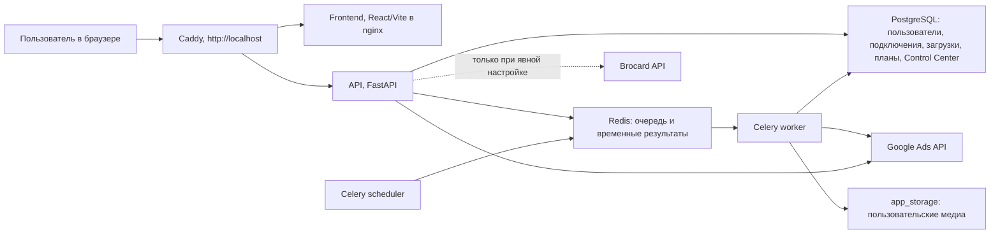

# Полный аудит текущего состояния Demand Gen Uploader

Дата фактической проверки: **29 июля 2026 года**  
Проект: `D:\Cursor AI\demand-gen-uploader`  
Проверенный адрес: `http://localhost/`  
Ветка Git: `feature/domain-themes-i18n`  
Последний коммит до незакоммиченных изменений: `1122cf1`

## 1. Краткий итог простыми словами

Приложение запускается и работает как защищённый стенд разработки. Все семь контейнеров здоровы, база и Redis доступны, миграции применены, backend- и frontend-тесты проходят. В Google Test реально подключён тестовый MCC, найдены два тестовых рекламных аккаунта, созданы две Demand Gen кампании в статусе `PAUSED`, а ранее выполненные действия `ENABLE`, `PAUSE` и изменение бюджета подтверждены сохранёнными Google Request ID и readback.

Это **не готовая production-система для реального портфеля MCC**. Текущий Developer Token имеет доступ только к тестовым аккаунтам, подключение `vcc2` получает от Google точную ошибку `AUTHORIZATION_ERROR.DEVELOPER_TOKEN_NOT_APPROVED`, а production-mutate дополнительно заблокирован самим приложением. Control Center пригоден для тестовой работы с аккаунтами и кампаниями, но в нём пока нет модели GEO/дочерних MCC, регистраций и депозитов, числовых фильтров, сортировки метрик, настоящего incremental sync и полноценной локализации.

Аудит выявил несколько реальных ошибок:

1. Обычный `GET /api/uploads/{id}/domain-validation` изменяет загрузку, делает `COMMIT` и ставит фоновую задачу. Во время разрешённого просмотра трёх существующих мастеров это изменило их `draft.domain_validation` и `updated_at`, хотя кнопка сохранения не нажималась.
2. Переключение на English переводит часть оболочки, но содержимое Control Center остаётся по-русски.
3. Страница `/connections` имеет горизонтальное переполнение всей страницы на мобильной ширине 390 px.
4. Сводка Control Center складывает расходы разных валют и подписывает итог как USD.
5. Старый экран статистики превращает отсутствующие значения в `0`.
6. Глобальный kill switch автоправил отображается и сохраняется, но evaluator его фактически не читает.
7. Адаптер `v25` существует как тонкий наследник `v24.2`, а не как независимо реализованный и проверенный адаптер.

### Итоговая статистика 407 нумерованных требований

> Числа ниже вычислены по строкам полной таблицы в разделе 10.

| Статус | Количество |
|---|---:|
| `ГОТОВО И ПРОВЕРЕНО` | 117 |
| `ГОТОВО, НО ПРОВЕРЕНО ТОЛЬКО В GOOGLE_TEST` | 55 |
| `ГОТОВО, НО ПРОВЕРЕНО ТОЛЬКО В SIMULATION` | 44 |
| `ЧАСТИЧНО` | 94 |
| `ТОЛЬКО ИНТЕРФЕЙС / ЗАГЛУШКА` | 4 |
| `НЕ РЕАЛИЗОВАНО` | 80 |
| `РАБОТАЕТ С ОШИБКОЙ` | 6 |
| `НЕДОСТУПНО ЧЕРЕЗ GOOGLE ADS API` | 7 |
| **Всего** | **407** |

## 2. Что реально работает прямо сейчас

1. Полный Docker-стек из семи сервисов; все контейнеры имеют `healthy`, restart count равен нулю.
2. Локальная авторизация, роли, CSRF-защита, журнал аудита и серверное шифрование Google/Brocard-реквизитов.
3. OAuth Web-подключения, безопасная проверка MCC через GAQL, синхронизация и хранение аккаунтов.
4. 21-шаговый мастер Demand Gen, черновики, импорт CSV/XLSX, медиатека, шаблоны, генерация копий, план, fingerprint, локальная проверка, подтверждение и отчёты.
5. Control Center с аккаунтами как основными строками, ручными рабочими статусами, локальными названиями, заметками, историей заметок, тегами, фильтрами, сохранёнными личными представлениями и карточкой аккаунта.
6. Чтение кампаний и безопасный pipeline ручных действий: fresh read, impact preview, подтверждение, `validate_only`, mutate по customer, readback, reconciliation-результат и audit log.
7. Фоновые задачи Celery, расписания и периодический Control Center sync.
8. Domain Validation с проверкой доступности и расширяемыми Web Risk, Spamhaus DQS и IPQS providers; реальные reputation keys сейчас не настроены, поэтому действует monitor.

## 3. Что работает только в SIMULATION

Полностью изолированными тестами подтверждены варианты campaign multiplier, диапазоны и распределения бюджетов, сложные расписания, волны, retry/backoff, восстановление после перезапуска, смешанные ошибки по аккаунтам и многие варианты полей Demand Gen. Эти ветви не проходили полный реальный Google Test для каждого варианта.

Simulation никогда не вызывает Google mutate. Это подтверждено safety-кодом, тестами и экраном настроек.

## 4. Что проверено на реальном Google test account

Подключение `google-test` использует MCC `3831073849`, режим `GOOGLE_TEST`, OAuth Web и Google Ads API `v24.2`. Свежий read-only обход Google вернул два аккаунта:

| Customer ID | Parent | Test account | Manager | Google status | Currency | Time zone |
|---|---|---:|---:|---|---|---|
| `1833869760` | `3831073849` | да | нет | `CLOSED` | USD | Europe/Warsaw |
| `8047280949` | `3831073849` | да | нет | `CLOSED` | USD | Europe/Warsaw |

Свежий readback подтвердил:

| Customer | Campaign ID | Status | Budget ID | Budget | Тип | Ресурсы |
|---|---|---|---|---:|---|---|
| `1833869760` | `24078084651` | `PAUSED` | `15761367103` | 10 USD/day | Demand Gen | campaign 1, ad group 1, ad 1, criteria 7, assets 3, audience 1 |
| `8047280949` | `24078086559` | `PAUSED` | `15756376533` | 12 USD/day | Demand Gen | campaign 1, ad group 1, ad 1, criteria 7, assets 3, audience 1 |

Свежие read-only Request ID обхода и readback сохранены в материалах аудита; примеры: `r80mJjCn_8XvMl6USQovzQ`, `oDQqV3LWZL8P8_ngEy97Dw`, `dD-E1x2LNhBZjOQSzlPJMQ`.

Ранее выполненные ручные действия также имеют отдельные validation/mutate Request ID:

| Действие | Validation Request ID | Mutate Request ID | Readback |
|---|---|---|---|
| `ENABLE` | `MsaamvjOy7Pr4-pTkQRaWw` | `4JZxggO0y7LuWPKlwf9agQ` | verified |
| `PAUSE` | `lOCWmwRofP7KDpux9btLnA` | `n1-e4b2iyTABPpcOZHDK2g` | verified |
| `SET_BUDGET` | `wU09_2FRgjrS8WEAW5NrpA` | `Th3JHBpIEhBjGHLoOLoDAg` | verified |

Во время этого аудита Google mutate не выполнялся.

## 5. Что пока нельзя проверить без Basic Access

Подключение `vcc2` сохранено и не удалено. Для MCC `5589335362` Google отвечает:

`AUTHORIZATION_ERROR.DEVELOPER_TOKEN_NOT_APPROVED`

В интерфейсе сохранён Request ID `vkb8q9oUEV1cxVefN_uCig` и понятное русское объяснение. Это не ошибка OAuth и не повреждение refresh token: Developer Token одобрен только для test accounts. По официальной документации Google Test Account Access работает только с тестовыми аккаунтами; production требует Explorer, Basic или Standard Access в зависимости от функций и квоты: [Access Levels and Permissible Use](https://developers.google.com/google-ads/api/docs/api-policy/access-levels).

Даже после получения доступа к production текущая конфигурация приложения продолжит блокировать production-mutate, пока не будет отдельно спроектирована и разрешена production-политика.

## 6. Что реализовано частично

1. Рекурсивная иерархия MCC есть в backend, но текущий Google Test имеет только один уровень, а UI не моделирует дочерние MCC отдельными объектами.
2. Метрики аккаунтов и кампаний запрашиваются и сохраняются, но тестовые аккаунты не откручивают рекламу; сортировка, числовые фильтры и GEO/MCC-агрегация отсутствуют.
3. Advertiser verification читается, но автоматический запуск в UI намеренно выключен.
4. Модерация читает policy summary, но в текущей базе нет сохранённых результатов реальной модерации.
5. Brocard client реализован, но профиль и ключ не настроены, поэтому live-проверка не выполнялась.
6. Domain reputation providers реализованы и покрыты mock-тестами, но все реальные ключи отключены.
7. Сохранённые views хранят фильтры и колонки, но не сортировку и группировку.
8. Reconciliation сравнивает readback с ожидаемым состоянием, но не выполняет автоматический repair.

## 7. Что является интерфейсной заглушкой

1. Google preview в мастере намеренно недоступен и объяснён как не поддерживаемый API.
2. Автоправила показывают PAUSE/ENABLE/изменение бюджета, но весь engine жёстко работает в `DRY_RUN` и не отправляет mutate.
3. Экран Finance сейчас является формой подключения Brocard, а не финансовым кабинетом Google Ads.
4. Многие поля мастера имеют UI и локальную логику, но не проходили отдельный реальный Google Test для каждого варианта.

## 8. Что вообще не реализовано

Крупнейшие отсутствующие блоки:

1. GEO как отдельная сущность, назначение GEO дочерним MCC, наследование GEO аккаунтами и GEO-группировки.
2. История перемещения аккаунта между MCC и сохранение нескольких путей до одного аккаунта.
3. Назначение Google Conversion Action на «Регистрацию» и «Депозит», соответствующие CPA/воронки и фильтры.
4. Полноценные сортировки таблиц, числовые фильтры, dense mode и изменение ширины колонок.
5. Ad groups, Ads, Assets и Demand Gen asset links как отдельные drill-down экраны Control Center.
6. ChangeStatus/ChangeEvent ingestion.
7. Keitaro.
8. Автоматическая работа автоправил, cooldown, приоритеты, конфликт-резолюция и лимиты действий.
9. Автоматические апелляции, генерация текста апелляций и браузерная автоматизация.
10. Proxy routing и antidetect/browser automation.

## 9. Что недоступно через Google Ads API

По официальной документации Google Ads API billing управляет `BillingSetup`, `AccountBudget` и `Invoice` только для monthly invoicing: [Billing overview](https://developers.google.com/google-ads/api/docs/billing/overview). Из этого API нельзя получить обычный automatic-payment threshold, дату следующего списания с банковской карты или полную историю карточных списаний.

Google Ads API предоставляет `IdentityVerificationService` для чтения статуса и запуска advertiser identity verification: [Advertiser identity verification](https://developers.google.com/google-ads/api/docs/account-management/advertiser-identity-verification). Payment verification как аналогичный универсальный API отсутствует.

Универсальный account-level appeal для suspension через официальный Google Ads API отсутствует. Доступные policy exemption requests относятся к отдельным объявлениям/ключевым словам и только к нарушениям, которые Google пометил как exemptible: [Policy Exemption Requests](https://developers.google.com/google-ads/api/docs/policy-exemption/overview).

Полный inbox уведомлений интерфейса Google Ads через API не предоставляется. Для изменений ресурсов доступны `ChangeEvent` и `ChangeStatus`; `ChangeEvent` ограничен последними 30 днями, максимумом 10 000 строк на запрос и задержкой до нескольких минут: [Change Event](https://developers.google.com/google-ads/api/docs/change-event).

Точная человеческая причина suspension не гарантируется API. Приложение правильно не выдумывает её из общего статуса.

## Справочник доказательств

Коды ниже используются в полной таблице, чтобы не повторять одни и те же длинные пути в каждой строке.

| Код | Проверенная цепочка |
|---|---|
| `E-INFRA` | `docker-compose.yml`, backend/frontend Dockerfiles, Caddy; семь контейнеров `healthy`, restart count 0; `/`, `/api/health`, `/api/ready` = 200; свежие логи без traceback/ERROR/5xx. |
| `E-MIG` | `backend/migrations/versions/*`; линейная additive-цепочка до `202607290007 (head)`; фактические `alembic current` и `heads` совпадают. |
| `E-AUTH` | `/connections` → `ConnectionsPage.tsx` → `/api/google-connections*` и `/api/google-connections/oauth/*` → `connection_credentials.py`, `hierarchy.py`, v24.2 adapter → encrypted `google_credentials`; OAuth Web реально использован подключением `google-test`. |
| `E-ERR` | `vcc2` сохранён; UI показывает Google code, сообщение и Request ID без маскировки: `AUTHORIZATION_ERROR.DEVELOPER_TOKEN_NOT_APPROVED`, `vkb8q9oUEV1cxVefN_uCig`. |
| `E-HIER` | `hierarchy.py`, account routes, `CustomerAccount`; очередь manager-узлов, recursive GAQL, dedupe по customer ID; текущий реальный результат — два test child accounts одного уровня. |
| `E-WIZ` | `/uploads/new`, `/uploads/{id}` → `UploadWizardPage.tsx` (21 шаг) → upload/batch/plan endpoints → `CampaignUpload`, `LaunchBatch`, `CampaignInstance`, `DeploymentPlan`; browser-проверка черновика и существующих результатов. |
| `E-IMPORT` | upload import/manual rows endpoints, CSV/XLSX parser, `source_rows`, domain-validation enqueue; покрыто `test_workflow.py` и `test_domain_validation.py`. |
| `E-MEDIA` | `/media` → `MediaPage.tsx` → media endpoints/tasks → `MediaAsset`, storage volume; 4 сохранённых объекта, SHA-256 dedupe, image checks и YouTube registration. |
| `E-MULT` | multiplier в wizard/domain planner; `CampaignInstance`, `deployment_key`; `test_campaign_multiplier.py`; локальные режимы и количества проверены без Google mutate. |
| `E-PLAN` | plan routes/planner → local validation, snapshot, fingerprint, confirmation `CREATE_PAUSED`, `validate_only`, deploy task, result export; `test_workflow.py`, `test_google_test_mode.py`. |
| `E-SCHED` | `/schedules` → schedule routes/service → scheduling models → `schedule_tasks.py`, Celery beat каждые 15 секунд; `test_scheduling.py`; текущих пользовательских расписаний в БД нет. |
| `E-DOM` | `DomainValidationPanel` → upload domain endpoints → `domain_validation/*` → Celery `validate_upload_domains`; availability + Web Risk/Spamhaus/IPQS providers; mock-тесты, реальные provider keys выключены, enforcement `monitor`. |
| `E-CC` | `/control-center` → `ControlCenterPage.tsx` → `/api/control-center/*` → `control_center/service.py` и Control Center models/migration `fabc2ba828ea`; browser desktop/mobile и `test_control_center.py`. |
| `E-CCSYNC` | ручной/фоновый sync → `control_center_tasks.py` → v24.2 GAQL → daily metrics/campaigns/events/problems; beat каждые 60 секунд; реальные успешные GOOGLE_TEST sync jobs. |
| `E-ACTION` | campaigns tab → preview/confirm endpoints → execution guard → Google validate/mutate/readback → `ControlCenterActionRequest` + audit; три реальные GOOGLE_TEST операции с Request ID. |
| `E-RULE` | rules tab/API/models/evaluator/beat каждые 300 секунд; только DRY RUN; `test_control_center.py`; в БД правил нет. |
| `E-FIN` | `/finance` → `FinancePage`/operations routes → encrypted Brocard profile/client; профилей нет, live Brocard не проверялся. |
| `E-MOD` | `/moderation` и account drawer → operations routes/v24.2 reads → `ModerationRecord`; текущих записей нет. |
| `E-GT` | MCC `3831073849`; accounts `1833869760`, `8047280949`; campaigns `24078084651`, `24078086559`; свежий read-only hierarchy/readback и сохранённые acceptance runs. |
| `E-DB` | PostgreSQL-транзакции `READ ONLY`: admin сохранён; 2 connections, 2 accounts, 7 uploads, 4 media, 6 plans, 2 campaigns, 3 action requests, 81 audit rows до browser-входа; secrets не выводились. |
| `E-TEST` | backend: Ruff clean, `120 passed, 1 skipped`; frontend: `22 passed`; production build успешна, предупреждение о chunk 923.41 kB; frontend Docker build успешна. |
| `E-UI` | Пройдены все 17 menu routes, 3 detail routes, 5 вкладок Control Center, desktop 1440×1000 и mobile 390×844; page errors 0, HTTP 4xx/5xx после входа 0. |
| `E-I18N` | 6 тем и RU/EN selector доступны; theme/i18n tests проходят; фактически English не переводит содержимое Control Center. |
| `E-OFFICIAL` | Официальные Google Ads docs по access levels, billing, identity verification, policy exemption и ChangeEvent, ссылки приведены выше. |

## 10. Полная таблица всех требований

В таблицах ниже **407 отдельных нумерованных строк**. Ненумерованные browser- и business-сценарии проверены отдельно в разделах 13 и 15.

### 10.1 Ранее заявленные результаты

| ID | Требование | Статус | Фактическое доказательство и ограничение |
|---|---|---|---|
| V1 | Семь Docker-контейнеров работают и healthy | **ГОТОВО И ПРОВЕРЕНО** | `E-INFRA`: postgres, redis, api, worker, scheduler, frontend, reverse-proxy имеют `Up ... (healthy)`. |
| V2 | Нет постоянных перезапусков | **ГОТОВО И ПРОВЕРЕНО** | `docker inspect`: restart count 0 у всех семи; uptime около трёх часов к финальной проверке. |
| V3 | `/`, `/api/health`, `/api/ready` | **ГОТОВО И ПРОВЕРЕНО** | Все три URL повторно дали HTTP 200; health=`ok`, ready=`ready`. |
| V4 | Alembic на актуальном head | **ГОТОВО И ПРОВЕРЕНО** | `E-MIG`: current=head=`202607290007`; линейная цепочка без второй головы. |
| V5 | Backend-тесты проходят | **ГОТОВО И ПРОВЕРЕНО** | `E-TEST`: `120 passed, 1 skipped in 51.62s`; skip — opt-in real creation, не запускавшийся из-за запрета mutate в аудите. |
| V6 | Frontend-тесты проходят | **ГОТОВО И ПРОВЕРЕНО** | `E-TEST`: 6 test files, 22 tests passed. |
| V7 | Production build frontend | **ГОТОВО И ПРОВЕРЕНО** | Vite build и Docker build прошли; есть неблокирующее предупреждение о JS chunk 923.41 kB. |
| V8 | Свежие логи без необъяснённых ошибок | **ГОТОВО И ПРОВЕРЕНО** | За финальные 15 минут нет `ERROR`, traceback, exception или 5xx; domain tasks завершились успешно. |
| V9 | MCC `3831073849` реально в GOOGLE_TEST | **ГОТОВО, НО ПРОВЕРЕНО ТОЛЬКО В GOOGLE_TEST** | `E-AUTH`, `E-GT`: VERIFIED OAuth Web connection, свежий Google read. |
| V10 | Аккаунты `1833869760`, `8047280949` обнаружены | **ГОТОВО, НО ПРОВЕРЕНО ТОЛЬКО В GOOGLE_TEST** | Свежий recursive read вернул оба test accounts и их parent/currency/time zone/status. |
| V11 | Реальные test Demand Gen кампании существуют | **ГОТОВО, НО ПРОВЕРЕНО ТОЛЬКО В GOOGLE_TEST** | `E-GT`: campaign IDs `24078084651`, `24078086559`, обе `PAUSED`, полный resource readback verified. |
| V12 | Есть подтверждения ENABLE, PAUSE, budget change | **ГОТОВО, НО ПРОВЕРЕНО ТОЛЬКО В GOOGLE_TEST** | `E-ACTION`: три `SUCCEEDED` action requests и соответствующие audit events. |
| V13 | Preview, validate_only, mutate, readback, Request ID сохранены | **ГОТОВО, НО ПРОВЕРЕНО ТОЛЬКО В GOOGLE_TEST** | Для всех трёх действий сохранены pre-state, preview, validation/mutate/read IDs и `readback_verified=true`. |
| V14 | Production-защита блокирует изменения | **ГОТОВО И ПРОВЕРЕНО** | Safety/route guard блокирует production безусловно; UI показывает запрет; тесты подтверждают. Production mutate не выполнялся. |
| V15 | `vcc2`, данные, медиа и admin не повреждены | **ЧАСТИЧНО** | Все объекты сохранены, удаления нет, но browser-read инициировал domain-validation и изменил `draft/updated_at` трёх uploads — ошибка B1. |

### 10.2 Общая архитектура

| ID | Требование | Статус | Фактическое доказательство и ограничение |
|---|---|---|---|
| A1 | Состав сервисов | **ГОТОВО И ПРОВЕРЕНО** | `E-INFRA`: ровно семь compose services. |
| A2 | Ответственность контейнеров | **ГОТОВО И ПРОВЕРЕНО** | Postgres — данные; Redis — broker/results; api — HTTP; worker — задачи; scheduler — beat; frontend — статические файлы; Caddy — единая точка входа. |
| A3 | Где хранится основная информация | **ГОТОВО И ПРОВЕРЕНО** | PostgreSQL + `postgres_data`; media в `app_storage`; Redis не является источником постоянных бизнес-данных. |
| A4 | Где хранятся секреты | **ГОТОВО И ПРОВЕРЕНО** | `.env`/server env и encrypted payload в PostgreSQL; ключи не передаются frontend и не выведены в отчёт. |
| A5 | Связь frontend/backend | **ГОТОВО И ПРОВЕРЕНО** | Browser → Caddy `:80`; `/api/*` → FastAPI, остальные пути → nginx SPA; cookie session + CSRF. |
| A6 | Постановка заданий в очередь | **ГОТОВО И ПРОВЕРЕНО** | FastAPI вызывает Celery `.delay`; Redis broker; job rows хранят прогресс/ошибки. |
| A7 | Запуск отложенных заданий scheduler | **ГОТОВО И ПРОВЕРЕНО** | Celery beat: schedules 15 s, Control Center due sync 60 s, rules 300 s. |
| A8 | Обращение к Google Ads API | **ГОТОВО И ПРОВЕРЕНО** | Encrypted credentials → adapter registry → v24.2 GoogleAdsService/services; login customer ID очищается от дефисов. |
| A9 | Существующие version adapters | **ГОТОВО И ПРОВЕРЕНО** | Registry объявляет `v24.2`, `v25`, `v25.0`; installed `google-ads 31.2.0` содержит generated v24/v25 modules. |
| A10 | Реально используемая версия | **ГОТОВО И ПРОВЕРЕНО** | Environment, connection rows и Settings показывают `v24.2`. |
| A11 | Рабочий v25 или только v24.2 | **ЧАСТИЧНО** | `v25` class лишь наследует v24.2 и проверяет префикс версии; отдельной реализации и acceptance нет. |
| A12 | Режимы SIMULATION/GOOGLE_TEST/PRODUCTION | **ГОТОВО И ПРОВЕРЕНО** | Enum/config/UI/backend guards согласованы. |
| A13 | Отличия режимов | **ГОТОВО И ПРОВЕРЕНО** | Simulation — mock; Google Test — реальные test-account calls; Production — reads возможны при доступе, mutate заблокирован. |
| A14 | Разрешённые/запрещённые операции | **ГОТОВО И ПРОВЕРЕНО** | Execution guard проверяет verified connection, test hierarchy, non-manager child, confirmation и mode. |
| A15 | Роли и аудит | **ГОТОВО И ПРОВЕРЕНО** | ADMIN/OPERATOR/VIEWER; endpoint guards и audit rows с actor/action/entity/summary. UI управления пользователями отсутствует, но это не ломает текущую модель ролей. |

### 10.3 Demand Gen: подключение Google и создание загрузки

| ID | Требование | Статус | Фактическое доказательство и ограничение |
|---|---|---|---|
| D1 | Создание OAuth Web подключения | **ГОТОВО, НО ПРОВЕРЕНО ТОЛЬКО В GOOGLE_TEST** | `E-AUTH`: форма, save/start/callback, PKCE/state/offline consent; `google-test` реально авторизован. |
| D2 | Зашифрованное хранение OAuth-реквизитов | **ГОТОВО И ПРОВЕРЕНО** | Credentials/refresh token лежат в encrypted payload; БД не содержит открытых значений, frontend их не получает. |
| D3 | Повторный вход через Google | **ГОТОВО И ПРОВЕРЕНО** | Кнопка и OAuth restart endpoint работают по той же проверенной цепочке; повторный OAuth во время аудита не выполнялся. |
| D4 | Проверка MCC | **ГОТОВО, НО ПРОВЕРЕНО ТОЛЬКО В GOOGLE_TEST** | Безопасный GAQL `customer` read; `google-test` VERIFIED, `vcc2` сохраняет точную Google error. |
| D5 | Синхронизация аккаунтов | **ГОТОВО, НО ПРОВЕРЕНО ТОЛЬКО В GOOGLE_TEST** | Реальный recursive sync сохранил два child accounts. |
| D6 | Работа через главный MCC | **ГОТОВО, НО ПРОВЕРЕНО ТОЛЬКО В GOOGLE_TEST** | Login customer `3831073849` использован как hierarchy root и login_customer_id. |
| D7 | Рекурсивное обнаружение дочерних MCC | **ЧАСТИЧНО** | BFS/queue реализован и протестирован mock-иерархиями; текущая реальная hierarchy не содержит child manager. |
| D8 | Аккаунты внутри дочерних MCC | **ЧАСТИЧНО** | Алгоритм обходит manager children, но end-to-end реальной многоуровневой hierarchy нет. |
| D9 | Один аккаунт через несколько путей MCC | **ЧАСТИЧНО** | Dedupe по customer ID есть, но сохраняется только один текущий parent/path, без списка всех путей. |
| D10 | Потерянный доступ | **ЧАСТИЧНО** | Account можно пометить detached/ошибочным, локальная строка остаётся; полноценного lifecycle problem/history нет. |
| D11 | Точный Google error code и Request ID | **ГОТОВО И ПРОВЕРЕНО** | `E-ERR`: vcc2 показывает code, Google message, понятное пояснение и Request ID. |
| D12 | Test/Basic/Standard access distinction | **ЧАСТИЧНО** | Ошибки и справочный текст различают уровни, но приложение не получает и не хранит официальный access level токена. |
| D13 | Мастер новой загрузки | **ГОТОВО И ПРОВЕРЕНО** | `/uploads/new` создаёт upload и открывает 21-шаговый `/uploads/{id}` wizard. |
| D14 | Выбор подключения | **ГОТОВО И ПРОВЕРЕНО** | Step 1 читает connections и сохраняет connection ID. |
| D15 | Выбор MCC | **ГОТОВО И ПРОВЕРЕНО** | Wizard использует выбранное root connection/MCC; отдельный child-MCC selector отсутствует. |
| D16 | Выбор рекламных аккаунтов | **ГОТОВО И ПРОВЕРЕНО** | Step 3 показывает accounts выбранного connection, поддерживает индивидуальный выбор. |
| D17 | CSV/XLSX import | **ЧАСТИЧНО** | `E-IMPORT`: оба parser branches и persisted rows есть; автоматический regression test явно покрывает CSV, полного XLSX browser/API acceptance нет. |
| D18 | Ручное заполнение | **ГОТОВО И ПРОВЕРЕНО** | 21 шаг формы формирует builder payload; отдельной spreadsheet-like manual rows таблицы нет. |
| D19 | Сохранение черновика | **ГОТОВО И ПРОВЕРЕНО** | Save/PATCH сохраняет current step, connection и полный builder. |
| D20 | Восстановление после reload | **ГОТОВО И ПРОВЕРЕНО** | Wizard hydration читает persisted draft/current_step; browser открыл существующие steps 0, 7 и 18. |
| D21 | Шаблоны кампаний | **ЧАСТИЧНО** | `/templates`, CRUD/versioning/copy и template model/API существуют, но текущая БД пуста и end-to-end создание в аудите не выполнялось. |
| D22 | Повторное использование шаблона | **ЧАСТИЧНО** | Wizard `FROM_TEMPLATE` загружает snapshot выбранной версии, но существующего template для browser acceptance нет. |
| D23 | Проверка дублей | **ЧАСТИЧНО** | Есть dedupe media, customer IDs и deployment keys; общего предупреждения о дублирующей загрузке/кампании по имени нет. |

### 10.4 Demand Gen: настройки кампании и медиа

| ID | Требование | Статус | Фактическое доказательство и ограничение |
|---|---|---|---|
| D24 | Название кампании | **ГОТОВО, НО ПРОВЕРЕНО ТОЛЬКО В GOOGLE_TEST** | Передано и прочитано у двух test campaigns. |
| D25 | Дневной бюджет | **ГОТОВО, НО ПРОВЕРЕНО ТОЛЬКО В GOOGLE_TEST** | Реальные non-shared budgets 10 и 12 USD/day. |
| D26 | Валюта аккаунта | **ГОТОВО И ПРОВЕРЕНО** | Currency читается из account, используется в preview и отображается; текущие оба USD. |
| D27 | Стратегия ставок | **ЧАСТИЧНО** | UI/adapter имеют несколько branches; реальный acceptance покрывает только `MAXIMIZE_CLICKS`. |
| D28 | Maximize Conversions | **ГОТОВО, НО ПРОВЕРЕНО ТОЛЬКО В SIMULATION** | Builder/adapter/tests есть; отдельного Google Test readback не было. |
| D29 | Target CPA | **ГОТОВО, НО ПРОВЕРЕНО ТОЛЬКО В SIMULATION** | Поле и adapter mapping есть; реальной test campaign с tCPA нет. |
| D30 | Географический таргетинг | **ГОТОВО, НО ПРОВЕРЕНО ТОЛЬКО В GOOGLE_TEST** | Acceptance использовал geo target `2840`; campaign criteria readback подтверждён. |
| D31 | Языки | **ГОТОВО, НО ПРОВЕРЕНО ТОЛЬКО В GOOGLE_TEST** | Acceptance использовал language `1000`; criterion readback подтверждён. |
| D32 | Возраст | **ГОТОВО, НО ПРОВЕРЕНО ТОЛЬКО В SIMULATION** | UI 18–24…65+, adapter criteria/tests; отдельного Google Test всех диапазонов нет. |
| D33 | Пол | **ГОТОВО, НО ПРОВЕРЕНО ТОЛЬКО В SIMULATION** | UI и mapping есть; отдельного Google Test нет. |
| D34 | Аудитории | **ГОТОВО, НО ПРОВЕРЕНО ТОЛЬКО В GOOGLE_TEST** | Audience resource и ad-group criteria созданы/readback; сложные сегменты не проверены. |
| D35 | Интересы и сегменты | **НЕ РЕАЛИЗОВАНО** | Нет полноценного selector/search для interests, life events и in-market taxonomy. |
| D36 | Optimized targeting | **ГОТОВО, НО ПРОВЕРЕНО ТОЛЬКО В GOOGLE_TEST** | Acceptance передал `false`; adapter/readback цепочка прошла. |
| D37 | Final URL | **ГОТОВО, НО ПРОВЕРЕНО ТОЛЬКО В GOOGLE_TEST** | `https://example.com/` передан в test ad и проверен readback/domain layer. |
| D38 | Display URL или business name | **ГОТОВО, НО ПРОВЕРЕНО ТОЛЬКО В GOOGLE_TEST** | Business name `API Test` создан; отдельного display-path input в UI нет. |
| D39 | Tracking template | **ГОТОВО, НО ПРОВЕРЕНО ТОЛЬКО В SIMULATION** | Payload/adapter mapping и tests есть; реального test readback нет. |
| D40 | Final URL suffix | **ГОТОВО, НО ПРОВЕРЕНО ТОЛЬКО В SIMULATION** | Payload/adapter mapping есть; реального test readback нет. |
| D41 | ValueTrack/custom parameters | **ЧАСТИЧНО** | Adapter принимает custom params, но wizard отправляет пустой список и не даёт полноценного редактора. |
| D42 | CTA | **ГОТОВО, НО ПРОВЕРЕНО ТОЛЬКО В SIMULATION** | UI/adapter mapping есть; acceptance CTA не задавал. |
| D43 | Заголовки | **ГОТОВО, НО ПРОВЕРЕНО ТОЛЬКО В GOOGLE_TEST** | Headline и long headline созданы в test ad. |
| D44 | Описания | **ГОТОВО, НО ПРОВЕРЕНО ТОЛЬКО В GOOGLE_TEST** | Description создан и ad readback verified. |
| D45 | Изображения разных форматов | **ЧАСТИЧНО** | Adapter поддерживает image roles, но реальный acceptance был VIDEO + square logo; набора landscape/square/portrait нет. |
| D46 | Квадратные изображения | **ГОТОВО, НО ПРОВЕРЕНО ТОЛЬКО В GOOGLE_TEST** | Square PNG сохранён, acceptance square logo asset создан; отдельное square marketing image не доказано. |
| D47 | Вертикальные изображения | **ГОТОВО, НО ПРОВЕРЕНО ТОЛЬКО В SIMULATION** | Role inference/validation есть; реального вертикального asset нет. |
| D48 | Логотипы | **ГОТОВО, НО ПРОВЕРЕНО ТОЛЬКО В GOOGLE_TEST** | 1254×1254 acceptance logo загружен как Google asset и прочитан. |
| D49 | Видеокреативы | **ГОТОВО, НО ПРОВЕРЕНО ТОЛЬКО В GOOGLE_TEST** | YouTube video ID использован в двух real test ads. |
| D50 | Загрузка видео в YouTube или Google Ads | **ЧАСТИЧНО** | YouTube ID registration и Google asset creation есть; приложение не загружает локальное видео на YouTube, local video acceptance не выполнен. |
| D51 | Статус обработки видео | **ЧАСТИЧНО** | Media status/task polling существует, но фактическая проверка обработки нового видео Google/YouTube не выполнена. |
| D52 | Просмотр медиа до создания | **ГОТОВО И ПРОВЕРЕНО** | `/media` показывает 4 assets и preview buttons; изображения/YouTube можно открыть. |
| D53 | Размеры, форматы, aspect ratio | **ГОТОВО И ПРОВЕРЕНО** | Backend validators и tests проверяют MIME/dimensions/roles; UI показывает размеры. |
| D54 | Дедупликация медиа | **ЧАСТИЧНО** | SHA-256/reuse logic есть, но в БД видны две исторические rows с одним YouTube ID; global dedupe не доказан. |
| D55 | Отсутствующие настройки обычного Demand Gen | **ЧАСТИЧНО** | Выявлены: display path input, interests/life events, parental/income, точное role assignment, отдельные square/portrait/logo controls и processing preview. |

### 10.5 Demand Gen: Campaign Multiplier

| ID | Требование | Статус | Фактическое доказательство и ограничение |
|---|---|---|---|
| D56 | 1, 3, 5, 7, 10 или произвольное число копий | **ГОТОВО И ПРОВЕРЕНО** | `E-MULT`: quick values и диапазон 1–500; deterministic generation tests. |
| D57 | Индивидуальное число по аккаунту | **ГОТОВО И ПРОВЕРЕНО** | Account override хранится и участвует в generation matrix. |
| D58 | Массовое изменение для выбранных | **ГОТОВО И ПРОВЕРЕНО** | Wizard bulk control для selected/all instances; frontend helper tests проходят. |
| D59 | `EXACT_COPY` | **ГОТОВО И ПРОВЕРЕНО** | Реализован отдельный strategy branch и покрыт unit tests. |
| D60 | Ротация креативов | **ГОТОВО, НО ПРОВЕРЕНО ТОЛЬКО В SIMULATION** | `ROTATE_CREATIVE_SETS` формирует локальные snapshots; Google Test этого варианта не выполнялся. |
| D61 | Случайное подмножество креативов | **ГОТОВО, НО ПРОВЕРЕНО ТОЛЬКО В SIMULATION** | `RANDOM_CREATIVE_SUBSET` детерминируется seed; unit tests, без real Google. |
| D62 | Отдельное имя каждой копии | **ГОТОВО И ПРОВЕРЕНО** | Каждая instance получает campaign_name; матрица позволяет individual edit. |
| D63 | Отдельный non-shared budget | **ГОТОВО, НО ПРОВЕРЕНО ТОЛЬКО В GOOGLE_TEST** | Обе реальные кампании имеют разные budget resource IDs и `explicitly_shared=false`. |
| D64 | Уникальный Campaign Instance ID | **ГОТОВО И ПРОВЕРЕНО** | UUID5 material включает upload/account/copy; unique persisted instance. |
| D65 | Уникальный deployment key | **ГОТОВО И ПРОВЕРЕНО** | DB unique constraint и deterministic key. |
| D66 | Защита от повторного создания | **ГОТОВО, НО ПРОВЕРЕНО ТОЛЬКО В GOOGLE_TEST** | Deployment resources/reuse и unique key предотвращают duplicate mutate; acceptance resources сохранены. |
| D67 | Ручное переименование копии | **ГОТОВО И ПРОВЕРЕНО** | Matrix PATCH до immutable plan; UI individual edit. |
| D68 | Автоматический выбор победителей | **НЕ РЕАЛИЗОВАНО** | Winner evaluation намеренно удалён; migration `202607220004`. |
| D69 | Keitaro integration | **НЕ РЕАЛИЗОВАНО** | Keitaro client/config/routes отсутствуют. |
| D70 | Auto-disable проигравших | **НЕ РЕАЛИЗОВАНО** | Нет performance winner engine и автоматических campaign mutates. |

### 10.6 Demand Gen: бюджеты

| ID | Требование | Статус | Фактическое доказательство и ограничение |
|---|---|---|---|
| D71 | Фиксированный бюджет | **ГОТОВО, НО ПРОВЕРЕНО ТОЛЬКО В GOOGLE_TEST** | Реальные budgets 10/12 USD/day прошли create/readback. |
| D72 | Диапазон бюджета | **ГОТОВО, НО ПРОВЕРЕНО ТОЛЬКО В SIMULATION** | `RANGE` и min/max validation покрыты generator tests. |
| D73 | Случайное значение на кампанию | **ГОТОВО, НО ПРОВЕРЕНО ТОЛЬКО В SIMULATION** | Seeded random distribution; без отдельного Google Test. |
| D74 | Равномерные случайные значения | **ГОТОВО, НО ПРОВЕРЕНО ТОЛЬКО В SIMULATION** | `BALANCED_RANDOM` реализован в planner/tests. |
| D75 | Последовательное распределение | **ГОТОВО, НО ПРОВЕРЕНО ТОЛЬКО В SIMULATION** | `SEQUENTIAL` реализован и tested. |
| D76 | Ручной список | **ГОТОВО, НО ПРОВЕРЕНО ТОЛЬКО В SIMULATION** | `MANUAL_LIST` parser/validation есть; real Google не проверен. |
| D77 | Бюджет по аккаунту | **ГОТОВО, НО ПРОВЕРЕНО ТОЛЬКО В SIMULATION** | Per-account override участвует в snapshot; test coverage. |
| D78 | Бюджет по кампании | **ГОТОВО, НО ПРОВЕРЕНО ТОЛЬКО В SIMULATION** | Per-instance edit/PATCH есть до immutable plan. |
| D79 | Финансовый preview | **ГОТОВО И ПРОВЕРЕНО** | Step 18 группирует campaign count и spend по currency до confirmation. |
| D80 | Работа с micros | **ГОТОВО, НО ПРОВЕРЕНО ТОЛЬКО В GOOGLE_TEST** | 10 000 000 и 12 000 000 micros прочитаны как 10/12 USD. |
| D81 | Разные валюты | **ЧАСТИЧНО** | Plans группируют валюты без конвертации, но Control Center summary ошибочно суммирует и маркирует USD. |

### 10.7 Demand Gen: проверка и создание

| ID | Требование | Статус | Фактическое доказательство и ограничение |
|---|---|---|---|
| D82 | Локальная валидация | **ГОТОВО, НО ПРОВЕРЕНО ТОЛЬКО В GOOGLE_TEST** | Acceptance plan прошёл local validation перед Google. |
| D83 | Проверка ассетов | **ГОТОВО, НО ПРОВЕРЕНО ТОЛЬКО В GOOGLE_TEST** | Logo/YouTube assets validated и созданы; все media variants не проверены. |
| D84 | Immutable plan | **ГОТОВО И ПРОВЕРЕНО** | Snapshot блокируется после назначения/deploy; mutation endpoints проверяют состояние. |
| D85 | Fingerprint плана | **ГОТОВО И ПРОВЕРЕНО** | SHA fingerprint сохранён у 6 plans и виден на `/plans`. |
| D86 | Google `validate_only` | **ГОТОВО, НО ПРОВЕРЕНО ТОЛЬКО В GOOGLE_TEST** | Acceptance и три actions имеют Google validation Request IDs. |
| D87 | Явное подтверждение | **ГОТОВО, НО ПРОВЕРЕНО ТОЛЬКО В GOOGLE_TEST** | `CREATE_PAUSED` + checkbox/admin override policy; acceptance прошёл confirm. |
| D88 | Создание только в PAUSED | **ГОТОВО, НО ПРОВЕРЕНО ТОЛЬКО В GOOGLE_TEST** | Оба campaign readback=`PAUSED`; builder не создаёт enabled campaign. |
| D89 | Google resource names | **ГОТОВО, НО ПРОВЕРЕНО ТОЛЬКО В GOOGLE_TEST** | 11 resource names на каждый успешный acceptance plan сохранены. |
| D90 | Campaign/Budget/AdGroup/Ad/Audience/Asset IDs | **ГОТОВО, НО ПРОВЕРЕНО ТОЛЬКО В GOOGLE_TEST** | Resource names и IDs присутствуют в plan results/readback. |
| D91 | Частичные ошибки по аккаунтам | **ГОТОВО, НО ПРОВЕРЕНО ТОЛЬКО В SIMULATION** | Per-customer atomic results и mixed success/failure tests; real mixed batch не выполнялся. |
| D92 | Безопасный retry временной ошибки | **ГОТОВО, НО ПРОВЕРЕНО ТОЛЬКО В SIMULATION** | Retry classifications/backoff и stable deployment key покрыты tests. |
| D93 | Идемпотентность | **ГОТОВО, НО ПРОВЕРЕНО ТОЛЬКО В SIMULATION** | Unique keys/resource reuse tested; намеренный повтор того же Google Test plan не выполнялся. |
| D94 | Итоговый отчёт | **ГОТОВО И ПРОВЕРЕНО** | Plan/report views содержат per-item status, resources, errors и request metadata. |
| D95 | CSV результата | **ГОТОВО И ПРОВЕРЕНО** | Batch report CSV endpoint и download UI существуют; XLSX также поддержан. |

### 10.8 Demand Gen: расписание

| ID | Требование | Статус | Фактическое доказательство и ограничение |
|---|---|---|---|
| D96 | Создание сразу | **ГОТОВО, НО ПРОВЕРЕНО ТОЛЬКО В SIMULATION** | `IMMEDIATE` schedule planner tested; текущих schedules нет. |
| D97 | Равномерно по времени | **ГОТОВО, НО ПРОВЕРЕНО ТОЛЬКО В SIMULATION** | `EVEN` timestamps tested. |
| D98 | Волны | **ГОТОВО, НО ПРОВЕРЕНО ТОЛЬКО В SIMULATION** | `WAVES` model/task/tests; нет real scheduled Google Test run. |
| D99 | Ручное расписание | **ГОТОВО, НО ПРОВЕРЕНО ТОЛЬКО В SIMULATION** | `MANUAL` per-account times supported/tested. |
| D100 | IANA time zone | **ГОТОВО И ПРОВЕРЕНО** | Python `ZoneInfo` validation; account zones read from Google. |
| D101 | Случайный диапазон интервалов | **ГОТОВО, НО ПРОВЕРЕНО ТОЛЬКО В SIMULATION** | Stable jitter/random interval in planner tests. |
| D102 | Первая test wave | **ГОТОВО, НО ПРОВЕРЕНО ТОЛЬКО В SIMULATION** | First wave size config и tests. |
| D103 | Observation pause | **ГОТОВО, НО ПРОВЕРЕНО ТОЛЬКО В SIMULATION** | Observation duration persisted/enforced by dispatcher tests. |
| D104 | Ручное подтверждение следующей волны | **ГОТОВО, НО ПРОВЕРЕНО ТОЛЬКО В SIMULATION** | Approve endpoint/state transition tested. |
| D105 | Явно выбранное auto-continue | **ГОТОВО, НО ПРОВЕРЕНО ТОЛЬКО В SIMULATION** | Boolean option persisted; defaults не подразумевают auto-run. |
| D106 | Лимит аккаунтов в час | **ГОТОВО, НО ПРОВЕРЕНО ТОЛЬКО В SIMULATION** | Scheduler limiter tests. |
| D107 | Лимит аккаунтов в сутки | **ГОТОВО, НО ПРОВЕРЕНО ТОЛЬКО В SIMULATION** | Daily cap persisted/tested. |
| D108 | Максимальная параллельность | **ГОТОВО, НО ПРОВЕРЕНО ТОЛЬКО В SIMULATION** | Claim/enqueue cap tested. |
| D109 | Retry/backoff | **ГОТОВО, НО ПРОВЕРЕНО ТОЛЬКО В SIMULATION** | Exponential retry + stable jitter in schedule tasks/tests. |
| D110 | Circuit breaker | **ГОТОВО, НО ПРОВЕРЕНО ТОЛЬКО В SIMULATION** | Schedule breaker fields/transitions tested. |
| D111 | Глобальная остановка расписания | **ГОТОВО, НО ПРОВЕРЕНО ТОЛЬКО В SIMULATION** | Global scheduling state/guard есть; текущего active schedule нет. |
| D112 | Pause/resume | **ГОТОВО, НО ПРОВЕРЕНО ТОЛЬКО В SIMULATION** | API/UI state transitions tested. |
| D113 | Перенос будущих запусков | **ГОТОВО, НО ПРОВЕРЕНО ТОЛЬКО В SIMULATION** | Reschedule/move endpoints пересчитывают только future rows. |
| D114 | Восстановление после restart | **ГОТОВО, НО ПРОВЕРЕНО ТОЛЬКО В SIMULATION** | Stale-run recovery covered by `test_scheduling.py`; контейнеры реально restart не требовали. |
| D115 | Нет массового catch-up после простоя | **ГОТОВО, НО ПРОВЕРЕНО ТОЛЬКО В SIMULATION** | Recovery pauses unsafe backlog; tests подтверждают. |
| D116 | Planned и actual time | **ГОТОВО, НО ПРОВЕРЕНО ТОЛЬКО В SIMULATION** | Оба timestamp поля persisted; UI columns есть. |
| D117 | Нет обещания «антибан» | **ГОТОВО И ПРОВЕРЕНО** | UI/docs описывают scheduling, не обход Google safeguards. |
| D118 | Proxy routing | **НЕ РЕАЛИЗОВАНО** | Нет proxy-per-account transport. |
| D119 | Browser/antidetect automation | **НЕ РЕАЛИЗОВАНО** | Нет browser profile/antidetect/Google Ads UI automation. |

### 10.9 Control Center: hierarchy, GEO и главный экран

| ID | Требование | Статус | Фактическое доказательство и ограничение |
|---|---|---|---|
| C1 | Главный MCC | **ГОТОВО, НО ПРОВЕРЕНО ТОЛЬКО В GOOGLE_TEST** | Root MCC `3831073849` реально используется. |
| C2 | Дочерние MCC | **ЧАСТИЧНО** | Backend recursive manager traversal есть, но UI/model не выделяет child MCC, а real hierarchy плоская. |
| C3 | Несколько child MCC на одно GEO | **НЕ РЕАЛИЗОВАНО** | GEO entity/assignment отсутствуют. |
| C4 | Дополнительные уровни вложенности | **ЧАСТИЧНО** | BFS поддерживает глубину, но current real hierarchy и UI её не подтверждают. |
| C5 | Рекурсивный сбор дерева | **ЧАСТИЧНО** | Код/tests есть; реальный Google Test подтвердил только root→client. |
| C6 | Customer ID как постоянный ID | **ГОТОВО И ПРОВЕРЕНО** | Customer ID normalized и unique вместе с connection; используется во всех sync/actions. |
| C7 | Исключение дублей | **ЧАСТИЧНО** | Dedupe внутри connection есть; один account в разных connections может существовать отдельно. |
| C8 | История старого/нового MCC | **НЕ РЕАЛИЗОВАНО** | Parent overwrite; отдельной path/history table нет. |
| C9 | Ручное GEO дочернему MCC | **НЕ РЕАЛИЗОВАНО** | Нет GEO/MCC management UI/API/model. |
| C10 | Новый MCC = GEO не назначено | **НЕ РЕАЛИЗОВАНО** | Child MCC не является отдельной persisted business entity. |
| C11 | Наследование GEO аккаунтом | **НЕ РЕАЛИЗОВАНО** | Поля GEO нет. |
| C12 | Ручное GEO аккаунту | **НЕ РЕАЛИЗОВАНО** | Поля/endpoint нет. |
| C13 | Заметки после перемещения MCC | **ЧАСТИЧНО** | При сохранении той же account row notes остаются; история parent move не хранится и перенос между connections не объединяется. |
| C14 | Один GEO из нескольких MCC | **НЕ РЕАЛИЗОВАНО** | Нет GEO filter/assignment. |
| C15 | Только выбранный child MCC | **НЕ РЕАЛИЗОВАНО** | Есть filter по connection/root MCC, но не по child manager. |
| C16 | Group by GEO | **НЕ РЕАЛИЗОВАНО** | Нет group engine/GEO. |
| C17 | Group by MCC | **НЕ РЕАЛИЗОВАНО** | Нет grouping; только flat table и connection filter. |
| C18 | Flat list | **ГОТОВО И ПРОВЕРЕНО** | Accounts tab показывает две account rows. |
| C19 | Сразу «Аккаунты в работе» | **РАБОТАЕТ С ОШИБКОЙ** | Route открывает Accounts, но quick filter по умолчанию `Все`, не `В работе`. |
| C20 | Account — основная строка | **ГОТОВО И ПРОВЕРЕНО** | Desktop table и mobile cards построены по CustomerAccount. |
| C21 | Customer/local/Google/GEO/MCC columns | **ЧАСТИЧНО** | Customer/local/Google/connection есть; GEO и настоящий child MCC отсутствуют. |
| C22 | Width и order колонок | **ЧАСТИЧНО** | Порядок меняется; прямого resize width нет. |
| C23 | Hide columns | **ГОТОВО И ПРОВЕРЕНО** | Columns dialog имеет 24 checkbox controls. |
| C24 | Persist table settings | **ГОТОВО И ПРОВЕРЕНО** | Order/visible/pinned сохраняются в localStorage `dgu.control-center.columns.v1`. |
| C25 | Desktop | **ГОТОВО И ПРОВЕРЕНО** | 1440×1000: no root overflow, table/cards/dialog/drawer открываются. |
| C26 | Mobile | **ГОТОВО И ПРОВЕРЕНО** | 390×844: Control Center переключается на mobile account cards, root overflow=false. |
| C27 | Horizontal scroll только в таблице | **ГОТОВО И ПРОВЕРЕНО** | Control Center root не переполняется; desktop table имеет собственный container. `/connections` нарушает правило отдельно. |
| C28 | Dense mode | **НЕ РЕАЛИЗОВАНО** | Есть fixed small table size, пользовательского mode toggle нет. |
| C29 | Account search | **ГОТОВО И ПРОВЕРЕНО** | Поиск включает local name, Google name, Customer ID, note и tags. |

### 10.10 Control Center: ручной статус, активность и фильтры

| ID | Требование | Статус | Фактическое доказательство и ограничение |
|---|---|---|---|
| C30 | Пять ручных статусов | **ГОТОВО И ПРОВЕРЕНО** | `UNCLASSIFIED`, `PREPARATION`, `WORKING`, `PAUSED`, `ARCHIVED`; UI русские labels. |
| C31 | Ручное изменение | **ГОТОВО И ПРОВЕРЕНО** | Inline select → PATCH → DB/event; backend regression test. Пользовательские rows в аудите не менялись. |
| C32 | Не меняется автоматически | **ГОТОВО И ПРОВЕРЕНО** | Sync не присваивает `work_status`; tests подтверждают независимость. |
| C33 | Blocked остаётся «В работе» | **ГОТОВО И ПРОВЕРЕНО** | Quick filter зависит только от manual work status. |
| C34 | No-spend остаётся «В работе» | **ГОТОВО И ПРОВЕРЕНО** | Metrics не меняют manual work status. |
| C35 | Отдельно manual и actual activity filters | **НЕ РЕАЛИЗОВАНО** | Manual filter есть, полноценного фактического activity enum/filter нет. |
| C36 | Семь состояний фактической активности | **ЧАСТИЧНО** | Google status, metrics, active campaigns, detached и freshness доступны разрозненно; единого состояния/фильтра нет. |
| C37 | Период «откручивает» | **ЧАСТИЧНО** | Period влияет на metrics query, но «откручивает» как вычисляемый статус не реализован. |
| C38 | Изменяемый период | **ГОТОВО И ПРОВЕРЕНО** | Today/yesterday/3d/7d/30d selector работает. |
| C39 | Last successful sync | **ГОТОВО И ПРОВЕРЕНО** | Stored и displayed в table/drawer. |
| C40 | Zero vs missing/stale | **ЧАСТИЧНО** | Control Center показывает `—` и причину; `/statistics` использует ошибочный fallback `0`. |
| C41 | GEO filter | **НЕ РЕАЛИЗОВАНО** | GEO отсутствует. |
| C42 | MCC filter | **ЧАСТИЧНО** | Filter по root connection есть; child MCC filter нет. |
| C43 | Manual status filter | **ГОТОВО И ПРОВЕРЕНО** | Quick filters работают; browser `В работе` дал `Найдено: 0`, aria-pressed=true. |
| C44 | Actual activity filter | **НЕ РЕАЛИЗОВАНО** | Нет activity enum/filter. |
| C45 | With/without problems | **ЧАСТИЧНО** | Quick `С проблемами` есть; отдельного `Без проблем` нет. |
| C46 | Period today | **ГОТОВО И ПРОВЕРЕНО** | UI/backend period bounds. |
| C47 | Period yesterday | **ГОТОВО И ПРОВЕРЕНО** | UI/backend period bounds. |
| C48 | Period 3 days | **ГОТОВО И ПРОВЕРЕНО** | UI/backend period bounds. |
| C49 | Period 7 days | **ГОТОВО И ПРОВЕРЕНО** | Default selector and API query. |
| C50 | Period 30 days | **ГОТОВО И ПРОВЕРЕНО** | UI/backend period bounds. |
| C51 | Custom period | **ЧАСТИЧНО** | Backend accepts start/end, UI custom date controls отсутствуют. |
| C52 | Combine all filters | **ЧАСТИЧНО** | Existing connection/status/currency/tag/search combine; GEO/activity/numeric filters отсутствуют. |
| C53 | Reset filters | **НЕ РЕАЛИЗОВАНО** | Нет одной reset action. |
| C54 | Active-filter chips | **НЕ РЕАЛИЗОВАНО** | Selects отражают values, но сводки/chips нет. |
| C55 | Save combination as view | **ГОТОВО И ПРОВЕРЕНО** | Personal saved view API/model/UI сохраняет существующие filters и columns. |

### 10.11 Control Center: заметки и локальные данные

| ID | Требование | Статус | Фактическое доказательство и ограничение |
|---|---|---|---|
| C56 | Локальное название | **ЧАСТИЧНО** | Inline edit/drawer → PATCH → `CustomerAccount.local_name` прослеживается, но current values пусты и save не выполнялся из-за запрета менять данные. |
| C57 | Текущая заметка | **ЧАСТИЧНО** | `current_note` и inline UI есть; current note rows=0, end-to-end save не выполнялся. |
| C58 | История заметок | **ЧАСТИЧНО** | `AccountNoteHistory` и drawer section есть; current count=0, фактической history row нет. |
| C59 | Автор заметки | **ЧАСТИЧНО** | Schema хранит actor, но реальной note history row для проверки нет. |
| C60 | Время изменения | **ЧАСТИЧНО** | Timestamp fields/UI есть, но current note history пуста. |
| C61 | Теги | **ЧАСТИЧНО** | Models/edit UI/filter есть; current tags=0, save не выполнялся. |
| C62 | Tag filter | **ЧАСТИЧНО** | Query/UI есть, но нет tag row для фактического результата. |
| C63 | Search in note text | **ЧАСТИЧНО** | Predicate включает `current_note`, но нет note data для browser acceptance. |
| C64 | Notes after lost Google access | **ЧАСТИЧНО** | Код сохраняет detached account row, но реальный lifecycle с note не воспроизводился. |
| C65 | Notes after move to another MCC | **ЧАСТИЧНО** | Сохраняются при update той же row; перенос между connections создаст другую identity, path history нет. |
| C66 | Удобное inline editing | **ЧАСТИЧНО** | Edit controls доступны прямо из table/drawer, но сохранение пользовательских данных в аудите запрещено и не выполнялось. |

### 10.12 Control Center: проблемы и блокировки

| ID | Требование | Статус | Фактическое доказательство и ограничение |
|---|---|---|---|
| C67 | Общий problem status | **ЧАСТИЧНО** | `has_problem` агрегирует problem rows и часть Google states; покрытие причин неполное. |
| C68 | Количество проблем | **ГОТОВО И ПРОВЕРЕНО** | Summary/table/drawer показывают count; сейчас 0. |
| C69 | Красная/оранжевая/жёлтая/зелёная критичность | **ЧАСТИЧНО** | Severity model и colored UI есть, но зелёная обычно означает отсутствие проблемы, не отдельную problem row. |
| C70 | Account suspended | **ЧАСТИЧНО** | Google customer status может помечаться проблемным, но отдельная lifecycle problem создаётся не всегда. |
| C71 | Lost access | **ЧАСТИЧНО** | Detached/error state есть; problem history/notification неполны. |
| C72 | Requires advertiser verification | **ГОТОВО, НО ПРОВЕРЕНО ТОЛЬКО В GOOGLE_TEST** | Identity service read и UI status implemented; test accounts вернули unavailable/no requirement. |
| C73 | Verification pending | **ЧАСТИЧНО** | Verification enums/status/deadline display поддерживают pending, но current accounts такого состояния не имеют. |
| C74 | Ads disapproved | **ЧАСТИЧНО** | Moderation/policy counts есть, но текущих records нет и account problem автоматически не всегда создаётся. |
| C75 | Ads under review | **ЧАСТИЧНО** | Moderation status может храниться, отдельной подтверждённой current row нет. |
| C76 | Enabled campaigns with no spend | **ЧАСТИЧНО** | Данные можно вывести вручную из status+metrics, но отдельной problem type/filter нет. |
| C77 | No active campaigns | **ЧАСТИЧНО** | `active_campaigns=0` отображается, но это не полноценная lifecycle problem. |
| C78 | OAuth error | **ЧАСТИЧНО** | Connection status/error сохраняется; account-level problem linkage неполный. |
| C79 | Developer Token error | **ГОТОВО И ПРОВЕРЕНО** | `vcc2` показывает точный token access error и Request ID. |
| C80 | Sync error | **ГОТОВО И ПРОВЕРЕНО** | Sync upserts `SYNC_ERROR` problem с diagnostic/request metadata. |
| C81 | Stale data | **ГОТОВО И ПРОВЕРЕНО** | Freshness calculation/chip и stale thresholds по work status. |
| C82 | First detected time | **ЧАСТИЧНО** | Problem model хранит `first_detected_at`, но current problem rows=0. |
| C83 | Last checked time | **ЧАСТИЧНО** | `last_checked_at` persisted/displayable, но current problem rows=0. |
| C84 | Resolved time | **ЧАСТИЧНО** | `resolved_at` и lifecycle fields существуют, но фактической resolved row нет. |
| C85 | Old/new state | **ЧАСТИЧНО** | Events/actions сохраняют pre/readback; universal old/new snapshot для каждого problem отсутствует. |
| C86 | Original Google error code | **ГОТОВО И ПРОВЕРЕНО** | Error code field сохраняется; vcc2 демонстрирует фактически. |
| C87 | Google Request ID | **ГОТОВО И ПРОВЕРЕНО** | Connection/action/sync metadata сохраняют IDs; некоторые `search_stream` reads их не capture. |
| C88 | Local notification on state change | **НЕ РЕАЛИЗОВАНО** | Alerts создаются в основном для job failures, не для каждого status transition. |
| C89 | Problem history after removal from MCC | **ЧАСТИЧНО** | Local account/problems не cascade-delete при detached, но removal event/history не гарантированы. |
| C90 | No invented exact suspension reason | **ГОТОВО И ПРОВЕРЕНО** | UI показывает только доступный Google status/error, без выдуманной причины. |

### 10.13 Control Center: метрики

Для C91–C108 статус учитывает всю требуемую цепочку: получение, БД, UI, сортировку в обе стороны, числовой фильтр, GEO/MCC aggregation и data-delay handling. Поэтому поле, которое читается и показывается, но не сортируется/фильтруется, имеет статус `ЧАСТИЧНО`.

| ID | Метрика/требование | Статус | Фактическое доказательство и ограничение |
|---|---|---|---|
| C91 | Расход | **ЧАСТИЧНО** | GAQL `cost_micros` → daily DB → UI; test accounts дают no data; нет numeric filter/sort/group, mixed-currency summary ошибочна. |
| C92 | Бюджет | **ЧАСТИЧНО** | Campaign budget читается и показывается в campaigns/drawer; account-level metric/sort/filter/aggregation нет. |
| C93 | Показы | **ЧАСТИЧНО** | GAQL → `AccountMetricDaily.impressions` → optional column; нет UI sort/filter/group, текущих rows нет. |
| C94 | Клики | **ЧАСТИЧНО** | GAQL/store/UI есть; нет UI sort/filter/group. |
| C95 | CTR | **ЧАСТИЧНО** | Derived из clicks/impressions, optional column; нет sort/filter/group. |
| C96 | CPC | **ЧАСТИЧНО** | Derived из cost/clicks, optional column; нет sort/filter/group. |
| C97 | Все конверсии | **ЧАСТИЧНО** | Используется `metrics.conversions`, а не отдельная полноценная семантика all_conversions; нет sort/filter/group. |
| C98 | Регистрации | **НЕ РЕАЛИЗОВАНО** | Conversion Action mapping отсутствует. |
| C99 | Депозиты | **НЕ РЕАЛИЗОВАНО** | Conversion Action mapping отсутствует. |
| C100 | CPA регистрации | **НЕ РЕАЛИЗОВАНО** | Нет registrations. |
| C101 | CPA депозита | **НЕ РЕАЛИЗОВАНО** | Нет deposits. |
| C102 | Click → registration | **НЕ РЕАЛИЗОВАНО** | Нет registration semantic metric. |
| C103 | Registration → deposit | **НЕ РЕАЛИЗОВАНО** | Нет обеих semantic metrics. |
| C104 | Conversion value | **ЧАСТИЧНО** | GAQL/store/optional column есть; нет sort/filter/group и текущих data rows. |
| C105 | ROAS | **НЕ РЕАЛИЗОВАНО** | Conversion value хранится, но ROAS column/calculation/filter отсутствуют. |
| C106 | Active campaigns count | **ЧАСТИЧНО** | GAQL/store/table/card есть; нет UI sort/filter/group. |
| C107 | Disapproved ads count | **ЧАСТИЧНО** | Policy issue count хранится на campaign/account summary; нет полной ad-level aggregation/filter. |
| C108 | Last update time | **ЧАСТИЧНО** | Stored/displayed + freshness; frontend не предоставляет sort controls, GEO/MCC aggregation отсутствует. |
| C109 | Sort high→low | **НЕ РЕАЛИЗОВАНО** | Accounts/campaign tables не имеют sort UI. |
| C110 | Sort low→high | **НЕ РЕАЛИЗОВАНО** | Accounts/campaign tables не имеют sort UI. |
| C111 | Multi-column sort | **НЕ РЕАЛИЗОВАНО** | Нет sort model. |
| C112 | Filter spend > 100 | **НЕ РЕАЛИЗОВАНО** | Numeric filter отсутствует. |
| C113 | Spend range | **НЕ РЕАЛИЗОВАНО** | Numeric range filter отсутствует. |
| C114 | Registrations > 5 | **НЕ РЕАЛИЗОВАНО** | Нет registrations и filter. |
| C115 | Deposits = 0 | **НЕ РЕАЛИЗОВАНО** | Нет deposits и filter. |
| C116 | CPA > value | **НЕ РЕАЛИЗОВАНО** | Numeric CPA filter отсутствует. |
| C117 | Spend > 200 AND deposits = 0 | **НЕ РЕАЛИЗОВАНО** | Нет numeric filter/deposit metric. |
| C118 | Registrations exist, deposits absent | **НЕ РЕАЛИЗОВАНО** | Нет semantic conversion metrics. |
| C119 | Sort aggregated GEO | **НЕ РЕАЛИЗОВАНО** | Нет GEO aggregation. |
| C120 | Sort aggregated MCC | **НЕ РЕАЛИЗОВАНО** | Нет MCC grouping/aggregation. |
| C121 | Different currencies | **ЧАСТИЧНО** | Currency per account/campaign сохранена; нет conversion rate/cross-currency normalization. |
| C122 | Do not sum incompatible currencies | **РАБОТАЕТ С ОШИБКОЙ** | Summary складывает все available `cost_micros` и вызывает `money(total, "USD")`; при mixed currency результат неверен. |

### 10.14 Control Center: регистрации и депозиты

| ID | Требование | Статус | Фактическое доказательство и ограничение |
|---|---|---|---|
| C123 | Назначить Conversion Actions как Registration | **НЕ РЕАЛИЗОВАНО** | Mapping UI/API/model отсутствуют. |
| C124 | Назначить Conversion Actions как Deposit | **НЕ РЕАЛИЗОВАНО** | Mapping UI/API/model отсутствуют. |
| C125 | Хранилище mapping | **НЕ РЕАЛИЗОВАНО** | Таблицы/config fields нет. |
| C126 | Scope connection/MCC/account | **НЕ РЕАЛИЗОВАНО** | Scope не определён. |
| C127 | Cross-account conversion tracking | **НЕ РЕАЛИЗОВАНО** | Не настраивается и не интерпретируется. |
| C128 | Не смешивать registration/deposit | **НЕ РЕАЛИЗОВАНО** | Отдельных колонок нет вообще. |
| C129 | `Нет данных`, если deposits не передаются | **НЕ РЕАЛИЗОВАНО** | Deposit column/state отсутствует. |
| C130 | Missing не превращается в zero | **РАБОТАЕТ С ОШИБКОЙ** | Control Center использует `—`, но legacy `/statistics` делает `value || 0`; отсутствие metrics может выглядеть нулём. |
| C131 | Warning о conversion delay | **ЧАСТИЧНО** | Есть общая freshness/no-data причина, но специального conversion-lag warning нет. |
| C132 | Работа без Keitaro/Brocard | **ГОТОВО И ПРОВЕРЕНО** | Google/core workflow не импортирует и не требует эти integrations. |

### 10.15 Control Center: сохранённые views и export

| ID | Требование | Статус | Фактическое доказательство и ограничение |
|---|---|---|---|
| C133 | Save filters | **ЧАСТИЧНО** | SavedView JSON config и UI save/apply есть; current views=0 и save не выполнялся. |
| C134 | Save sorting | **НЕ РЕАЛИЗОВАНО** | Sorting отсутствует. |
| C135 | Save columns | **ЧАСТИЧНО** | LocalStorage persistence проверена; DB saved-view path не принят browser save. |
| C136 | Save grouping | **НЕ РЕАЛИЗОВАНО** | Grouping отсутствует. |
| C137 | Personal view | **ЧАСТИЧНО** | `owner_user_id`/per-user list есть; current views=0. |
| C138 | Team-shared view | **НЕ РЕАЛИЗОВАНО** | Shared/team flag и access rules отсутствуют. |
| C139 | View «Большой расход без депозитов» | **НЕ РЕАЛИЗОВАНО** | Нет deposits/numeric filters. |
| C140 | CSV/XLSX export | **ГОТОВО И ПРОВЕРЕНО** | Оба download buttons/endpoints формируют файлы. |
| C141 | Export active filters | **ЧАСТИЧНО** | Экспорт получает только quick_filter и search; connection/status/currency/tag/period не передаются. |
| C142 | Export sorting | **НЕ РЕАЛИЗОВАНО** | Export всегда order by Customer ID. |
| C143 | Export period/update time | **НЕ РЕАЛИЗОВАНО** | В файле нет выбранного периода/generated-at; есть только per-account last sync column. |

### 10.16 Control Center: кампании, объявления и ассеты

| ID | Требование | Статус | Фактическое доказательство и ограничение |
|---|---|---|---|
| C144 | Переход из аккаунта к кампаниям | **ЧАСТИЧНО** | Account drawer показывает свои campaigns, но нет отдельного перехода в заранее отфильтрованный campaign drill-down. |
| C145 | Campaign filters | **ГОТОВО И ПРОВЕРЕНО** | Campaigns tab имеет search, status и source filters. |
| C146 | Campaign metrics | **ЧАСТИЧНО** | Cost/clicks/conversions fields читаются и показываются; test accounts дают `—`, sort/numeric filters отсутствуют. |
| C147 | Campaign status | **ГОТОВО, НО ПРОВЕРЕНО ТОЛЬКО В GOOGLE_TEST** | Две реальные кампании прочитаны как `PAUSED`. |
| C148 | Ad groups | **НЕ РЕАЛИЗОВАНО** | Нет отдельного списка/drill-down ad groups в Control Center. |
| C149 | Ads | **ЧАСТИЧНО** | Moderation records могут показывать ad ID/status, но общего ads explorer нет. |
| C150 | Assets | **НЕ РЕАЛИЗОВАНО** | Media library не является account/campaign asset explorer. |
| C151 | Demand Gen asset links | **НЕ РЕАЛИЗОВАНО** | Readback считает resources, но UI не показывает ad/asset links. |
| C152 | Policy summary | **ЧАСТИЧНО** | GAQL moderation fetch и campaign policy count есть; текущих rows нет. |
| C153 | Реальные disapproval reasons | **ЧАСТИЧНО** | Policy topics сохраняются без выдумывания, но real rejected ad acceptance отсутствует. |
| C154 | Change history | **ГОТОВО И ПРОВЕРЕНО** | Local ControlCenterEvent/action/audit history отображается; это не Google ChangeEvent. |
| C155 | Google ChangeStatus | **НЕ РЕАЛИЗОВАНО** | Нет GAQL ingestion/resource table. |
| C156 | Google ChangeEvent | **НЕ РЕАЛИЗОВАНО** | Нет GAQL ingestion/resource table. |
| C157 | ChangeEvent history limits | **НЕ РЕАЛИЗОВАНО** | Приложение ChangeEvent не использует; официальный предел — последние 30 дней, 10 000 rows/query, delay до ~3 минут (`E-OFFICIAL`). |

### 10.17 Control Center: ручные действия

| ID | Требование | Статус | Фактическое доказательство и ограничение |
|---|---|---|---|
| C158 | PAUSE выбранной кампании | **ГОТОВО, НО ПРОВЕРЕНО ТОЛЬКО В GOOGLE_TEST** | Исторический request `c4d0c0a4...` завершён, mutate/readback verified. |
| C159 | ENABLE выбранной кампании | **ГОТОВО, НО ПРОВЕРЕНО ТОЛЬКО В GOOGLE_TEST** | Исторический request `7418bc36...` завершён, mutate/readback verified. |
| C160 | Массовый PAUSE | **ГОТОВО, НО ПРОВЕРЕНО ТОЛЬКО В SIMULATION** | Multi-select/per-customer batching реализованы; real Google Test был для одной кампании. |
| C161 | Массовый ENABLE | **ГОТОВО, НО ПРОВЕРЕНО ТОЛЬКО В SIMULATION** | Multi-select pipeline tested; real Google Test был для одной кампании. |
| C162 | Budget change | **ГОТОВО, НО ПРОВЕРЕНО ТОЛЬКО В GOOGLE_TEST** | Request `209fa913...`; validation, mutate и 12 USD readback verified. |
| C163 | Fresh read before mutate | **ГОТОВО, НО ПРОВЕРЕНО ТОЛЬКО В GOOGLE_TEST** | Action preview сохраняет pre-state из fresh Google read. |
| C164 | Impact preview | **ГОТОВО, НО ПРОВЕРЕНО ТОЛЬКО В GOOGLE_TEST** | Preview payload/UI и три historical previews сохранены. |
| C165 | `validate_only` | **ГОТОВО, НО ПРОВЕРЕНО ТОЛЬКО В GOOGLE_TEST** | Каждый historical action имеет validation Request ID до mutate. |
| C166 | Explicit confirmation | **ГОТОВО, НО ПРОВЕРЕНО ТОЛЬКО В GOOGLE_TEST** | Confirmation endpoint/state зафиксированы audit events. |
| C167 | Mutate separately per customer | **ГОТОВО, НО ПРОВЕРЕНО ТОЛЬКО В GOOGLE_TEST** | Execution groups operations by customer; реальные actions выполнены на конкретном customer. |
| C168 | Per-object result | **ГОТОВО, НО ПРОВЕРЕНО ТОЛЬКО В GOOGLE_TEST** | Item results/status/errors сохраняются в action request. |
| C169 | Request ID | **ГОТОВО, НО ПРОВЕРЕНО ТОЛЬКО В GOOGLE_TEST** | Validation, mutate и read IDs сохранены отдельно. |
| C170 | Readback | **ГОТОВО, НО ПРОВЕРЕНО ТОЛЬКО В GOOGLE_TEST** | Все три actions имеют `readback_verified=true`. |
| C171 | Reconciliation | **ЧАСТИЧНО** | Сравнение expected/readback есть; automatic repair/retry mismatch отсутствует. |
| C172 | Audit log | **ГОТОВО И ПРОВЕРЕНО** | Preview, confirm, complete events видны на `/audit`. |
| C173 | Role restrictions | **ГОТОВО И ПРОВЕРЕНО** | Mutations требуют ADMIN; reads доступны согласно role guards. |
| C174 | Production protection | **ГОТОВО И ПРОВЕРЕНО** | Production mutate blocked в route и safety layer, независимо от UI. |
| C175 | No automatic winner selection | **НЕ РЕАЛИЗОВАНО** | Такой engine отсутствует намеренно. |

### 10.18 Control Center: синхронизация и квоты

| ID | Требование | Статус | Фактическое доказательство и ограничение |
|---|---|---|---|
| C176 | Ручное обновление | **ГОТОВО, НО ПРОВЕРЕНО ТОЛЬКО В GOOGLE_TEST** | Selected/working/all buttons → sync job; historical jobs успешны. Во время аудита кнопки не нажимались. |
| C177 | Background update | **ГОТОВО, НО ПРОВЕРЕНО ТОЛЬКО В GOOGLE_TEST** | Beat dispatch каждые 60 s; реальные GOOGLE_TEST sync jobs видны в Jobs/History. |
| C178 | Adaptive polling | **ГОТОВО, НО ПРОВЕРЕНО ТОЛЬКО В GOOGLE_TEST** | Due time рассчитывается по work status; текущие UNCLASSIFIED rows реально переопрашивались. |
| C179 | Working accounts more often | **ГОТОВО, НО ПРОВЕРЕНО ТОЛЬКО В GOOGLE_TEST** | Interval map: WORKING 15 min против UNCLASSIFIED 120 min; branch covered tests, current working count=0. |
| C180 | Archived accounts less often | **ГОТОВО, НО ПРОВЕРЕНО ТОЛЬКО В SIMULATION** | ARCHIVED interval 1440 min в scheduler/tests; current archived count=0. |
| C181 | Freshness indicator | **ГОТОВО И ПРОВЕРЕНО** | Table/drawer chips показывают актуально/устарело и last sync. |
| C182 | Incremental sync | **РАБОТАЕТ С ОШИБКОЙ** | Sync сохраняет daily rows incrementally, но каждый проход снова читает 30 дней metrics и весь campaign set; это не настоящий delta sync. |
| C183 | SearchStream | **ГОТОВО И ПРОВЕРЕНО** | Adapter использует GoogleAdsService `search` и legacy moderation/statistics `search_stream`; removed `get_customer` не вызывается. |
| C184 | Locks | **ГОТОВО И ПРОВЕРЕНО** | Active-run lock и PostgreSQL `FOR UPDATE SKIP LOCKED` предотвращают двойной claim. |
| C185 | Jitter | **ГОТОВО И ПРОВЕРЕНО** | Due scheduling добавляет bounded jitter. |
| C186 | Backoff | **ЧАСТИЧНО** | Две попытки и короткая задержка есть; полноценного exponential backoff в Control Center sync нет. |
| C187 | Circuit breaker | **ЧАСТИЧНО** | Quota/stale guards есть, но отдельного connection-level breaker для sync failures нет. |
| C188 | Quota controller | **ЧАСТИЧНО** | Internal estimate/reserve/ledger есть; это не официальный quota endpoint Google. |
| C189 | Google Ads operation counter | **ГОТОВО И ПРОВЕРЕНО** | Daily ledger и UI summary показывали 35 операций. |
| C190 | Daily quota estimate | **ГОТОВО И ПРОВЕРЕНО** | UI показал forecast 41, reserve 3000, internal remainder 11965 с явным disclaimer. |
| C191 | Basic Access quota protection | **ЧАСТИЧНО** | Configured limit/reserve блокируют локально, но access level токена не определяется автоматически и Google sliding window не читается. |
| C192 | No false real-time promise | **ГОТОВО И ПРОВЕРЕНО** | UI использует freshness/last sync и прямо называет quota internal estimate. |

### 10.19 Control Center: автоправила

| ID | Требование | Статус | Фактическое доказательство и ограничение |
|---|---|---|---|
| C193 | Rules engine exists | **ГОТОВО И ПРОВЕРЕНО** | API/model/evaluator/Celery beat/UI существуют; current rules=0. |
| C194 | DRY RUN | **ГОТОВО И ПРОВЕРЕНО** | Жёстко enforced; evaluator возвращает `mutation_performed=false`. |
| C195 | AND/OR conditions | **ГОТОВО И ПРОВЕРЕНО** | Condition group schema/evaluator/tests. |
| C196 | Account scope | **ГОТОВО И ПРОВЕРЕНО** | IDs/tags/work statuses supported. |
| C197 | Campaign scope | **ГОТОВО И ПРОВЕРЕНО** | Campaign conditions/proposed targets supported in evaluation. |
| C198 | PAUSE action | **ТОЛЬКО ИНТЕРФЕЙС / ЗАГЛУШКА** | Rule может предложить PAUSE, но mutate никогда не выполняется. |
| C199 | ENABLE action | **ТОЛЬКО ИНТЕРФЕЙС / ЗАГЛУШКА** | Только proposed action в DRY RUN. |
| C200 | Budget action | **ТОЛЬКО ИНТЕРФЕЙС / ЗАГЛУШКА** | Только proposed action в DRY RUN. |
| C201 | Notification-only action | **ЧАСТИЧНО** | Evaluation/audit result сохраняется, но отдельное пользовательское alert delivery не гарантировано. |
| C202 | Cooldown | **НЕ РЕАЛИЗОВАНО** | Поле/ограничение повторного match не применяется. |
| C203 | Conversion-delay guard | **НЕ РЕАЛИЗОВАНО** | Нет semantic conversion delay model. |
| C204 | Stale-data guard | **ГОТОВО И ПРОВЕРЕНО** | Evaluator отбрасывает stale account data. |
| C205 | Action limit | **ЧАСТИЧНО** | Limit fields существуют, но enforcement полного action lifecycle отсутствует. |
| C206 | Priorities | **НЕ РЕАЛИЗОВАНО** | Нет rule priority/order conflict semantics. |
| C207 | Conflict resolution | **НЕ РЕАЛИЗОВАНО** | Одновременные противоположные proposals не разрешаются policy engine. |
| C208 | Idempotency | **НЕ РЕАЛИЗОВАНО** | Нет durable dedupe key для rule match/action. |
| C209 | Circuit breaker | **НЕ РЕАЛИЗОВАНО** | Rule-level breaker отсутствует. |
| C210 | Global kill switch | **РАБОТАЕТ С ОШИБКОЙ** | State/UI/API есть, но evaluator его не читает и записывает `kill_switch_respected=true` без фактической проверки. |
| C211 | Trigger history | **ГОТОВО И ПРОВЕРЕНО** | Evaluation rows/audit schema/API существуют; current rows=0. |
| C212 | Rules cannot act autonomously | **ГОТОВО И ПРОВЕРЕНО** | Все rules только DRY RUN и по умолчанию disabled; Google mutate path отсутствует. |

### 10.20 Финансы и сторонние сервисы

| ID | Требование | Статус | Фактическое доказательство и ограничение |
|---|---|---|---|
| F1 | Что показывает Finance | **ГОТОВО И ПРОВЕРЕНО** | `/finance` показывает Brocard profile form и пустую table; профилей нет. |
| F2 | Данные Finance из Google Ads | **НЕ РЕАЛИЗОВАНО** | Finance page не вызывает Google billing services. |
| F3 | Monthly invoicing billing | **НЕ РЕАЛИЗОВАНО** | Google API это поддерживает для monthly invoicing (`E-OFFICIAL`), но приложение не реализует. |
| F4 | Automatic payment threshold | **НЕДОСТУПНО ЧЕРЕЗ GOOGLE ADS API** | Официальный billing API не отдаёт обычный карточный threshold. |
| F5 | Следующее automatic charge | **НЕДОСТУПНО ЧЕРЕЗ GOOGLE ADS API** | Универсального поля/сервиса для следующего карточного списания нет. |
| F6 | Card charge history | **НЕДОСТУПНО ЧЕРЕЗ GOOGLE ADS API** | Invoice API относится к monthly invoicing, не к полной истории банковской карты. |
| F7 | Brocard integration | **ЧАСТИЧНО** | Encrypted profile, accounts/cards/balance client и explicit sync есть; live profile/key отсутствуют. |
| F8 | Нет Brocard calls без явного включения | **ГОТОВО И ПРОВЕРЕНО** | Нет профиля — нет фоновых Brocard requests; sync только по кнопке/endpoint. |
| F9 | Работа без Brocard | **ГОТОВО И ПРОВЕРЕНО** | Все Google/core функции запускаются при пустом Finance. |
| F10 | Keitaro integration | **НЕ РЕАЛИЗОВАНО** | Код/config/routes отсутствуют. |
| F11 | Работа без Keitaro | **ГОТОВО И ПРОВЕРЕНО** | Ни один core service не зависит от Keitaro. |
| F12 | Finance placeholders | **ТОЛЬКО ИНТЕРФЕЙС / ЗАГЛУШКА** | Для Google billing/threshold/charges экран ничего не реализует; рабочая часть относится только к Brocard. |
| F13 | Missing data shown as zero | **РАБОТАЕТ С ОШИБКОЙ** | Finance empty state корректен, но `/statistics` использует `|| 0` для отсутствующих metrics. |

### 10.21 Модерация, верификация, уведомления и appeals

| ID | Требование | Статус | Фактическое доказательство и ограничение |
|---|---|---|---|
| M1 | Account status | **ГОТОВО, НО ПРОВЕРЕНО ТОЛЬКО В GOOGLE_TEST** | Оба test accounts свежо прочитаны как `CLOSED`; UI объясняет test-account state. |
| M2 | Policy summary | **ЧАСТИЧНО** | GAQL/store/UI есть; текущих moderation rows нет, real disapproval не проверен. |
| M3 | Advertiser verification | **ГОТОВО, НО ПРОВЕРЕНО ТОЛЬКО В GOOGLE_TEST** | IdentityVerification read реально включён в sync; test accounts показывают temporarily unavailable/no data. |
| M4 | Payment verification | **НЕДОСТУПНО ЧЕРЕЗ GOOGLE ADS API** | Универсального PaymentVerificationService нет. |
| M5 | Local notifications | **ЧАСТИЧНО** | Alerts page/job-failure events есть; status-change notifications неполны. |
| M6 | Status-change history | **ЧАСТИЧНО** | Local sync/action events есть; Google ChangeEvent ingestion отсутствует. |
| M7 | Google UI notification feed | **НЕДОСТУПНО ЧЕРЕЗ GOOGLE ADS API** | Официальный API не предоставляет полный inbox интерфейса; доступны отдельные resources/change feeds. |
| M8 | Exact suspension reason | **НЕДОСТУПНО ЧЕРЕЗ GOOGLE ADS API** | API status/error не гарантирует точную человеческую причину; приложение её не выдумывает. |
| M9 | Universal account-level appeal | **НЕДОСТУПНО ЧЕРЕЗ GOOGLE ADS API** | Policy exemption покрывает только отдельные exemptible policy findings, не universal suspension appeal. |
| M10 | Automatic appeal submission | **НЕ РЕАЛИЗОВАНО** | Нет service/task/UI. |
| M11 | AI-generated appeal text | **НЕ РЕАЛИЗОВАНО** | Нет LLM integration. |
| M12 | Browser appeal automation | **НЕ РЕАЛИЗОВАНО** | Нет automation; Google Ads UI во время аудита не автоматизировался. |
| M13 | CAPTCHA bypass | **НЕ РЕАЛИЗОВАНО** | Отсутствует и не должен добавляться. |

### 10.22 Пользовательские действия из задания

| ID | Действие | Статус | Фактическое состояние |
|---|---|---|---|
| U1 | Открыть программу | **ГОТОВО И ПРОВЕРЕНО** | `http://localhost/` открывается, login работает. |
| U2 | Проверить запуск | **ГОТОВО И ПРОВЕРЕНО** | Health/ready/UI 200 и семь healthy. |
| U3 | Подключить MCC | **ГОТОВО И ПРОВЕРЕНО** | OAuth Web flow реализован; production MCC потребует подходящий Developer Token access. |
| U4 | Синхронизировать accounts | **ГОТОВО, НО ПРОВЕРЕНО ТОЛЬКО В GOOGLE_TEST** | Рабочая кнопка/API; реальные test accounts сохранены. |
| U5 | Открыть Control Center | **ГОТОВО И ПРОВЕРЕНО** | Route/menu/tab проверены desktop/mobile. |
| U6 | Назначить GEO child MCC | **НЕ РЕАЛИЗОВАНО** | Сейчас сделать нельзя. |
| U7 | Отметить account «В работе» | **ГОТОВО И ПРОВЕРЕНО** | Inline manual status API/UI; пользовательские rows в аудите не менялись. |
| U8 | Добавить note | **ЧАСТИЧНО** | Inline/drawer edit и history path реализованы, но audit не изменял пользовательские данные и current notes=0. |
| U9 | Все working accounts Индии | **НЕ РЕАЛИЗОВАНО** | Нет GEO. |
| U10 | Sort их по spend | **НЕ РЕАЛИЗОВАНО** | Нет sort UI. |
| U11 | Sort по registrations | **НЕ РЕАЛИЗОВАНО** | Нет registrations и sort. |
| U12 | Spend есть, deposits нет | **НЕ РЕАЛИЗОВАНО** | Нет semantic deposits/numeric filters. |
| U13 | Problems конкретного account | **ГОТОВО И ПРОВЕРЕНО** | Account drawer содержит problems count/list. |
| U14 | Campaigns account | **ЧАСТИЧНО** | Drawer показывает campaigns, но полноценного campaign drill-down нет. |
| U15 | Безопасно pause campaign | **ГОТОВО, НО ПРОВЕРЕНО ТОЛЬКО В GOOGLE_TEST** | Preview→confirm→validate→mutate→readback; production blocked. |
| U16 | Создать Demand Gen upload | **ГОТОВО И ПРОВЕРЕНО** | New upload + 21-step wizard. |
| U17 | Создать несколько copies | **ГОТОВО И ПРОВЕРЕНО** | Multiplier/matrix local generation tested. |
| U18 | Настроить budget range | **ГОТОВО И ПРОВЕРЕНО** | Wizard RANGE/BALANCED/SEQUENTIAL controls и generator tests. |
| U19 | Deferred schedule | **ГОТОВО, НО ПРОВЕРЕНО ТОЛЬКО В SIMULATION** | UI/API/tasks/tests есть; current schedules=0, real Google scheduled run не выполнялся. |
| U20 | Проверить результат | **ГОТОВО И ПРОВЕРЕНО** | Plans/jobs/report/resource IDs/export views существуют. |

### Матрица настроек Demand Gen

| Настройка Google Ads | Есть в интерфейсе | Передаётся в API | Проверена в GOOGLE_TEST | Ограничение |
|---|---:|---:|---:|---|
| Campaign name | да | да | да | Проверены две кампании. |
| Daily budget | да | да, micros | да | Только USD в real test. |
| Maximize Clicks | да | да | да | Реальный acceptance использовал этот branch. |
| Maximize Conversions | да | да | нет | Только code/tests. |
| Target CPA | да | да | нет | Только code/tests. |
| Target ROAS / Maximize conversion value | да | частично | нет | Нет отдельной real acceptance campaign. |
| GEO include/exclude | да | да | include — да | Exclude не проверен real test. |
| Languages | да | да | да | Проверен language constant `1000`. |
| Age | да | да | нет | `65+` требует отдельной проверки совместимости. |
| Gender | да | да | нет | Только code/tests. |
| Audience resource names | да | да | базово да | Нет UI taxonomy поиска interests. |
| Interests/life events | нет | нет | нет | Не реализованы. |
| Optimized targeting | да | да | да | Проверено значение `false`. |
| Final URL | да | да | да | Репутация сейчас monitor, providers без keys. |
| Mobile final URL | нет отдельного input | payload поддерживает | нет | Поле есть в form state, но не рендерится. |
| Display path | нет отдельного input | adapter поддерживает | нет | Нельзя удобно задать в UI. |
| Business name | да | да | да | `API Test`. |
| Tracking template | да | да | нет | Только code/tests. |
| Final URL suffix | да | да | нет | Только code/tests. |
| URL custom parameters | нет полноценного editor | adapter поддерживает | нет | Wizard отправляет пустой список. |
| CTA | да | да | нет | Acceptance CTA не задавал. |
| Headlines/long headline | да | да | да | Проверен video ad. |
| Descriptions | да | да | да | Проверен video ad. |
| Landscape/square/portrait images | частично | да по inferred role | только square logo | Нет явного role assignment и full image acceptance. |
| Logos | да через media | да | да | Проверен square logo. |
| YouTube video | да | да | да | Проверен существующий YouTube ID. |
| Local video upload to YouTube | нет | нет | нет | Приложение не является YouTube uploader. |
| Channel controls | да | частично | нет | Не все комбинации проверены Google Test. |
| Google-rendered preview | disabled | нет | нет | Официальный Google Ads API не отдаёт готовый кабинетный preview для этого workflow. |

### Реальные сценарии фильтрации Control Center

| Сценарий | Статус | Что происходит сейчас |
|---|---|---|
| India + Working из всех IN-MCC | **НЕ РЕАЛИЗОВАНО** | GEO отсутствует. |
| India + Working + group by MCC | **НЕ РЕАЛИЗОВАНО** | Нет GEO и grouping. |
| Один выбранный child MCC | **ЧАСТИЧНО** | Можно выбрать connection/root MCC, не child manager. |
| All GEO + Working + group by GEO | **НЕ РЕАЛИЗОВАНО** | Нет GEO/grouping. |
| Working + not spending | **НЕ РЕАЛИЗОВАНО** | Нет фактического activity/numeric filter. |
| Not working + spending | **НЕ РЕАЛИЗОВАНО** | Нет комбинируемого numeric/activity filter. |
| Working + blocked | **ЧАСТИЧНО** | Manual status и Google status можно сочетать лишь через имеющиеся controls; отдельного «blocked» activity filter нет. |

## 11. Архитектура и техническая реализация

### Простая схема

### Контейнеры

| Service | Функция | Persistent data | Healthcheck |
|---|---|---|---|
| `postgres` | Основная БД | `postgres_data` | `pg_isready` |
| `redis` | Celery broker/result transport | `redis_data` | `redis-cli ping` |
| `api` | HTTP API, auth, validation, reads/actions | PostgreSQL/app_storage | `/api/health` |
| `worker` | Imports, validation, deploy, sync, schedules | PostgreSQL/Redis/app_storage | Celery ping |
| `scheduler` | Периодическая постановка задач | Redis/PostgreSQL | Celery process check |
| `frontend` | Собранная React SPA | image filesystem | nginx HTTP |
| `reverse-proxy` | Один адрес для SPA и `/api/*` | нет business data | HTTP health |

### Данные и секреты

PostgreSQL является источником истины. Redis не заменяет БД. Пользовательские медиа находятся в `app_storage`. Google OAuth/developer credentials и Brocard token хранятся только на backend в зашифрованном payload. Encryption key берётся из environment. Cookie сессии HTTP-only; изменяющие запросы требуют CSRF.

Текущие read-only counts после проверки: 1 active ADMIN (`admin`), 2 Google connections, 2 customer accounts, 7 uploads, 4 media, 6 deployment plans, 0 launch batches, 0 schedules, 2 Control Center campaigns, 3 successful action requests, 0 rules, 0 saved views, 0 tags и 0 note history. Browser login добавил обычную audit/session запись.

### Google API adapters и режимы

Реальная версия — `v24.2`. `v25` импортируется, но наследует v24.2, поэтому считать его независимо проверенным нельзя.

| Режим | Google reads | Google validate | Google mutate | Текущая безопасность |
|---|---:|---:|---:|---|
| `SIMULATION` | нет, используются локальные/mock data | локальная имитация | нет | безопасный offline mode |
| `GOOGLE_TEST` | да | да | да, только test-account child, с confirmation | реально проверен |
| `PRODUCTION` | возможны при подходящем token access | code path есть | **заблокирован приложением** | не готов к запуску рекламы |

### Миграции

Цепочка линейная и additive:

`202607190001 → 202607210002 → 202607220003 → 202607220004 → 202607220005 → 202607260006 → fabc2ba828ea → 202607290007`

Control Center добавлен `fabc2ba828ea_add_google_ads_control_center.py`, изолированный Google Test mode — `202607290007_google_test_mode.py`. Фактический head: `202607290007`.

## 12. Результаты тестов

| Проверка | Фактический результат | Вывод |
|---|---|---|
| Ruff backend | `All checks passed` | Статические Python-проверки чистые. |
| Pytest backend | `120 passed, 1 skipped in 51.62s` | Все обычные tests прошли. |
| Skipped test | opt-in integration real Google creation | Намеренно не запускался: аудит запрещает новые mutates. Существующие acceptance results проверены read-only. |
| Vitest frontend | 6 files, `22 passed` | App, theme, i18n, multiplier, wizard и Control Center tests прошли. |
| Vite production build | успешно, 1076 modules | Main JS 923.41 kB, gzip 271.68 kB; есть warning >500 kB. |
| Frontend Docker build | успешно | Multi-stage image собирается. Runtime nginx image ожидаемо не содержит npm. |
| Alembic | current=head=`202607290007` | Новые миграции не требуются. |
| Docker health | 7/7 healthy | Restart count 0. |
| HTTP | 200/200/200 | `/`, health, ready. |
| Fresh logs | совпадений ERROR/traceback/5xx нет | Проверены api, worker, scheduler, redis, reverse-proxy. |
| Google hierarchy read | успешно | Два test accounts, пять свежих hierarchy Request IDs. |
| Google campaign readback | успешно | Обе Demand Gen campaigns и связанные resources verified. |

Автоматические domain reputation tests используют mocks и не вызывают Web Risk, Spamhaus или IPQS. Реальные provider keys выключены. Real Google Test acceptance использовал VIDEO ad, square logo, Maximize Clicks, geo `2840`, language `1000` и final URL `example.com`; он не доказывает все остальные UI-комбинации.

## 13. Результаты browser-проверки

Встроенная вкладка Codex Browser дважды не смогла подключить webview. После документированного retry проверка продолжена локальным Chrome/Playwright на том же `http://localhost`, без Google Ads UI automation. Вход в локальную программу был необходим и добавил обычную `auth.login` audit row.

### Страницы

| Route | Фактическое содержимое | Результат |
|---|---|---|
| `/` | Сводка: 2 connections, 2 accounts, 7 uploads, jobs и последние uploads | Работает |
| `/uploads/new` | Name, Simulation/Google Test/Production, create wizard | Работает; create не нажимался |
| `/uploads/{id}` | 21 steps, domain panel, persisted draft/status | Открывается; выявлен скрытый GET-write |
| `/templates` | Create template form, empty table | Работает; текущих templates нет |
| `/media` | File/YouTube controls, 4 assets, preview | Работает |
| `/plans` | 6 plans, modes, fingerprints, statuses, resource counts | Работает |
| `/schedules` | Schedule table empty state | Работает; schedules=0 |
| `/launch-groups` | Empty state | Работает; launch batches=0 |
| `/jobs` | Successful sync/deploy jobs | Работает |
| `/control-center` | 5 tabs, 2 accounts, 2 campaigns, history, rules | Работает с ограничениями |
| `/moderation` | Connection selector, sync, empty state | Работает; data=0 |
| `/statistics` | Connection selector, sync, empty state | Работает, но missing-value zero bug в row renderer |
| `/finance` | Brocard form, empty profiles table | Рабочая integration form, не Google finance |
| `/alerts` | Empty notifications table | Работает; alerts=0 |
| `/audit` | Login, sync и action events с metadata | Работает |
| `/connections` | `google-test` verified, `vcc2` exact Google error | Работает; mobile overflow |
| `/accounts` | Два test accounts, parent/currency/time zone/status | Работает |
| `/settings` | Environment/API version/safety limits | Работает |

### Кнопки, вкладки и формы

| Страница / кнопка | Что должна делать | Что делает фактически | Статус / ошибка |
|---|---|---|---|
| Global «Открыть меню» | Открыть mobile navigation | Меню доступно на 390 px | Работает |
| Global «Тема оформления» | Выбрать theme | Показывает Light/Dark/Warm/Ocean/Forest/Lavender | Работает |
| Global «Язык интерфейса» | RU/EN | Selector меняется, но Control Center остаётся русским | Ошибка локализации |
| Global «Выйти» | Завершить session | Endpoint/UI существуют | Не нажималась, чтобы не прерывать аудит |
| Dashboard «Обновить» | Повторить summary reads | Query refetch | Работает |
| Dashboard «Новая загрузка» | Перейти к create form | Route `/uploads/new` | Работает |
| New Upload mode buttons | Выбрать execution mode | Меняют local selection и warning | Работают |
| «Открыть мастер кампаний» | Создать upload | POST создаёт row и открывает wizard | Не нажималась: изменяет данные |
| Templates «Сохранить шаблон» | Создать versioned template | POST chain существует | Не нажималась: изменяет данные |
| Media «Обновить» | Refetch | GET refetch | Работает |
| Media file input / «Добавить» | Upload file / register YouTube | API/task chain существует | Не отправлялись новые данные |
| Media preview icons | Открыть preview | Доступны для всех 4 assets | Работают |
| Plans «Обновить» | Refetch plans | GET refetch | Работает |
| Plans «Мастер» | Открыть upload wizard | Navigate to existing upload | Работает; read вызвал domain side effect у uploads без report |
| Launch groups «Обновить» | Refetch | Empty result | Работает |
| Control Center tabs | Accounts/Campaigns/Problems/History/Rules | Все 5 переключаются и загружают свои endpoints | Работают |
| Quick filters | All/Working/Problems/Verification/Paused/Archive | `Working` дал `Найдено: 0`, selected state корректен | Работают; default неверен |
| Period/time controls | Изменить metrics window/time basis | Today/yesterday/3/7/30 и account/Moscow modes | Работают |
| «Сохранить вид» | Persist view | API/model есть | Не нажималась: изменяет данные |
| «Колонки» | Настроить table | Dialog с 24 fields; visible/order/pin | Работает; resize width нет |
| Update selected/working/all | Поставить sync jobs | API/queue chain есть | Не нажимались; исторические jobs успешны |
| CSV/XLSX | Export table | Downloads quick-filter/search subset | Частично: не все filters/period/sort |
| Note/edit icons | Edit local name/note/tags | Dialog/PATCH/history | Не сохранялись; chain tested |
| Account «Открыть карточку» | Drawer details | Metrics, campaigns, verification, problems, notes, events | Работает |
| Campaign PAUSE/ENABLE/Budget | Preview action | Доступны после selection; historical Google Test actions verified | Не нажимались в аудите |
| Problems/History «Обновить» | Refetch | GET refetch | Работает |
| Rules «Новое правило» | Create disabled DRY RUN rule | Form/API есть | Не нажималась; actions remain placeholders |
| Moderation/Statistics «Синхронизировать» | Start read sync | Endpoint/task exists | Не нажималась; текущие tables empty |
| Finance «Сохранить» | Save encrypted Brocard profile | API chain есть | Не нажималась; credentials не вводились |
| Alerts «Обновить» | Refetch | Empty result | Работает |
| Connections save/OAuth | Save credentials and open Google OAuth | Full OAuth flow | Не нажималась |
| Connections «Повторный вход» | Restart OAuth | Full OAuth flow | Не нажималась по запрету |
| Connections «Проверить» | Safe MCC read | GAQL read and exact errors | Исторически работает; в аудите не повторялся |
| Connections «Аккаунты» | Sync/list accounts | Account chain | Исторически работает |
| Connections «Отключить» | Disable connection | PATCH/delete-like state change | Не нажималась |
| Settings «Обновить» | Refetch | GET refetch | Работает |
| Settings «Сохранить лимиты» | Persist safety limits | Protected API | Не нажималась |
| Wizard «Сохранить» / step / Back / Continue | Persist draft and step | PATCH на каждое перемещение | Не нажимались; existing drafts hydrated |
| Wizard domain retry | Force availability/reputation check | POST + backend checks | Не нажималась |
| Wizard generate/build/validate/confirm | Matrix→plan→validation→confirmation | Полная backend chain | Existing results inspected; новые операции не выполнялись |
| Wizard create/report/export | Deploy PAUSED and show/export result | Работает по mode guards | Existing Simulation/Google Test evidence; no new mutate |
| Google preview | Показать Google-rendered preview | Disabled с объяснением API limitation | Понятная заглушка |

### Desktop, mobile, console и сеть

Все 17 menu routes при 1440×1000 имели root overflow=false. Control Center при 390×844 переключился на mobile cards и также имел root overflow=false. `/connections` при 390 px получил `scrollWidth=431`, потому что содержимое второй connection card начиналось с `left=41` и сохраняло width 390.

После входа browser не зафиксировал HTTP 4xx/5xx и JavaScript page errors. Единственный console 401 относится к ожидаемому `/auth/me` до входа. `ERR_ABORTED` появились при намеренной быстрой навигации между routes и у инъекции Kaspersky; это не ответы backend.

### Важный побочный эффект browser-read

Открытие трёх существующих `/uploads/{id}` выполнило только `GET`, но endpoint domain validation при отсутствии report сделал `COMMIT` и поставил Celery task:

* `Demand Gen 26.07.2026`: добавлен completed report с 0 URL;
* `API_TEST_ACCEPTANCE_20260729_134730`: 1 working URL, 1 warning;
* `Playwright Acceptance 2026-07-21`: 1 URL помечен blocked проверкой доступности.

Исходные uploads не удалены, их campaign results не изменены, но `draft.domain_validation` и `updated_at` изменились. Это доказывает, что текущий read endpoint не является read-only.

## 14. Список найденных ошибок

| ID | Приоритет | Ошибка | Доказательство | Риск |
|---|---|---|---|---|
| B1 | Блокирующая | GET domain-validation изменяет upload | `backend/app/api/routes/uploads.py:171-184` делает pending report, commit и enqueue | Просмотр страницы меняет пользовательские данные и запускает network checks |
| B2 | Блокирующая для mixed currency | Summary суммирует разные валюты как USD | `ControlCenterPage.tsx:496` вызывает `money(data.metrics.cost_micros, "USD")` | Финансово неверная сводка |
| B3 | Блокирующая перед включением rules | Kill switch не читается evaluator | State endpoints `control_center.py:1421-1460`, evaluator пишет `kill_switch_respected=true` около строки 1595 | Если DRY RUN когда-либо снимут, switch не защитит |
| B4 | Высокая | v25 не является независимым adapter | `versions/v25/adapter.py` наследует v24.2 | Ложное ощущение готовности к API migration |
| B5 | Средняя | English переводит только часть shell | Browser RU→EN: весь main Control Center остался RU | Нельзя считать i18n завершённой |
| B6 | Средняя | Mobile root overflow на Connections | 390 px viewport → 431 px document width | Горизонтальный скролл всей страницы |
| B7 | Средняя | Missing statistics become zero | `OperationsPages.tsx:81` использует `|| 0` | Пользователь принимает отсутствие данных за настоящий ноль |
| B8 | Средняя | Control Center default filter = All | `ControlCenterPage.tsx:145` | Не соответствует требованию начинать с «В работе» |
| B9 | Средняя | Sync называется incremental, но перечитывает 30 days/all campaigns | `control_center_tasks.py`/adapter query behavior | Лишняя квота и ухудшение масштабирования |
| B10 | Низкая | OpenAPI docs недоступны через public proxy path | API имеет `/openapi.json`, Caddy отправляет не-`/api` path во frontend, `/api/openapi.json` backend не публикует | Сложнее эксплуатационная диагностика |
| B11 | Низкая | Большой frontend chunk | Vite warning: 923.41 kB | Более медленная первая загрузка |

Отдельный внешний блокер, не дефект кода: Developer Token имеет только Test Account Access, поэтому `vcc2` и production accounts недоступны. Кроме того, production mutate в приложении намеренно заблокирован.

## 15. Инструкция пользователя

### Термины

* **MCC** — управляющий аккаунт Google Ads, внутри которого находятся рекламные аккаунты.
* **Simulation** — безопасная имитация без запросов, создающих объекты в Google.
* **Google Test** — реальные запросы Google Ads API только к test accounts; реклама с них не показывается.
* **Production** — реальные рекламные аккаунты. В текущей версии изменения в них заблокированы.
* **Синхронизация** — чтение актуального состояния из Google и сохранение его в программе.

### 1. Как открыть программу

1. Убедитесь, что Docker Desktop показывает `Engine running`.
2. Откройте [http://localhost/](http://localhost/).
3. Введите логин и пароль администратора.
4. После входа должна открыться страница «Обзор».

### 2. Как проверить, что программа запущена

1. Откройте [http://localhost/api/health](http://localhost/api/health). Нормальный ответ содержит `"status":"ok"`.
2. Откройте [http://localhost/api/ready](http://localhost/api/ready). Нормальный ответ содержит `"status":"ready"`.
3. В самой программе откройте «Обзор». Карточки подключений, аккаунтов, загрузок и заданий должны загрузиться без красной ошибки.

### 3. Как подключить MCC

1. Откройте «Подключения Google».
2. В блоке «Новое подключение» задайте понятное название.
3. Введите Customer ID управляющего аккаунта. Дефисы можно не использовать.
4. Выберите режим. Для test accounts используйте `Google Test`. Не выбирайте Production для экспериментов.
5. Выберите OAuth Web.
6. Введите Developer Token, OAuth Client ID и OAuth Client Secret.
7. Нажмите «Сохранить и войти через Google».
8. На официальной странице Google войдите тем пользователем, у которого есть доступ к MCC, и подтвердите доступ.
9. После возврата в программу нажмите «Проверить».
10. Успешное подключение должно получить статус «Проверено».

Developer Token текущего проекта работает только с test accounts. Поэтому `vcc2` с MCC `5589335362` сейчас не пройдёт проверку production-доступа, даже если OAuth выполнен правильно.

### 4. Как синхронизировать аккаунты

1. Откройте «Подключения Google».
2. Найдите нужное проверенное подключение.
3. Нажмите «Аккаунты». Программа прочитает доступную иерархию и сохранит рекламные аккаунты.
4. Проверьте результат в «Аккаунты MCC».
5. Для повторного чтения метрик и кампаний откройте «Центр контроля» и используйте «Обновить выбранные», «Обновить „В работе“» или «Обновить все».
6. После запуска смотрите результат на странице «Задания» и во вкладке «История» Control Center.

### 5. Как открыть Control Center

Нажмите «Центр контроля» в группе меню «Контроль». По умолчанию сейчас открывается вкладка «Аккаунты» с фильтром «Все». Требуемый default «В работе» ещё не настроен.

### 6. Как назначить GEO дочерним MCC

**Сейчас это сделать нельзя, потому что функция не реализована.** В программе нет сущности GEO и отдельного списка дочерних MCC.

### 7. Как отметить аккаунт «В работе»

1. Откройте Control Center → «Аккаунты».
2. Найдите строку аккаунта по Customer ID или названию.
3. В колонке рабочего статуса откройте список «Не разобран».
4. Выберите «В работе».
5. Этот статус является ручным. Расход, блокировка или следующая синхронизация не должны менять его автоматически.

### 8. Как добавить заметку

1. В строке аккаунта нажмите «Добавить заметку» либо значок редактирования.
2. Введите локальное название, заметку и при необходимости теги.
3. Сохраните.
4. Текущая заметка появится в таблице. Предыдущие значения доступны в карточке аккаунта в разделе «История заметок».

### 9. Как выбрать все рабочие аккаунты Индии

**Сейчас это сделать нельзя, потому что функция GEO не реализована.** Можно выбрать только ручной фильтр «В работе», но нельзя добавить условие «Индия».

### 10. Как отсортировать их по расходу

**Сейчас это сделать нельзя, потому что сортировка колонок не реализована.** Колонку «Расходы» можно показать, но по ней нельзя упорядочить строки.

### 11. Как отсортировать по регистрациям

**Сейчас это сделать нельзя, потому что регистрации и сортировка не реализованы.** Программа пока не знает, какие Google Conversion Actions считать регистрациями.

### 12. Как найти расход без депозитов

**Сейчас это сделать нельзя, потому что deposits и числовые filters не реализованы.**

### 13. Как открыть проблемы конкретного аккаунта

1. Откройте Control Center → «Аккаунты».
2. Нажмите значок глаза «Открыть карточку» в нужной строке.
3. В правой панели найдите раздел «Проблемы».
4. Там отображаются сохранённые проблемы, их состояние и история. Если раздел пуст, это означает только отсутствие сохранённых problem rows, а не абсолютную гарантию отсутствия проблем в Google.

### 14. Как открыть кампании аккаунта

1. Откройте карточку аккаунта значком глаза.
2. В разделе «Кампании» видны связанные кампании, status и budget.
3. Для общего списка откройте вкладку «Кампании» Control Center.

Полноценного перехода к ad groups, ads и assets сейчас нет.

### 15. Как безопасно поставить кампанию на паузу

1. Используйте только Simulation или проверенное Google Test connection. Production changes сейчас заблокированы.
2. Откройте Control Center → «Кампании».
3. Найдите нужную кампанию и отметьте checkbox.
4. Выберите правильный режим действия.
5. Нажмите «Остановить».
6. Внимательно проверьте Customer ID, Campaign ID, текущее и ожидаемое состояние в impact preview.
7. Выполните явное подтверждение.
8. Программа сначала отправит `validate_only`, затем mutate отдельно для нужного customer и после этого перечитает campaign.
9. Откройте «История» и «Журнал», чтобы увидеть result и Google Request IDs.

### 16. Как создать Demand Gen загрузку

1. Откройте «Новая загрузка».
2. Введите название.
3. Для первого прогона выберите Simulation. Для реального test account — Google Test.
4. Нажмите «Открыть мастер кампаний».
5. Последовательно заполните 21 шаг: connection, MCC, accounts, creation mode, template, campaign settings, ad group, audience, ads/assets, counts, budgets, creative distribution, overrides, matrix, schedule, local validation, Google validation, finance preview, confirmation, creation и report.
6. На каждом переходе мастер сохраняет draft. Учтите найденную ошибку: первое открытие старой загрузки без domain report само запускает domain validation.

### 17. Как создать несколько копий кампании

1. На шаге «Количество кампаний» выберите 1, 3, 5, 7, 10 или введите своё число.
2. При необходимости задайте разное количество каждому аккаунту.
3. Выберите strategy: exact copy, rotation, random subset или другой доступный вариант.
4. Сформируйте matrix.
5. Проверьте отдельное имя и budget каждой строки. До создания immutable plan отдельные строки можно переименовать.

### 18. Как настроить диапазон бюджетов

1. На шаге «Генератор бюджетов» выберите режим диапазона.
2. Укажите minimum и maximum в валюте аккаунта.
3. Выберите distribution: random, balanced random или sequential.
4. Проверьте сгенерированные значения в matrix.
5. Проверьте finance preview отдельно по каждой валюте. Не полагайтесь на общий Control Center total при mixed currencies до исправления B2.

### 19. Как настроить отложенное расписание

1. На шаге «Расписание» выберите Immediate, Even, Waves или Manual.
2. Укажите корректный IANA time zone, например `Europe/Warsaw`.
3. Для waves задайте размер первой волны, observation pause и ручное либо явно выбранное automatic continuation.
4. Установите hourly/daily limits и maximum parallelism.
5. Сохраните и проверьте planned timestamps.

Эта часть подтверждена только Simulation/tests. Реального отложенного Google Test запуска в текущей базе нет. Расписание не является «антибаном».

### 20. Как проверить результат

1. На шаге «Локальная проверка» устраните validation errors.
2. На шаге Google validation проверьте результат `validate_only`.
3. На finance preview проверьте campaign count и budget по валютам.
4. Перед созданием проверьте immutable plan/fingerprint и подтвердите создание только в `PAUSED`.
5. Следите за страницей «Задания».
6. Откройте «Планы» и итоговый report: у каждой кампании должны быть status, resource names/IDs или точная ошибка.
7. При необходимости скачайте CSV/XLSX.
8. В Google Test дополнительно проверьте readback в Control Center и Request IDs в «Журнале».

## 16. Приоритетный список оставшихся работ

Ниже только приоритеты; во время аудита ничего из этого не исправлялось.

1. **P0:** сделать `GET /uploads/{id}/domain-validation` действительно read-only; initialisation/queueing вынести в явную POST-команду или controlled write flow.
2. **P0:** запретить cross-currency total либо группировать суммы по currency.
3. **P0 перед любым выходом rules из DRY RUN:** реально применять kill switch, cooldown, action limits, conflict resolution и idempotency.
4. **P1:** ввести отдельные models для child MCC, hierarchy paths, parent history и GEO assignments.
5. **P1:** добавить Conversion Action mappings для registration/deposit и честную no-data/delay semantics.
6. **P1:** добавить account/campaign sorting, numeric filters, custom period, reset/filter chips и полноценный export context.
7. **P1:** завершить RU/EN localization и исправить mobile overflow Connections.
8. **P1:** либо реализовать и отдельно протестировать v25 adapter, либо не объявлять v25 доступным.
9. **P2:** сделать настоящий incremental sync с cursor/change resources, exponential backoff и connection circuit breaker.
10. **P2:** добавить ad group/ad/asset drill-down, ChangeStatus/ChangeEvent и полную problem-state lifecycle.
11. **P2:** уменьшить frontend bundle и исправить public OpenAPI route.
12. **Внешняя зависимость:** получить подходящий Google Developer Token access и только после отдельного security review проектировать production enablement.

## 17. Финальный вердикт о готовности

**Для локальной разработки и Google Test проект работоспособен.** Он уверенно запускается, хранит данные, создаёт test Demand Gen resources в `PAUSED`, читает их обратно, выполняет контролируемые test actions и показывает результаты.

**Для production-портфеля из множества MCC/GEO проект не готов.** Главные причины: Test-only Developer Token, намеренная production block, отсутствие GEO/child-MCC business model, registrations/deposits и необходимых фильтров, неверная mixed-currency summary, скрытая запись на GET и незавершённые safety-механизмы автоправил.

Рекомендуемая оценка текущего состояния: **рабочий test-stage продукт, не production release**.

Во время аудита исходный код, `.env`, OAuth-реквизиты, подключения, campaigns, schedules и volumes намеренно не изменялись. Единственный созданный файл — этот отчёт. Существующая реализация сама изменила domain-validation snapshots трёх uploads при разрешённом чтении wizard; это подробно зафиксировано как B1 и не было вручную откатано.
