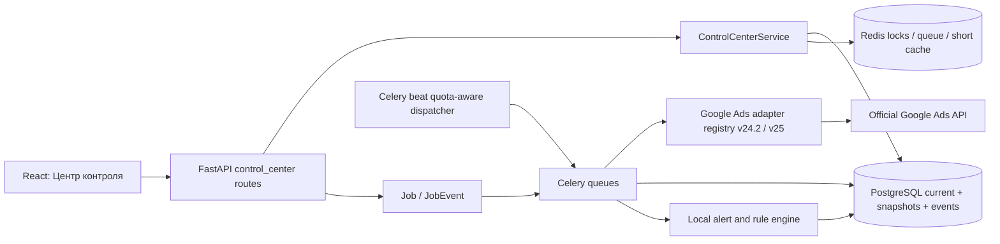

# Финальный план «Центра контроля»

Дата проектирования: **2026-07-27**. Это план целевой рабочей версии, а не
временного MVP. Реализация, миграции и live-запросы на этом этапе не выполнялись.

## 1. Цели и неизменяемые границы

### 1.1. Цель

Добавить отдельный пункт основного меню **«Центр контроля»** с единым
мониторингом и безопасным управлением Google Ads customer accounts через MCC:
аккаунты, кампании, ad groups, ads, assets, статистика, policy, advertiser
verification, ошибки, change history, локальные rules, saved views и sync
settings.

### 1.2. Что остаётся нетронутым

- Мастер автозалива, templates, media, schedules, Campaign Multiplier,
  launch groups и их модели продолжают работать самостоятельно.
- «Статистика», «Модерация», «Финансы», «Уведомления», «Аккаунты MCC» и
  «Подключения Google» не удаляются и не переименовываются.
- Existing OAuth credentials, Developer Token, refresh token, подключения и
  PostgreSQL data не копируются в новые таблицы.
- Новый раздел читает credentials только через существующий adapter factory.

Текущая изоляция Google Ads уже зафиксирована в adapter layer.
[architecture.md](architecture.md), [service.py](../backend/app/google_ads/service.py),
текущий код/v24.2, 2026-07-27, `CONFIRMED_BY_CURRENT_CODE`.

### 1.3. Версионный prerequisite

Перед созданием monitoring queries нужен adapter v25 и Python client library
`google-ads>=31.2.0`, при этом v24.2 остаётся доступен как временный fallback до
завершения contract tests. v25 выпущен 2026-07-22; v24.2 sunset - июнь 2027.
[Release notes](https://developers.google.com/google-ads/api/docs/release-notes),
[sunset table](https://developers.google.com/google-ads/api/docs/sunset-dates),
v25/v24.2, 2026-07-27, `CONFIRMED_BY_OFFICIAL_DOCS`.

## 2. Целевая архитектура



Решение: PostgreSQL является source of truth для UI; Redis хранит только
короткоживущие locks/cache/queue state. Потеря Redis не должна удалять историю
или менять Google Ads. Это соответствует текущему использованию PostgreSQL,
Redis и Celery.
[models.py](../backend/app/db/models.py),
[celery_app.py](../backend/app/jobs/celery_app.py), текущий код,
2026-07-27, `CONFIRMED_BY_CURRENT_CODE`.

### 2.1. Backend-модули

Новые файлы:

- `backend/app/control_center/schemas.py` - typed filters, rows, details,
  actions, rules и exports;
- `backend/app/control_center/service.py` - use cases и permission checks;
- `backend/app/control_center/repository.py` - server-side filtering,
  pagination, aggregates;
- `backend/app/control_center/gaql.py` - versioned query definitions и query
  fingerprints;
- `backend/app/control_center/freshness.py` - source timestamps, stale policy,
  timezone windows;
- `backend/app/control_center/actions.py` - preview/validate/confirm/reconcile;
- `backend/app/control_center/rules.py` - immutable rule AST evaluation;
- `backend/app/control_center/alerts.py` - transitions -> local alerts;
- `backend/app/control_center/exports.py` - streamed CSV/XLSX from filtered
  read model;
- `backend/app/api/routes/control_center.py` - только HTTP contract;
- `backend/app/jobs/control_center_tasks.py` - read sync, actions, rules,
  aggregates, retention;
- `backend/app/google_ads/versions/v25/adapter.py` - v25 implementation;
- `backend/app/google_ads/registry.py` - version selection/capabilities.

Изменяемые существующие файлы:

- `backend/app/google_ads/interface.py` - новые read/action protocols без
  привязки к UI;
- `backend/app/google_ads/service.py` - registry вместо hard-coded adapter;
- `backend/app/db/models.py` - additive models/columns;
- `backend/app/api/routes/__init__.py` и FastAPI router registration;
- `backend/app/jobs/celery_app.py` - отдельные periodic dispatchers/queues;
- `backend/app/core/config.py` или `ApplicationSetting` capability - feature
  flag, без секретов.

Версионная изоляция продолжает текущий adapter pattern.
[interface.py](../backend/app/google_ads/interface.py),
[service.py](../backend/app/google_ads/service.py), текущий код/v24.2,
2026-07-27, `CONFIRMED_BY_CURRENT_CODE`.

### 2.2. Frontend

Новый route: `/control-center`. Внутренний router/tab state:

- `overview`;
- `accounts`;
- `campaigns`;
- `ads-assets`;
- `moderation`;
- `verification`;
- `errors`;
- `changes`;
- `rules`;
- `views`;
- `sync-settings`.

Новые файлы:

- `frontend/src/pages/ControlCenterPage.tsx`;
- `frontend/src/components/control-center/ControlCenterShell.tsx`;
- `ScopeSelector.tsx`, `FilterBuilder.tsx`, `ColumnManager.tsx`;
- `AccountTable.tsx`, `EntityTable.tsx`, `BulkActionBar.tsx`;
- `AccountDetails.tsx`, `FreshnessIndicator.tsx`, `StatusCell.tsx`;
- `ActionPreviewDialog.tsx`, `ActionResultDrawer.tsx`;
- `RuleEditor.tsx`, `RuleHistory.tsx`;
- `SavedViewMenu.tsx`, `SyncHealthPanel.tsx`;
- `frontend/src/api/controlCenter.ts` и typed contracts.

Изменить только registration/navigation в `frontend/src/app/App.tsx`.
Текущие operations/settings routes остаются самостоятельными.
[App.tsx](../frontend/src/app/App.tsx), текущий код, 2026-07-27,
`CONFIRMED_BY_CURRENT_CODE`.

### 2.3. Обмен обновлениями с UI

Решение: обычный polling локального API каждые 15 секунд для активного job/action
и каждые 30-60 секунд для overview. UI polling не вызывает Google Ads напрямую.
SSE/WebSocket не нужен в первой финальной версии: Google data сама приходит с
задержкой, а локальные jobs уже имеют persistent status/events. Возможность SSE
остаётся extension point, если появится много одновременных операторов.

Google прямо указывает, что performance data не мгновенна и может запаздывать на
часы.
[Data freshness](https://support.google.com/google-ads/answer/2544985?hl=en-ca),
Google Ads reporting/v25, 2026-07-27, `CONFIRMED_BY_OFFICIAL_DOCS`.

## 3. Additive data model

### 3.1. Расширение существующего каталога

`customer_accounts` остаётся canonical identity. Additive columns:

- `parent_customer_id` nullable;
- `hierarchy_level`;
- `link_status`;
- `first_seen_at`, `last_seen_at`, `detached_at`, `archived_at`;
- `last_complete_hierarchy_run_id`;
- `geo_code` nullable, только локально назначаемый;
- `notes` nullable;
- optimistic `row_version`.

Google отдаёт hierarchy/status/link, но не first/last/detached dates.
[CustomerClient](https://developers.google.com/google-ads/api/reference/rpc/v25/CustomerClient),
[customer_client_link](https://developers.google.com/google-ads/api/fields/v25/customer_client_link),
v25, 2026-07-27, `CONFIRMED_BY_OFFICIAL_DOCS` для Google fields;
локальные даты `NOT_SUPPORTED` Google и вычисляются приложением.

Ограничения/индексы:

- сохранить `UNIQUE(connection_id, customer_id)`;
- `INDEX(connection_id, parent_customer_id, hierarchy_level)`;
- `INDEX(connection_id, status, detached_at)`;
- disappearance фиксировать только после `sync_run.status=SUCCEEDED` и
  `is_complete=true`; partial sync не detaches accounts.

### 3.2. Current state

| Таблица | Назначение | Ключевые поля | Constraints / indexes |
|---|---|---|---|
| `account_monitoring_state` | Быстрая строка account table | account FK, account/link/verification/billing summary, active/paused campaign counts, review/disapproved counts, today/yesterday/period rollups, last status change, per-domain sync timestamps, freshness, latest error/request ID | `UNIQUE(account_id)`; indexes status, verification status, freshness, last error |
| `campaign_monitoring_state` | Current campaign catalog | account FK, Google resource name/id/name, channel/subtype, configured/primary status/reasons, budget FK/amount/shared flag, bidding type, start/end, latest metrics/freshness | `UNIQUE(account_id, resource_name)`; indexes account+status, account+name, budget resource |
| `ad_group_monitoring_state` | Current ad group catalog | campaign FK/resource, status, primary status/reasons, name, latest metrics/freshness | `UNIQUE(account_id, resource_name)` |
| `ad_monitoring_state` | Current ad catalog | ad group/campaign refs, ad id/type, status, primary status/reasons, policy summary, latest metrics | `UNIQUE(account_id, resource_name)`; policy/status indexes |
| `asset_link_monitoring_state` | Demand Gen ad-asset context | ad resource, asset resource/type, field type, enabled/source/performance label, policy summary, latest metrics | `UNIQUE(account_id, ad_resource_name, asset_resource_name, field_type)` |
| `billing_monitoring_state` | Только доступный monthly-invoicing summary | billing setup/payment/account budget/invoice summary + capability `SUPPORTED/NOT_APPLICABLE/UNKNOWN` | `UNIQUE(account_id)` |
| `sync_policies` | Per-connection/account cadence | active/archive intervals, enabled domains, quota tier, manual override | `UNIQUE(connection_id, account_id nullable)` |
| `quota_usage_daily` | Защита developer-token quota | credential fingerprint, date, read/mutate/failed operation counts, reserved/limit | `UNIQUE(token_fingerprint, quota_date)` |

`Campaign`, `AdGroup`, `AdGroupAd`, `CampaignBudget` и
`AdGroupAdAssetView` существуют в v25.
[v25 fields overview](https://developers.google.com/google-ads/api/fields/v25/overview),
v25, 2026-07-27, `CONFIRMED_BY_OFFICIAL_DOCS`.

### 3.3. Snapshots и events

| Таблица | Гранулярность / содержимое | Dedupe key | Default retention |
|---|---|---|---|
| `account_status_events` | account/link/hidden/detached status transitions, source run, observed time | `(account_id, event_type, source_fingerprint)` | 7 лет |
| `account_metric_snapshots` | account, hour/day, account-local raw bucket, UTC bounds, metrics, dimension hash, source version | `(account_id, grain, bucket_start_raw, dimension_hash, query_version)` | hourly 90 дней; daily 37 месяцев; monthly 7 лет |
| `campaign_metric_snapshots` | campaign, hour/day, те же period metadata и metrics | `(campaign_state_id, grain, bucket_start_raw, dimension_hash, query_version)` | hourly 90 дней; daily 37 месяцев; monthly 7 лет |
| `policy_snapshots` | ad или ad-asset, approval/review/primary status, topics/evidence, observed time | `(subject_type, subject_resource_name, content_hash)` | 24 месяца; transitions 7 лет |
| `verification_snapshots` | program, requirement deadlines, status, безопасный признак action URL/expiration | `(account_id, program, content_hash)` | 24 месяца; transitions 7 лет |
| `google_change_events` | ChangeStatus/ChangeEvent source, resource, operation, changed fields, redacted old/new, user/client if available | Google resource name + timestamp + stable payload hash | 7 лет; `user_email` redaction policy отдельно |
| `alert_events` | Derived transition/rule/error alert | `(alert_type, subject, source_event_id, rule_id nullable)` | 24 месяца |

Google сохраняет granular report data 37 месяцев, high-level/billing до 11 лет,
ChangeStatus доступен 90 дней, ChangeEvent 30 дней. Локальное хранение дольше
API windows нужно для истории, но сроки выше являются проектными defaults и
должны соответствовать политике хранения организации.
[Zero metrics/retention](https://developers.google.com/google-ads/api/docs/reporting/zero-metrics),
[ChangeStatus](https://developers.google.com/google-ads/api/docs/change-status),
[ChangeEvent](https://developers.google.com/google-ads/api/docs/change-event),
v25, 2026-07-27, `CONFIRMED_BY_OFFICIAL_DOCS` для Google windows.

### 3.4. Runs, errors и действия

| Таблица | Назначение | Constraints / важные поля |
|---|---|---|
| `sync_runs` | Один logical sync: hierarchy/stats/policy/verification/change/billing/manual | connection, type, trigger, scheduled window, query version, status, completeness, started/finished, quota operations, cursor, idempotency key; `UNIQUE(idempotency_key)` |
| `sync_run_items` | Per-account/query result | run, account, query kind, attempt, status, rows, request ID, error FK, timing; `UNIQUE(run_id, account_id, query_kind)` |
| `google_api_errors` | Structured redacted diagnostics | canonical/granular code, message, field path, request ID, customer, service/method, retryable, attempt, first/last seen, occurrence count, resolved_at; `UNIQUE(request_id, error_ordinal)` where request ID exists |
| `action_requests` | Immutable user intent and preview | actor, action type, selected resources, requested values, pre-state hash, preview, validation status, confirmation deadline, idempotency key, status; `UNIQUE(idempotency_key)` |
| `action_runs` | Execution group, обычно per customer | request, customer, validate/execution request IDs, status, started/finished, ambiguous flag, reconciliation status |
| `action_run_items` | Per resource result | action run, operation index, resource, before/intended/after, status, error, reversible; `UNIQUE(action_run_id, operation_index)` |

`GoogleAdsError` включает granular code/message/location, а request ID доступен
на error и response metadata.
[Understand API errors](https://developers.google.com/google-ads/api/docs/best-practices/understand-api-errors),
v25, 2026-07-27, `CONFIRMED_BY_OFFICIAL_DOCS`.

### 3.5. Пользовательские представления и классификация

| Таблица | Назначение | Constraints |
|---|---|---|
| `saved_views` | Scope, route/level, filters, sort, grouping, period/timezone mode, column preset ref, owner/share mode | `UNIQUE(owner_user_id, entity_level, name)`; versioned JSON schema |
| `column_presets` | Visible/order/pinned/width/format columns | `UNIQUE(owner_user_id, entity_level, name)`; whitelist field IDs |
| `account_groups` | Локальные static/dynamic группы | owner/name, filter AST, dynamic flag; unique owner+name |
| `account_group_members` | Static membership | `UNIQUE(group_id, account_id)` |
| `account_tags` | Tenant/user-defined tags | normalized name/color; `UNIQUE(owner_scope, normalized_name)` |
| `account_tag_links` | Many-to-many tags | `UNIQUE(account_id, tag_id)` |

Filters/columns никогда не содержат raw SQL; сервер принимает только versioned
whitelist schema. Это проектное security решение.

### 3.6. Rules

Не создавать отдельную дублирующую таблицу `alert_rules`. Notification-only
rule - это `rule_definitions.mode=NOTIFY_ONLY`.

| Таблица | Назначение | Constraints |
|---|---|---|
| `rule_definitions` | Versioned name, scope type, metric window/timezone, AND/OR AST, action, mode `DRY_RUN/NOTIFY_ONLY/ACTION`, cadence, priority, safeguards, enabled | unique owner+name+active version |
| `rule_assignments` | Account/group/dynamic scope assignment | unique rule version+scope |
| `rule_evaluations` | Input snapshot version, conditions, result, explanation, freshness/lag decision | `UNIQUE(rule_version_id, subject_key, evaluation_window_start)` |
| `rule_actions` | Intended/executed/skipped action linked to evaluation/action request | `UNIQUE(evaluation_id, subject_resource_name, action_fingerprint)` |
| `rule_runtime_state` | Cooldown, counters, circuit, last success/failure | `UNIQUE(rule_id, subject_key)` |
| `rule_global_control` | Один kill switch и reason/audit | singleton constraint |

Отдельного Google Ads UI Automated Rules resource/service в v25 reference нет.
[v25 overview](https://developers.google.com/google-ads/api/reference/rpc/v25/overview),
v25, 2026-07-27, `NOT_SUPPORTED`.

## 4. API contract

Все list endpoints используют cursor pagination, `limit<=200`, server-side
filter/sort и возвращают `data_as_of`, `sync_state`, `freshness` и
`source=LIVE_SYNC|CACHED|STALE|ARCHIVED`.

### 4.1. Read endpoints

```text
GET  /api/control-center/overview
GET  /api/control-center/accounts
GET  /api/control-center/accounts/{account_id}
GET  /api/control-center/accounts/{account_id}/timeline
GET  /api/control-center/accounts/{account_id}/metrics
GET  /api/control-center/campaigns
GET  /api/control-center/ad-groups
GET  /api/control-center/ads
GET  /api/control-center/assets
GET  /api/control-center/moderation
GET  /api/control-center/verification
GET  /api/control-center/errors
GET  /api/control-center/changes
GET  /api/control-center/sync-runs
GET  /api/control-center/sync-runs/{run_id}
GET  /api/control-center/quota
```

### 4.2. Read-only commands and local preferences

```text
POST /api/control-center/sync-runs
POST /api/control-center/exports
GET  /api/control-center/exports/{job_id}
GET|POST|PATCH|DELETE /api/control-center/saved-views[/{id}]
GET|POST|PATCH|DELETE /api/control-center/column-presets[/{id}]
GET|POST|PATCH|DELETE /api/control-center/groups[/{id}]
GET|POST|PATCH|DELETE /api/control-center/tags[/{id}]
GET|PATCH /api/control-center/sync-settings
```

`POST /sync-runs` только создаёт durable job; API process не выполняет полный
Google sync синхронно. Это исправляет текущую ограниченную модель account sync.
[accounts.py](../backend/app/api/routes/accounts.py), текущий код/v24.2,
2026-07-27, `CONFIRMED_BY_CURRENT_CODE`.

### 4.3. Actions

```text
POST /api/control-center/actions/preview
POST /api/control-center/actions/{request_id}/confirm
POST /api/control-center/actions/{request_id}/cancel
GET  /api/control-center/actions/{request_id}
GET  /api/control-center/action-runs
```

Preview response:

- exact resources grouped by customer;
- current status/budget and data age;
- intended state and reversible flag;
- shared-budget affected campaigns;
- blocked items/reasons;
- estimated mutate operations;
- `validate_only` outcome per item;
- confirmation phrase, expires at, immutable preview hash.

Action endpoint не принимает arbitrary resource names без проверки ownership к
selected connection/MCC и normalised customer ID.

## 5. Celery jobs и очереди

### 5.1. Jobs

| Job | Google request | Результат |
|---|---|---|
| `dispatch_monitoring_due` | Нет | Выбирает due policies с `SKIP LOCKED`, quota budget и jitter |
| `sync_mcc_hierarchy` | `SearchStream customer_client`; рекурсивно managers; direct `customer_client_link` | Catalog, parent edges, link/account status, first/last/detached |
| `sync_account_core` | Campaign/customer GAQL | Entity state + current-period core metrics |
| `sync_ad_groups` | Ad group GAQL | Current ad groups и metrics |
| `sync_ads_policy` | Ad group ad GAQL | Ads, primary/policy state |
| `sync_asset_policy` | `ad_group_ad_asset_view` GAQL | Demand Gen asset links/policy/performance |
| `sync_identity_verification` | `GetIdentityVerification` | Verification snapshot/transition |
| `sync_change_status` | GAQL `change_status` | Dirty resource markers |
| `sync_change_events` | GAQL `change_event` | Detailed local history |
| `sync_billing_readonly` | Billing setup GAQL, payments/invoice methods where applicable | Monthly-invoicing capability/state |
| `aggregate_monitoring_metrics` | Нет | Account/campaign today/yesterday/period rollups |
| `detect_monitoring_alerts` | Нет | Status/policy/verification/error transitions |
| `evaluate_rules` | Нет до action | Versioned evaluations и explanations |
| `execute_confirmed_action` | Mutate per customer | Per-item result/request ID |
| `reconcile_action` | Fresh Search/ChangeEvent | Resolve success/ambiguous timeout |
| `build_control_center_export` | Нет | CSV/XLSX from DB snapshot |
| `compact_monitoring_history` | Нет | Retention/rollup/redaction |

Google `SearchStream` считается одной operation независимо от batches.
[Quota guide](https://developers.google.com/google-ads/api/docs/best-practices/quotas#search_requests),
v25, 2026-07-27, `CONFIRMED_BY_OFFICIAL_DOCS`.

### 5.2. Queues и concurrency

- `google-read-critical`: account status, verification near deadline, manual
  refresh, post-action reconciliation;
- `google-read-bulk`: metrics, policy, change history, billing;
- `google-actions`: только confirmed user/rule actions, concurrency 1 per
  customer;
- `control-maintenance`: aggregates, exports, retention.

Redis lock key:
`control:{connection_id}:{customer_id}:{sync_domain}` с lease + heartbeat.
PostgreSQL unique idempotency constraints остаются окончательной защитой.
Existing scheduler уже использует heartbeat, retry и `SKIP LOCKED`.
[schedule_tasks.py](../backend/app/jobs/schedule_tasks.py), текущий код,
2026-07-27, `CONFIRMED_BY_CURRENT_CODE`.

## 6. Polling, свежесть и квоты

### 6.1. Правила расчёта

- Basic Access: 15 000 operations/day на developer token.
- Один `Search`/`SearchStream` = 1 operation.
- `GetIdentityVerification` = 1 operation.
- Mutate quota учитывает mutate operations, а GoogleAdsFailure тоже расходует
  quota.
- Rows/batches внутри одного `SearchStream` не меняют daily operation count.

[API limits](https://developers.google.com/google-ads/api/docs/best-practices/quotas),
v25, 2026-07-27, `CONFIRMED_BY_OFFICIAL_DOCS`.

Расчёт ниже консервативный. `M` - количество descendant manager accounts,
которые надо обойти для точного parent tree. Hierarchy: root query каждый час
`24` + один полный recursive pass/day `M`. В примерах приняты `M=4/10/20`.

Один request выполняется для одного customer и одного GAQL `FROM` resource.
Поэтому «полная статистика» не считается одним условным вызовом: campaign,
ad group, ad, ad-asset и video представлены отдельными query shapes. Account
rollup для выбранного Demand Gen scope строится локально из campaign rows, чтобы
не расходовать ещё один request только ради суммы.
[Reporting overview](https://developers.google.com/google-ads/api/docs/reporting/overview),
[GAQL structure](https://developers.google.com/google-ads/api/docs/query/structure),
v25, 2026-07-27, `CONFIRMED_BY_OFFICIAL_DOCS`.

### 6.2. Рекомендуемые сценарии

| Домен | 20 accounts | 50 accounts | 100 accounts |
|---|---:|---:|---:|
| MCC root hourly + recursive daily | `24+4=28` | `24+10=34` | `24+20=44` |
| Campaign state + metrics; account rollup локально | каждые 30 мин: `48*20=960` | ежечасно: `24*50=1 200` | ежечасно: `24*100=2 400` |
| Ad group state + metrics | каждые 2 ч: `12*20=240` | каждые 4 ч: `6*50=300` | каждые 6 ч: `4*100=400` |
| Ad state + metrics + policy | каждые 2 ч: `12*20=240` | каждые 4 ч: `6*50=300` | каждые 6 ч: `4*100=400` |
| Ad-asset state + metrics + policy | каждые 2 ч: `12*20=240` | каждые 4 ч: `6*50=300` | каждые 6 ч: `4*100=400` |
| Video/asset detail | каждые 6 ч: `4*20=80` | каждые 12 ч: `2*50=100` | раз в сутки: `1*100=100` |
| `ChangeStatus` | каждые 15 мин: `96*20=1 920` | каждые 30 мин: `48*50=2 400` | ежечасно: `24*100=2 400` |
| Identity verification | 2 раза/день: `40` | `100` | `200` |
| Billing capability/state, резерв до 3 read shapes/account/day | `3*20=60` | `3*50=150` | `3*100=300` |
| `ChangeEvent` expected budget | до 6/account/day: `120` | до 4: `200` | до 3: `300` |
| Daily reconciliation/backfill | `20` | `50` | `100` |
| **Фоновый итог** | **3 948** | **5 134** | **7 044** |
| Плановый резерв manual refresh/actions/errors | `500` | `750` | `1 500` |
| **Плановое потребление** | **4 448 (29.7%)** | **5 884 (39.2%)** | **8 544 (57.0%)** |
| Свободно от Basic 15 000 | `10 552` | `9 116` | `6 456` |

Это расчёт scheduler operations, а не обещание фактического ровного расхода.
Ошибки GoogleAdsFailure, дополнительные sub-managers, manual refresh и actions
увеличивают расход; invoice read добавляется только в нужный месячный период, а
quota controller считает фактические operations. Если конкретный GAQL shape
превысит response-size limit, его дробление на дополнительные непагинационные
requests также уменьшит резерв.
[API limits](https://developers.google.com/google-ads/api/docs/best-practices/quotas),
v25, 2026-07-27, `CONFIRMED_BY_OFFICIAL_DOCS`.

### 6.3. Ручные операции

- Full manual refresh одного account: campaign `1` + ad group `1` + ad `1` +
  ad-asset `1` + video/asset `1` + ChangeStatus `1` + identity `1` + до `3`
  billing reads = примерно `7-10` operations; при найденных изменениях
  ChangeEvent добавляет ещё `1`.
- Action над `N` independent resources одного customer: fresh pre-read `1` +
  conservative `N` validate-only operations + `N` actual mutate operations +
  read-back `1` = планировать примерно `2N+2`. Google считает daily usage как
  сумму get requests и mutate operations, а не число mutate HTTP/gRPC calls;
  telemetry на test account всё равно сверяет локальный ledger.
  [API limits](https://developers.google.com/google-ads/api/docs/best-practices/quotas),
  v25, 2026-07-27, `CONFIRMED_BY_OFFICIAL_DOCS`.
- Manual refresh ограничить: не чаще 1 полного refresh/account/5 минут, повторный
  пользователь получает существующий run.
- При 80% daily quota background polling замедляется; при 90% остаются critical
  status/verification reads и confirmed actions; при 95% actions требуют
  отдельного admin override, а background stops.

### 6.4. Adaptive polling

| Состояние | Core metrics | Status/change | Policy | Verification | Billing |
|---|---|---|---|---|---|
| Active + spend today | По tier table | По tier table | По tier table | 12 ч; 1 ч около deadline | 24 ч |
| Active без spend 24 ч | 2-4 ч | 1-2 ч | 12 ч | 24 ч | 24 ч |
| `SUSPENDED` / `CANCELED` | 12 ч | 2-4 ч | 24 ч | 24 ч | 24 ч |
| Detached/archive | Не чаще 24 ч, если доступ ещё есть | 12-24 ч | Остановить после потери access | 24-48 ч | 48 ч |
| Sync error transient | Backoff 1m, 2m, 4m + jitter, bounded | То же | То же | Serialized queue | То же |
| Auth/permission error | Остановить автоматический retry до исправления | Остановить | Остановить | Остановить | Остановить |

Identity service имеет более строгий, но неопубликованный per-minute rate limit;
очередь должна сериализовать вызовы, например один старт каждые 2 секунды с
jitter, а значение сделать configurable после telemetry.
[Verification guide](https://developers.google.com/google-ads/api/docs/account-management/advertiser-identity-verification),
v25, 2026-07-27, `CONFIRMED_BY_OFFICIAL_DOCS` для long polling;
точный pacing `REQUIRES_LIVE_VALIDATION`.

### 6.5. Freshness contract

Каждая строка содержит:

- `source_observed_at` - когда Google data относится к периоду;
- `synced_at` - когда API ответ получен;
- `aggregated_at` - когда local read model пересчитана;
- `source_api_version` и `query_version`;
- `freshness=LIVE_SYNC|CACHED|STALE|ARCHIVED`;
- `stale_reason`;
- period timezone mode и точные UTC/local boundaries.

Recommended stale thresholds:

- account/link status: 2 часа;
- core metrics: 4 часа;
- policy: 8 часов;
- verification: 24 часа, но 2 часа близко к deadline;
- change events: 2 часа;
- billing: 48 часов.

Google data delay остаётся отдельной подписью: «Google может корректировать
данные». UI не называет polling «реальным временем».
[Data freshness](https://support.google.com/google-ads/answer/2544985?hl=en-ca),
Google Ads reporting/v25, 2026-07-27, `CONFIRMED_BY_OFFICIAL_DOCS`.

## 7. Временные окна

### 7.1. Локальный день аккаунта

Запрашивать `segments.date` и при необходимости `segments.hour`, хранить raw
bucket в account timezone. Итоги разных аккаунтов показывать с подписью
«Каждая строка в локальном дне своего аккаунта», не как одно абсолютное окно.
Google time-segmented reports используют account timezone.
[Timezone help](https://support.google.com/google-ads/answer/17006726?hl=en),
Google Ads reporting/v25, 2026-07-27, `CONFIRMED_BY_OFFICIAL_DOCS`.

### 7.2. Московские сутки UTC+3

1. Определить Moscow interval `[00:00, 24:00)` и UTC boundaries.
2. Для каждого account через IANA `customer.time_zone` определить local
   intervals, запросить перекрывающие hourly buckets.
3. Конвертировать bucket boundaries в UTC, включать по half-open interval.
4. Dedupe key включает account, local date/hour, timezone, dimension hash и
   query version.
5. Для whole-hour offsets результат точный.
6. Для half-hour offsets пометить `APPROXIMATE_BOUNDARY_30M`; recommended default
   - исключить такую строку из «точного общего итога» и показать отдельно.
7. DST обрабатывать IANA tzdata; repeated/missing hour покрыть fixture tests и
   затем read-only acceptance.

Google поддерживает whole-hour и half-hour account offsets, а report segment
остаётся часовым.
[Timezone help](https://support.google.com/google-ads/answer/17006726?hl=en),
v25, 2026-07-27, `REQUIRES_LIVE_VALIDATION` для пограничных buckets.

## 8. Ручные действия

### 8.1. Разрешённый набор

- Campaign: `PAUSED` / `ENABLED`.
- Ad group: `PAUSED` / `ENABLED`.
- Ad group ad: `PAUSED` / `ENABLED`.
- Campaign budget: установить absolute amount, увеличить/уменьшить на amount
  или percent после вычисления final `amount_micros`.

Соответствующие mutate services официально доступны.
[Mutating overview](https://developers.google.com/google-ads/api/docs/mutating/overview),
[CampaignBudgetService](https://developers.google.com/google-ads/api/reference/rpc/v25/CampaignBudgetService),
v25, 2026-07-27, `CONFIRMED_BY_OFFICIAL_DOCS`.

### 8.2. Обязательный workflow

1. Проверить app permission, CSRF, connection ownership и numeric
   customer/login customer IDs.
2. Fresh read account/resource state; запретить stale/incomplete/suspended
   selection.
3. Построить immutable preview и impact, включая shared budgets.
4. Выполнить `validate_only`; operation errors показать до confirm.
5. Потребовать явное подтверждение. Для bulk/budget increase - второй шаг с
   количеством объектов, валютой, old/new total и confirmation phrase.
6. После confirm проверить preview hash/expiry и fresh state ещё раз.
7. Group by customer. Independent operations могут использовать
   `partial_failure=True`; dependent operations - atomic request
   `partial_failure=False`.
8. Сохранить per-item outcome и request ID.
9. Read-back/ChangeEvent reconciliation.
10. Создать audit + alert; не скрывать partial failures.

`validate_only` и `partial_failure` описаны в official mutate request.
[MutateAdGroupAdsRequest](https://developers.google.com/google-ads/api/reference/rpc/v25/MutateAdGroupAdsRequest),
v25, 2026-07-27, `CONFIRMED_BY_OFFICIAL_DOCS`.

### 8.3. Idempotency и ambiguous results

Local idempotency key:

```text
sha256(actor + action_type + sorted_resources + intended_values
       + pre_state_hash + confirmation_nonce)
```

Server-side general idempotency key в mutate contract отсутствует. При
`DEADLINE_EXCEEDED` после отправки не делать blind retry: отметить run
`AMBIGUOUS`, выполнить fresh read и ChangeEvent; повторить только если current
state однозначно остался прежним и policy разрешает.
[MutateGoogleAdsRequest](https://developers.google.com/google-ads/api/reference/rpc/v25/MutateGoogleAdsRequest),
v25, 2026-07-27, `NOT_SUPPORTED` для server idempotency key.

### 8.4. Default limits

- максимум 100 selected resources/action request;
- максимум 20 accounts/bulk action;
- budget increase не более 20% и не более configurable absolute amount за один
  action;
- не более 50 mutate operations/hour/user и 200/day/user до admin override;
- automatic ENABLE всегда off по умолчанию;
- account state старше 15 минут блокирует mutate до fresh read.

Значения являются проектными безопасными defaults и требуют бизнес-решения
пользователя до action phase.

## 9. Local rules engine

### 9.1. Scope и условия

Scope: account, campaign, explicit account set, account group, GEO, name filter.
Period: today/yesterday/rolling N hours/days, timezone mode. Conditions:
AND/OR tree из spend, clicks, impressions, conversions, CPA, CTR, CPC, status,
disapproved/review counts, no spend, no impressions.

Actions: `NOTIFY`, `PAUSE`, `ENABLE`, `SET_BUDGET`, `CHANGE_BUDGET_AMOUNT`,
`CHANGE_BUDGET_PERCENT`.

Google metrics доступны через GAQL, но conversions имеют задержку.
[Reporting overview](https://developers.google.com/google-ads/api/docs/reporting/overview),
[Data freshness](https://support.google.com/google-ads/answer/2544985?hl=en-ca),
v25, 2026-07-27, `CONFIRMED_BY_OFFICIAL_DOCS`.

### 9.2. Обязательные safeguards

- Новый rule создаётся в `DRY_RUN`; переход в `NOTIFY_ONLY`, затем `ACTION`
  требует отдельного подтверждения.
- `ENABLE` запрещён для automatic mode по умолчанию.
- `stale_data_guard`: ни одно condition/action при stale/incomplete sync.
- `conversion_delay_guard`: rules с conversions/CPA не используют слишком
  свежий период; default lag 15 часов для non-last-click-sensitive decisions.
- `cooldown` per rule + subject.
- maximum actions/hour/day, maximum affected accounts/resources.
- maximum budget delta/final amount и currency-aware preview.
- `circuit_breaker` по error rate и anomalous match rate.
- overlap lock + unique evaluation/action fingerprints.
- priorities и explicit conflict resolution:
  `PAUSE > NOTIFY > budget decrease > budget increase > ENABLE`;
  lower-priority conflicting action becomes `SKIPPED_CONFLICT`.
- history каждого evaluation, input snapshot IDs и human-readable explanation.
- rollback только для reversible action и только после fresh-state check; это
  новая action, а не удаление истории.
- global kill switch прекращает создание новых rule actions, но не read sync.
- manual actions имеют приоритет; rule sees resulting fresh state.
- detached/suspended/archive accounts никогда не получают mutate.

### 9.3. Evaluation flow

```text
due rule
-> acquire rule/scope lock
-> freeze input snapshot set
-> freshness + conversion lag + quota checks
-> evaluate versioned AST
-> persist explanation
-> DRY_RUN / notify / create action_request
-> optional manual confirmation or guarded execution
-> reconcile
-> counters, alerts, audit
```

Google не предоставляет отдельный resource для Google Ads UI Automated Rules.
[v25 reference index](https://developers.google.com/google-ads/api/reference/rpc/v25/overview),
v25, 2026-07-27, `NOT_SUPPORTED`.

## 10. Alerts и ошибки

### 10.1. События

Создавать local alert при:

- account/link status transition;
- detached/reattached;
- verification requirement/status/deadline;
- ad/ad-asset policy transition;
- sync stale/incomplete;
- auth/quota/repeated transient error;
- billing setup/account budget/invoice transition, если поддерживается;
- manual/rule action partial failure/ambiguous result;
- global rule circuit/kill switch.

Общего Notifications API нет, поэтому UI должен показывать `Источник:
локальный мониторинг Google Ads API`.
[v25 reference index](https://developers.google.com/google-ads/api/reference/rpc/v25/overview),
v25, 2026-07-27, `NOT_SUPPORTED`.

### 10.2. Retry classification

- Retry: gRPC `UNAVAILABLE`, `DEADLINE_EXCEEDED`, `INTERNAL`, `UNKNOWN`,
  `ABORTED`; bounded exponential backoff + jitter.
- `RESOURCE_EXHAUSTED`: quota-aware defer, не обычный tight retry.
- Не retry без исправления: `INVALID_ARGUMENT`, `NOT_FOUND`,
  `PERMISSION_DENIED`, `FAILED_PRECONDITION`, `UNAUTHENTICATED` и policy/input
  errors.
- Любой неизвестный code сохранять structured и отправлять на manual review.

[Understand API errors](https://developers.google.com/google-ads/api/docs/best-practices/understand-api-errors),
v25, 2026-07-27, `CONFIRMED_BY_OFFICIAL_DOCS`.

## 11. Billing

Первая версия только read-only:

- `BillingSetup` status и payments identifiers;
- `PaymentsAccount` metadata, если доступно manager;
- `AccountBudget` spending limit/served/adjustments/status для monthly invoicing;
- monthly `Invoice` metadata/PDF URL.

Для automatic-pay accounts показывать capability:
`NOT_AVAILABLE_VIA_GOOGLE_ADS_API`, а не пустой баланс. Не выводить outstanding
balance, threshold, next charge, card history, payment verification, failed
payment reason или suspicious activity.
[Billing overview](https://developers.google.com/google-ads/api/docs/billing/overview),
v25, 2026-07-27, `CONFIRMED_BY_OFFICIAL_DOCS` для monthly invoicing;
`NOT_SUPPORTED` для automatic-pay данных.

Future extension point:

```text
FinanceProvider.capabilities()
FinanceProvider.fetch_account_state()
FinanceProvider.fetch_transactions()
FinanceProvider.fetch_threshold_projection()
```

Brocard не подключается к «Центру контроля» в обязательной версии. Existing
Brocard code остаётся в своём разделе.
[brocard.py](../backend/app/integrations/brocard.py), текущий код,
2026-07-27, `CONFIRMED_BY_CURRENT_CODE`.

## 12. Security и permissions

### 12.1. Existing controls to reuse

- OAuth refresh tokens и credentials хранятся зашифрованно через
  `GoogleCredential`.
- FastAPI session auth, CSRF и current roles уже существуют.
- AuditLog и Job/JobEvent уже существуют.

[models.py](../backend/app/db/models.py),
[google_connections.py](../backend/app/api/routes/google_connections.py),
текущий код, 2026-07-27, `CONFIRMED_BY_CURRENT_CODE`.

### 12.2. Новые permissions

- `control_center.read`;
- `control_center.export`;
- `control_center.sync`;
- `control_center.action`;
- `control_center.bulk_action`;
- `control_center.rules_read`;
- `control_center.rules_manage`;
- `control_center.rules_activate`;
- `control_center.settings_manage`.

Role defaults:

- Viewer: read, без secret/error raw payload и без export по умолчанию;
- Operator: read, sync, preview, single action;
- Manager: bulk actions/rules activation;
- Admin: settings, limits, kill switch.

### 12.3. Обязательные проверки

- `customer_id` и `login_customer_id`: только digits, без дефисов, membership в
  выбранном connection hierarchy.
- API никогда не принимает developer token/OAuth secret от frontend.
- Secrets, action URL, raw authorization headers и credentials не попадают в
  logs, errors, exports и audit payload.
- Error message проходит redaction; request ID сохраняется.
- Exports используют тот же permission/scope/filter, имеют expiry и audit.
- Action подтверждение привязано к actor/session/preview hash и истекает.
- Bulk action показывает skipped/ineligible objects до подтверждения.
- Никаких action при incomplete sync или stale account state.
- Feature flag `control_center_enabled` в `ApplicationSetting`; отключение
  скрывает route/menu и прекращает dispatch, но не удаляет data.

OAuth headers требуют developer token и корректный `login-customer-id`.
[REST authentication](https://developers.google.com/google-ads/api/rest/auth),
v25, 2026-07-27, `CONFIRMED_BY_OFFICIAL_DOCS`.

## 13. Phased implementation

Каждый этап добавляет часть финальной архитектуры; временные таблицы/endpoints не
создаются.

| Этап | Файлы и миграции | Backend / frontend / jobs | Тесты | Риски и rollback | Done / Basic Access |
|---|---|---|---|---|---|
| 1. Architecture + v25 + additive core model | Новые `control_center/*`, v25 adapter/registry; migration customer hierarchy, current state, sync/error tables; App route behind flag | Capability contract, no visible data until flag | Adapter contract, migration up/down on copy, v24.2/v25 field tests | Flag off; keep v24.2 default; additive tables remain | Test account enough; v25 query compile passes |
| 2. Read-only account hierarchy | `control_center.py`, hierarchy task, account state/events | Recursive MCC sync, detach safety, Account/Overview UI | Nested managers, partial failure, detached/reattached, restart, quota | Stop beat + flag off; never delete accounts | Test hierarchy; production acceptance needs Basic |
| 3. Read-only statistics | Metric tables, GAQL registry, aggregates, tables/filters/views/export | Customer/campaign/ad group/ad/asset snapshots, timezone modes | GAQL mocked, zero rows, 20/50/100 quota, DST/half-hour, CSV/XLSX | Disable metric domains; preserve snapshots | Test accounts for mechanics; realistic production data needs Basic |
| 4. Policy + advertiser verification | Policy/verification tables/tasks/UI | Ads/assets moderation, verification timeline/deadlines/alerts | All enums, empty verification, rate limit, policy transitions | Disable domains independently | Mock/test; production states need Basic |
| 5. Change history + errors + alerts | Change/error/alert tables, history/errors UI | ChangeStatus dirty detector, ChangeEvent archive, structured Request ID | 90/30-day bounds, overlap/dedupe, redaction, retry classes | Stop consumers; existing audit unaffected | Test/mock; UI-change comparison needs production |
| 6. Manual actions | Action tables, permissions, dialogs, action queue | Preview, fresh read, validate, confirm, partial failure, reconcile | Single/bulk, shared budget, stale/suspended, ambiguous timeout, idempotency | Disable action capability; read-only remains | Validate-only on test; production PAUSE/ENABLE only by separate approval |
| 7. Local rules engine | Rule/evaluation/action/runtime tables, editor/history/kill switch | Dry run, notify, guarded actions, conflicts, cooldown, quotas | Condition AST, stale/lag, conflict, caps, circuit, restart, rollback action | Global kill switch + disable dispatcher | Full dry-run on test/production read data; real action separately approved |
| 8. Final production acceptance | No throwaway code; config/ops docs | Basic Access production read-only, load, quota telemetry, then separately approved action smoke | Browser desktop/mobile/a11y, persistence/restart, production read-only checklist | Feature flag off; no data deletion | Basic Access mandatory; real mutate outside this research task |

## 14. Full test plan

### 14.1. Unit

- GAQL builder only accepts whitelisted fields/segments and fixed resource
  kinds.
- Currency micros and percent/amount budget calculations.
- Status/policy/verification mappings, unknown enums.
- Freshness, half-open windows, local/Moscow modes, IANA DST repeated/missing
  hours and half-hour offsets.
- Rule AST AND/OR, priorities, conflicts, cooldown, caps, stale/lag guards.
- Redaction of OAuth, developer token, action URL and sensitive query values.
- Idempotency/fingerprints/dedupe.

### 14.2. Adapter and mocked Google API

- v25 hierarchy including nested manager, hidden/test/status/link.
- `Search` and `SearchStream` pagination/batches/request IDs.
- Account/campaign/ad group/ad/ad-asset metrics and all-zero omissions.
- Every policy/review/primary status.
- Identity empty and all program states; rate limit.
- ChangeStatus/Event windows, >10k continuation strategy, overlap dedupe.
- Billing monthly-invoicing supported/not-applicable.
- Every canonical/granular error class and field path.
- `validate_only`, partial failure, shared budget, suspended account,
  ambiguous timeout/read-back.
- Automated tests never call production Google Ads.

### 14.3. Scheduler, quota and recovery

- 20/50/100 account simulated days match operation budgets.
- 80/90/95% quota degradation.
- Locking prevents parallel same-account/domain sync.
- Retry/backoff/jitter/circuit breaker.
- Worker/reverse proxy/PostgreSQL/Redis restart recovery.
- Incomplete hierarchy never detaches accounts.
- Beat duplicate dispatch and clock skew.
- Identity serialized pacing.
- Retention/rollup preserves required events/actions.

### 14.4. API and security

- Role/permission matrix, CSRF, session expiry.
- Cross-connection customer/resource injection.
- Cursor pagination, stable sort, invalid filter/column ID.
- Saved view ownership/share.
- Export permission, row count, formula-injection escaping, expiry and no
  secrets.
- Action confirmation expiry/session/hash/replay.
- Audit records for sync/settings/export/action/rules/kill switch.

### 14.5. Browser acceptance

- Desktop 1280/1440/1920 and mobile 360/390/768.
- Dense table overflow, pinned columns, resize/reorder, long names/errors.
- Keyboard navigation, focus order, dialogs/drawers, screen-reader labels.
- Status conveyed by icon + text, not color alone; contrast WCAG AA.
- Empty/loading/error/partial/stale/archive/offline states.
- Saved views survive reload; active job resumes after refresh.
- CSV/XLSX opens correctly and matches filtered snapshot.

### 14.6. Production acceptance after Basic Access

1. Read-only hierarchy of MCC `5589335362`, no mutate.
2. Compare account count/parent edges/status with Google Ads UI.
3. Validate each GAQL query on representative Demand Gen accounts.
4. Compare local/account-timezone daily metrics and freshness.
5. Observe policy/verification/billing capabilities without forcing states.
6. Validate ChangeStatus/ChangeEvent against known harmless UI edit.
7. Run 7-day quota telemetry below guard thresholds.
8. Only after separate explicit approval: one test campaign PAUSE/ENABLE with
   preview, request IDs, audit and read-back.

Current Test Account Access cannot perform production acceptance.
[Developer Token](https://developers.google.com/google-ads/api/docs/api-policy/developer-token),
all versions, 2026-07-27, `CONFIRMED_BY_OFFICIAL_DOCS`.

## 15. Риски и противодействие

| Риск | Последствие | Контроль | Доказательство |
|---|---|---|---|
| v24.2 deprecated / v25 breaking change | Query/runtime failure | v25 first, registry, contract suite, query version in snapshots | [release notes](https://developers.google.com/google-ads/api/docs/release-notes), v25, 2026-07-27, `CONFIRMED_BY_OFFICIAL_DOCS` |
| Test token used against production | All reads fail | Capability banner, production dispatch disabled until Basic Access verified | [developer token](https://developers.google.com/google-ads/api/docs/api-policy/developer-token), all versions, 2026-07-27, `CONFIRMED_BY_OFFICIAL_DOCS` |
| Cross-account quota exhaustion | Monitoring/action starvation | Daily ledger, tier schedules, reserve, priority queues, adaptive slowdown | [quotas](https://developers.google.com/google-ads/api/docs/best-practices/quotas), v25, 2026-07-27, `CONFIRMED_BY_OFFICIAL_DOCS` |
| Delayed/conversion-adjusted data | Wrong rule action | Freshness + conversion-delay guard, immutable input snapshot | [freshness](https://support.google.com/google-ads/answer/2544985?hl=en-ca), reporting, 2026-07-27, `CONFIRMED_BY_OFFICIAL_DOCS` |
| Half-hour timezone boundary | Inexact Moscow total | Precision marker; exclude from exact aggregate by default | [timezone](https://support.google.com/google-ads/answer/17006726?hl=en), reporting, 2026-07-27, `REQUIRES_LIVE_VALIDATION` |
| Missing suspension/UI notification detail | False explanation | Show only source enum/field; «Google API не сообщил причину» | [Customer](https://developers.google.com/google-ads/api/reference/rpc/v25/Customer), v25, 2026-07-27, `NOT_SUPPORTED` |
| Shared campaign budget | Unexpected multiple campaigns affected | Query linked campaigns and require impact confirmation | [CampaignBudget](https://developers.google.com/google-ads/api/reference/rpc/v25/CampaignBudget), v25, 2026-07-27, `CONFIRMED_BY_OFFICIAL_DOCS` |
| Ambiguous mutate timeout | Duplicate/reversed action | No blind retry; reconcile current state/change event | [mutate request](https://developers.google.com/google-ads/api/reference/rpc/v25/MutateGoogleAdsRequest), v25, 2026-07-27, `NOT_SUPPORTED` for idempotency key |
| Partial sync interpreted as detach | History/account loss in UI | Complete-run marker; never delete; detach only after full successful hierarchy sync | [CustomerClient](https://developers.google.com/google-ads/api/reference/rpc/v25/CustomerClient), v25, 2026-07-27, `NOT_SUPPORTED` for ready detach event |
| Sensitive data in logs/export | Credential/privacy breach | Typed redaction, field whitelist, tests, short-lived export | [Python config fields](https://developers.google.com/google-ads/api/docs/client-libs/python/configuration), v25, 2026-07-27, `CONFIRMED_BY_OFFICIAL_DOCS` |

## 16. Definition of Done

- Только official Google Ads API; никаких browser/cookie/proxy paths.
- v25 adapter и contract tests проходят; v24.2 fallback контролируем.
- Full MCC tree, current states, snapshots/events и detached history устойчивы к
  restart.
- UI поддерживает все 11 разделов, server filtering/pagination, saved views,
  columns, grouping и exports.
- Local/Moscow periods имеют явные boundaries и precision.
- Policy, verification, changes, errors и request IDs представлены без
  выдуманных причин.
- Polling для 20/50/100 укладывается в Basic Access с резервом и telemetry.
- Manual actions невозможны без fresh state, validate preview и confirmation.
- Rules по умолчанию dry-run/notify, имеют все safeguards и kill switch.
- Секреты отсутствуют в frontend, logs, DB monitoring payload и exports.
- Existing uploader/schedules/multiplier/media/templates regression suite
  проходит без изменений поведения.
- Production read-only acceptance проведён после Basic Access; production
  mutate - только по отдельному явному подтверждению.

## 17. Решения, которые действительно нужны от пользователя

1. **Получение Basic Access** до production acceptance. Без него production MCC
   `5589335362` проверить через API нельзя.
   [Developer Token](https://developers.google.com/google-ads/api/docs/api-policy/developer-token),
   все версии, 2026-07-27, `CONFIRMED_BY_OFFICIAL_DOCS`.
2. **Получасовые timezone**: принять рекомендацию исключать их из точного
   московского total и показывать отдельный приблизительный итог либо разрешить
   приближение ±30 минут.
   [Timezone help](https://support.google.com/google-ads/answer/17006726?hl=en),
   reporting, 2026-07-27, `REQUIRES_LIVE_VALIDATION`.
3. **Retention policy**: подтвердить defaults 90 дней hourly, 37 месяцев daily,
   7 лет actions/status/changes или задать корпоративные сроки.
4. **Action limits**: подтвердить 100 resources/request, 20 accounts/bulk,
   budget +20% maximum и per-user hour/day caps.
5. **Role mapping**: назначить существующим ролям Viewer/Operator/Manager/Admin
   permissions, особенно bulk action и rule activation.
6. **Advertiser verification action**: оставить только read-only status/link
   (рекомендация) или позднее отдельно разрешить
   `StartIdentityVerification`.
   [Verification guide](https://developers.google.com/google-ads/api/docs/account-management/advertiser-identity-verification),
   v25, 2026-07-27, `CONFIRMED_BY_OFFICIAL_DOCS`.
7. **Billing visibility**: показывать monthly-invoicing details всем Viewer или
   только finance/admin roles. Automatic-payment threshold всё равно недоступен
   через API.
   [Billing overview](https://developers.google.com/google-ads/api/docs/billing/overview),
   v25, 2026-07-27, `NOT_SUPPORTED` для automatic-payment threshold.
