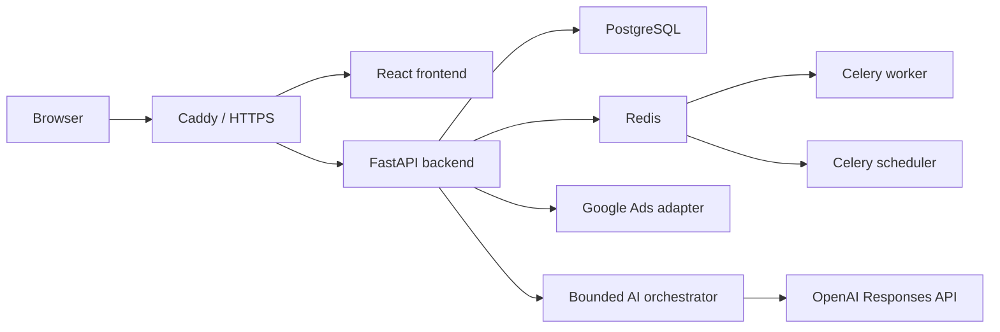

# Axyro Analytics: обзор для технического ревью

## Что это за проект

Axyro Analytics — личная серверная платформа Iskhakov Ruslan для аналитики и
операционного управления Google Ads через MCC. Это не публичный SaaS: текущий
production использует один владелец. Репозиторий содержит полный backend,
frontend, миграции, тесты, Docker-инфраструктуру и эксплуатационную документацию.

Основная задача продукта — собрать структуру и статистику нескольких MCC и
рекламных аккаунтов в одном центре контроля. Дополнительный модуль создаёт
проверенные Demand Gen кампании только после preview, `validate_only` и явного
подтверждения пользователя.

Рабочий сайт: [https://axyro.tech](https://axyro.tech)

## Технологический стек

- Backend: Python 3.12, FastAPI, Pydantic, SQLAlchemy, Alembic.
- Frontend: React 18, TypeScript, Vite, MUI, TanStack Query/Table.
- Данные: PostgreSQL как источник истины, Redis как брокер задач.
- Фоновые процессы: Celery worker и Celery Beat scheduler.
- Интеграции: Google Ads API, OpenAI Responses API, Brocard API.
- Развёртывание: Docker Compose, Caddy, HTTPS, GitHub Actions, Timeweb.
- Тесты и проверки: pytest, Vitest, Ruff, mypy, TypeScript и Compose build.

## Архитектура



Google Ads API изолирован в отдельном adapter-слое. Бизнес-модули не работают
напрямую с protobuf выбранной версии API. PostgreSQL хранит пользовательские
данные, задания, планы и аудит; Redis не является источником истины.

AI-модель не получает прямого доступа к SQL, GAQL, HTTP, Docker, SSH, файлам
или секретам. Backend повторно проверяет роль, scope, режим, лимиты и feature
gates для каждого typed tool. AI может подготовить draft или preview, но не
может самостоятельно подтвердить и выполнить изменяющую операцию.

## Основные потоки

### Синхронизация и аналитика

1. Владелец подключает Google Ads через OAuth 2.0.
2. Refresh token и внешние реквизиты сохраняются на backend в зашифрованном виде.
3. Adapter безопасным запросом проверяет MCC и синхронизирует иерархию аккаунтов.
4. Фоновые задания обновляют структуру, метрики, статусы и диагностические данные.
5. Control Center и AI читают нормализованные snapshots с информацией о
   freshness, completeness, timezone и исходной валюте.

### Контролируемое изменение Google Ads

1. Пользователь формирует draft или preview.
2. Backend повторно читает актуальное состояние и проверяет capability.
3. Выполняются локальные проверки и Google Ads `validate_only`.
4. Пользователь отдельно подтверждает окончательный запрос.
5. Backend выполняет mutation, делает GAQL readback и записывает AuditLog и
   Google Request ID.

Production mutation сейчас заблокирован до получения Google Ads API Basic
Access. Реальные mutate-проверки выполнялись только в изолированных Google test
accounts.

### Demand Gen deployment

```text
import/manual input
  -> validation
  -> immutable plan + fingerprint
  -> validate_only
  -> financial preview
  -> explicit confirmation
  -> create PAUSED
  -> readback
  -> audit
```

Новая кампания никогда не включается автоматически при создании.

## С чего начать чтение кода

1. [`backend/app/main.py`](../backend/app/main.py) — создание FastAPI приложения.
2. [`backend/app/api/router.py`](../backend/app/api/router.py) — состав HTTP API.
3. [`backend/app/db/models.py`](../backend/app/db/models.py) — основная модель данных.
4. [`backend/app/google_ads`](../backend/app/google_ads) — adapter, guards,
   capability registry и версии Google Ads API.
5. [`backend/app/control_center`](../backend/app/control_center) — запросы,
   нормализация, правила и сервис Control Center.
6. [`backend/app/domain`](../backend/app/domain) — планы, расписания, импорт и
   прикладная логика Demand Gen.
7. [`backend/app/ai`](../backend/app/ai) — gateway, policy, orchestrator и typed tools.
8. [`frontend/src/app/App.tsx`](../frontend/src/app/App.tsx) — маршруты frontend.
9. [`frontend/src/pages/ControlCenterPage.tsx`](../frontend/src/pages/ControlCenterPage.tsx)
   и [`frontend/src/pages/AiAnalystPage.tsx`](../frontend/src/pages/AiAnalystPage.tsx)
   — два крупнейших пользовательских модуля.
10. [`backend/tests`](../backend/tests) и [`frontend/src`](../frontend/src) —
    unit, integration и acceptance-проверки рядом с кодом.

## Локальный запуск

Требуются Docker Desktop и Docker Compose.

```bash
cp .env.example .env
docker compose up -d --build
docker compose exec api alembic upgrade head
docker compose up -d --wait
```

Перед запуском необходимо задать собственные безопасные значения
`APP_ENCRYPTION_KEY`, `SETUP_TOKEN` и пароля PostgreSQL. Реальные OAuth,
Developer Token и внешние API keys для изучения кода не нужны.

После запуска:

- frontend: `http://localhost/`;
- healthcheck: `http://localhost/api/health`;
- readiness: `http://localhost/api/ready`.

## Структура репозитория

```text
backend/                 FastAPI, доменная логика, интеграции, миграции и тесты
frontend/                React/TypeScript интерфейс и frontend-тесты
docs/                    архитектура, ADR, инструкции и отчёты приёмки
infrastructure/          Caddy и scripts для production deployment/backup
docker-compose.yml       локальная среда из семи сервисов
docker-compose.prod.yml  production overrides
.github/workflows/       CI и точный SHA-based production deployment
```

## Безопасность репозитория

В Git не должны попадать `.env`, OAuth credentials, Developer Token, refresh
tokens, API keys, SSH-ключи, PostgreSQL/Redis data, backups и пользовательские
uploads. В репозитории остаются только `.env.example` и код загрузки настроек.

Внешние секреты нужны только запущенному backend и не передаются frontend.
Изменяющие операции защищены ролями, CSRF, preview fingerprint,
`validate_only`, явным подтверждением, idempotency, readback и аудитом.

## Что особенно полезно проверить

1. Не слишком ли велик `models.py` и стоит ли разделить модели по bounded context.
2. Достаточно ли чётко разделены API routes, application services и domain logic.
3. Корректна ли граница Google Ads adapter и стратегия поддержки версий API.
4. Достаточны ли гарантии idempotency, locking и recovery фоновых заданий.
5. Нет ли лишней сложности в AI orchestrator и матрице разрешений typed tools.
6. Достаточны ли тесты для критических OAuth, scheduling и mutation workflows.
7. Какие части frontend стоит разделить на более мелкие компоненты и hooks.
8. Какие технические долги необходимо закрыть до подключения production Basic Access.

## Дополнительные документы

- [`architecture.md`](architecture.md) — краткие архитектурные принципы.
- [`adr/`](adr) — ключевые архитектурные решения.
- [`control-center-user-guide.md`](control-center-user-guide.md) — Control Center.
- [`ai-analyst-full-implementation-report.md`](ai-analyst-full-implementation-report.md)
  — устройство AI-модуля.
- [`final-acceptance-report.md`](final-acceptance-report.md) — последняя общая приёмка.
- [`deployment.md`](deployment.md) — схема развёртывания.
