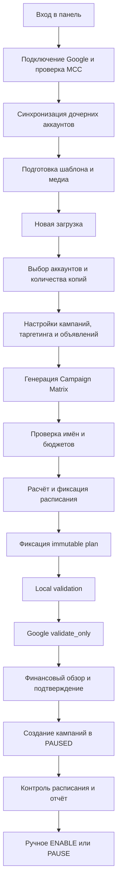
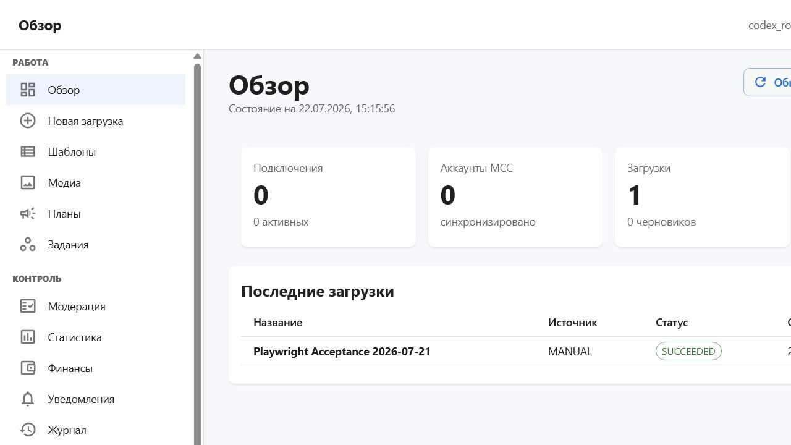
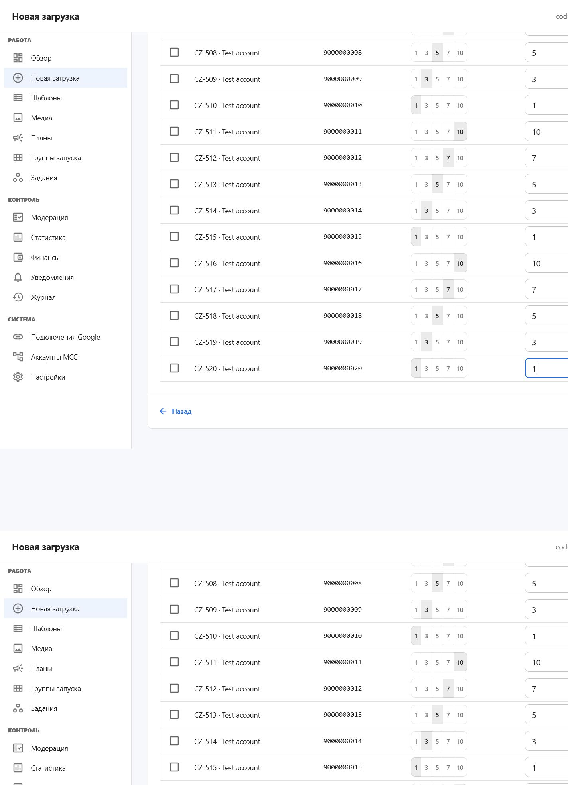
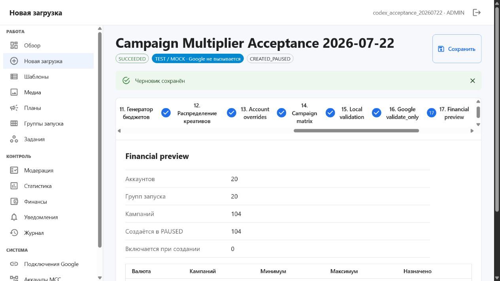
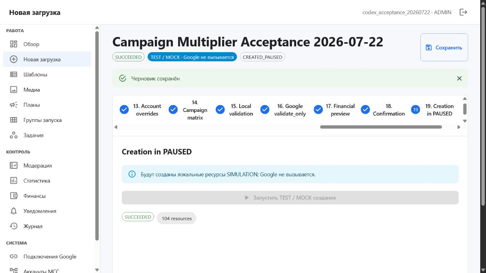
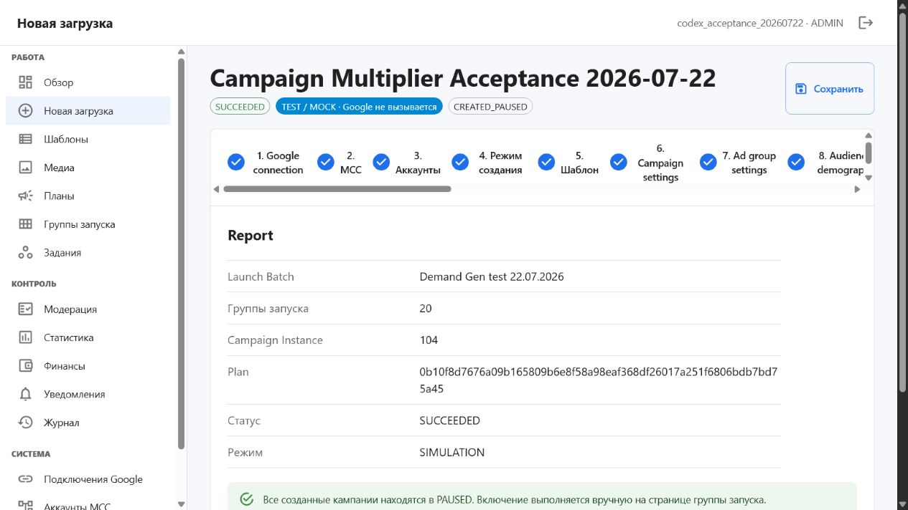
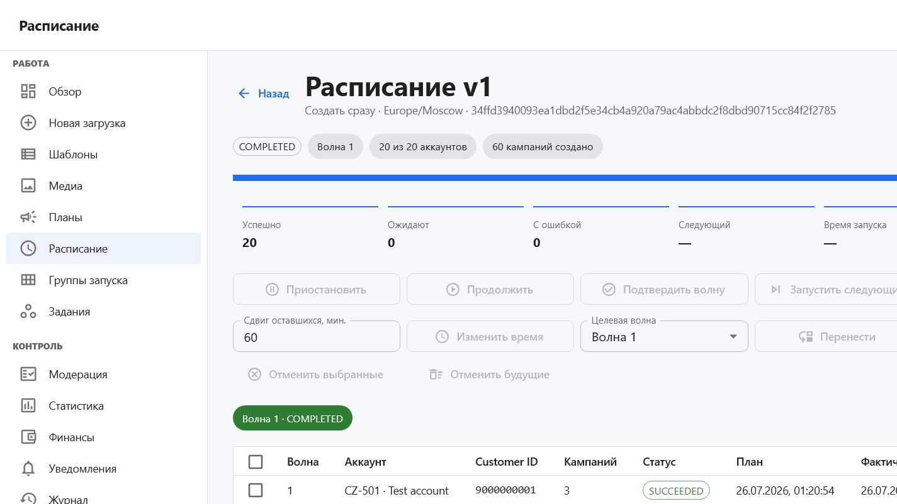
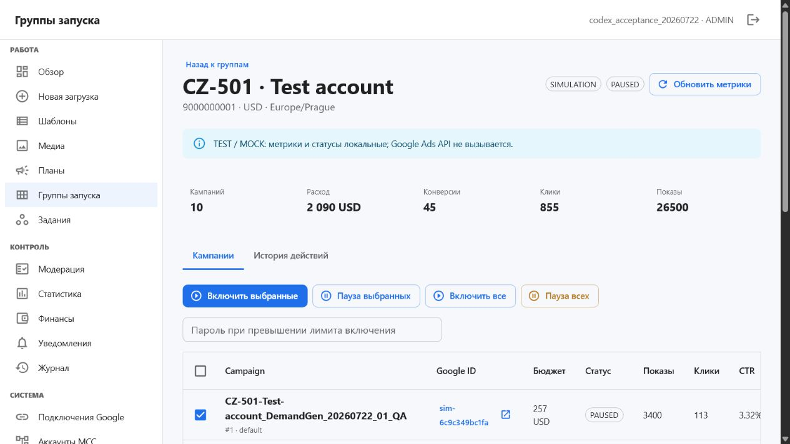

# Demand Gen Uploader

## Полное руководство оператора

Версия руководства: 26 июля 2026 года  
Проект: `D:\Cursor AI\demand-gen-uploader`  
Адрес локальной панели: [http://localhost/](http://localhost/)  
Назначение: массовая подготовка и создание Google Ads Demand Gen кампаний в дочерних аккаунтах MCC.

> **Самое важное правило**
>
> Программа создаёт кампании только в статусе `PAUSED`. Успешное создание не включает рекламу и не начинает расход. Включение выполняется отдельно и вручную в разделе **Группы запуска**.

---

## Содержание

1. [Быстрый старт за пять минут](#1-быстрый-старт-за-пять-минут)
2. [Что программа делает и чего она не делает](#2-что-программа-делает-и-чего-она-не-делает)
3. [Как устроен полный процесс](#3-как-устроен-полный-процесс)
4. [Основные термины](#4-основные-термины)
5. [Вход и первичная настройка](#5-вход-и-первичная-настройка)
6. [Навигация по панели](#6-навигация-по-панели)
7. [Что подготовить до подключения Google](#7-что-подготовить-до-подключения-google)
8. [Подключение Google через OAuth Web](#8-подключение-google-через-oauth-web)
9. [Подключение через Service Account](#9-подключение-через-service-account)
10. [Проверка MCC и синхронизация аккаунтов](#10-проверка-mcc-и-синхронизация-аккаунтов)
11. [Шаблоны](#11-шаблоны)
12. [Медиатека](#12-медиатека)
13. [Создание новой загрузки](#13-создание-новой-загрузки)
14. [Все 21 шага Campaign Builder](#14-все-21-шага-campaign-builder)
15. [Как выбирать количество копий](#15-как-выбирать-количество-копий)
16. [Как настраивать бюджеты](#16-как-настраивать-бюджеты)
17. [Как читать и редактировать Campaign Matrix](#17-как-читать-и-редактировать-campaign-matrix)
18. [Как настроить расписание](#18-как-настроить-расписание)
19. [Проверки, финансовый обзор и подтверждение](#19-проверки-финансовый-обзор-и-подтверждение)
20. [Как контролировать выполняющееся расписание](#20-как-контролировать-выполняющееся-расписание)
21. [Как вручную включать и ставить на паузу кампании](#21-как-вручную-включать-и-ставить-на-паузу-кампании)
22. [Остальные разделы панели](#22-остальные-разделы-панели)
23. [Готовые рабочие сценарии](#23-готовые-рабочие-сценарии)
24. [Статусы и их значения](#24-статусы-и-их-значения)
25. [Ошибки и способы исправления](#25-ошибки-и-способы-исправления)
26. [Ежедневные чек-листы](#26-ежедневные-чек-листы)
27. [Безопасный запуск и перезапуск программы](#27-безопасный-запуск-и-перезапуск-программы)
28. [Данные, резервные копии и запрещённые действия](#28-данные-резервные-копии-и-запрещённые-действия)
29. [Текущие ограничения версии](#29-текущие-ограничения-версии)
30. [Краткий FAQ](#30-краткий-faq)

---

## 1. Быстрый старт за пять минут

### Текущая локальная установка

1. Убедитесь, что Docker Desktop запущен и показывает `Engine running`.
2. Откройте [http://localhost/](http://localhost/).
3. Введите:

   - логин: `admin`
   - пароль: `admin`

4. После входа откроется раздел **Обзор**.
5. Для полностью безопасного знакомства откройте **Новая загрузка**.
6. Оставьте режим **TEST / MOCK**.
7. Введите понятное название, например `Проверка Demand Gen 26.07`.
8. Нажмите **Открыть Campaign Builder**.
9. На шаге **Аккаунты** нажмите **Добавить 20 тестовых аккаунтов**.
10. Пройдите мастер до конца, не переключаясь в `LIVE`.

> Пароль `admin` является слабым и подходит только для локальной изолированной установки. Не открывайте панель в интернет или локальную сеть с этим паролем. В текущей версии отдельного экрана самостоятельной смены пароля нет: смена выполняется администратором сервера без удаления базы.

### Самый короткий безопасный тест

Используйте следующие параметры:

| Параметр | Значение |
|---|---|
| Режим | `TEST / MOCK` |
| Аккаунты | 20 тестовых |
| Кампаний на аккаунт | 1 |
| Copy mode | `Точные копии` |
| Бюджет | `FIXED`, например 10 |
| Расписание | `Создать сразу` |
| Google connection | `Без подключения` |

В этом режиме Google не вызывается, реальные кампании не создаются, а `request ID` отсутствуют. Это нормальное и ожидаемое поведение.

---

## 2. Что программа делает и чего она не делает

### Программа умеет

- подключаться к Google Ads через MCC;
- получать список дочерних рекламных аккаунтов;
- формировать несколько копий Demand Gen кампании на каждом выбранном аккаунте;
- назначать отдельное имя, бюджет и внутренний идентификатор каждой копии;
- работать с видео, изображениями и каруселями;
- распределять бюджеты по заданному диапазону;
- показывать полную матрицу будущих кампаний до обращения к Google;
- создавать немедленное, равномерное, ступенчатое или ручное расписание;
- выполнять локальную проверку;
- выполнять Google Ads `validate_only` перед созданием;
- показывать суммарный финансовый обзор;
- создавать кампании только в `PAUSED`;
- отслеживать выполнение по аккаунтам, волнам и попыткам;
- вручную включать или приостанавливать выбранные кампании;
- синхронизировать модерацию, статистику и метрики;
- сохранять историю действий в журнале.

### Программа намеренно не делает

- не включает созданные кампании автоматически;
- не выбирает «победителя» среди копий;
- не останавливает «проигравшие» кампании по статистике;
- не рекомендует автоматически количество копий;
- не меняет бюджеты на основании метрик;
- не принимает решения без явного действия пользователя;
- не интегрирована с Keitaro в текущей версии;
- не подделывает Google `request ID` в тестовом режиме;
- не гарантирует одобрение объявлений политиками Google;
- не заменяет проверку биллинга, конверсий и посадочной страницы в Google Ads.

### Что означает успешное завершение

`SUCCEEDED` или `COMPLETED` означает, что запланированная операция завершена. Для реального создания это означает: ресурсы созданы и кампании находятся в `PAUSED`. Это **не** означает, что реклама уже показывается.

---

## 3. Как устроен полный процесс



Практический смысл этапов:

1. До **Campaign Matrix** вы задаёте правила.
2. В **Campaign Matrix** вы видите точный результат этих правил.
3. После фиксации `immutable plan` результат блокируется от случайных изменений.
4. `validate_only` проверяет запрос без создания ресурсов.
5. После подтверждения фоновый исполнитель работает по расписанию.
6. После создания вы отдельно решаете, какие кампании включить.

---

## 4. Основные термины

| Термин | Простое объяснение |
|---|---|
| MCC / Manager Account | Управляющий аккаунт Google Ads, к которому подключены дочерние рекламные аккаунты. |
| Customer ID | Идентификатор аккаунта Google Ads. Обычно 10 цифр; дефисы можно не вводить. |
| Google connection | Сохранённое в программе сочетание MCC, developer token и OAuth/Service Account реквизитов. |
| Upload / Загрузка | Сохраняемый черновик одного запуска Campaign Builder. |
| Template / Шаблон | Набор исходных настроек кампании для повторного использования. |
| Launch Batch | Зафиксированная версия сгенерированной матрицы кампаний. |
| Launch Group / Группа запуска | Все копии кампании, относящиеся к одному дочернему аккаунту. |
| Campaign Instance | Одна конкретная будущая или уже созданная копия кампании. |
| Sequence | Порядковый номер копии внутри аккаунта. |
| Generation seed | Строка, делающая случайное распределение воспроизводимым. |
| Campaign Matrix | Таблица всех будущих Campaign Instance до создания. |
| Schedule / Расписание | Точное правило, когда создавать Launch Group каждого аккаунта. |
| Wave / Волна | Группа аккаунтов, выполняемая как один этап ступенчатого расписания. |
| Immutable plan | Неизменяемый снимок матрицы, расписания и медиа с уникальным fingerprint. |
| Fingerprint | Контрольная подпись плана. Изменение данных создаёт другую подпись. |
| Local validation | Проверка данных внутри программы без обращения к Google. |
| validate_only | Официальная проверка Google Ads API без фактического создания ресурсов. |
| Request ID | Идентификатор реального запроса Google, полезный для диагностики. |
| SIMULATION / TEST / MOCK | Полностью локальный тестовый режим без вызова Google. |
| LIVE | Режим реального обращения к Google Ads API. |
| PAUSED | Кампания создана, но не показывает рекламу. |
| ENABLED | Кампания включена вручную и может начать показы после допуска Google и при рабочем биллинге. |
| Guardrail / Предохранитель | Лимит, требующий пароль администратора при потенциально опасном объёме. |
| Circuit breaker | Автоматическая остановка расписания после серии серьёзных ошибок. |

---

## 5. Вход и первичная настройка

### Обычный вход

1. Откройте [http://localhost/](http://localhost/).
2. В поле **Логин** введите имя пользователя.
3. В поле **Пароль** введите пароль.
4. Нажмите **Войти**.

Если отображается сообщение **Неверный логин или пароль**:

1. Проверьте раскладку клавиатуры и `Caps Lock`.
2. Убедитесь, что в начале и конце логина нет пробелов.
3. Для текущей локальной установки используйте `admin` / `admin`.
4. Не пытайтесь создавать администратора повторно: после создания первого пользователя первичная регистрация закрывается.

Сессия рассчитана примерно на 12 часов. После её окончания программа снова покажет форму входа. Несохранённые изменения в открытой форме лучше не оставлять до истечения сессии.

### Выход

В правом верхнем углу нажмите значок выхода. После выхода локальные данные не удаляются.

### Первое открытие на совершенно чистой базе

Если пользователей ещё нет, вместо формы входа появляется экран **Первичная настройка**:

1. Введите логин длиной не менее 3 символов.
2. При необходимости укажите email.
3. Введите пароль длиной не менее 12 символов.
4. Введите `SETUP_TOKEN` из файла `.env`, если он настроен.
5. Нажмите **Создать администратора**.

Этот экран работает только один раз. Повторное создание первого администратора блокируется.

---

## 6. Навигация по панели

На компьютере меню находится слева. На телефоне оно открывается кнопкой меню в верхней панели.

### Раздел «Работа»

| Страница | Для чего используется |
|---|---|
| **Обзор** | Общие числа, состояние подключений, аккаунтов, загрузок и заданий. |
| **Новая загрузка** | Начало нового 21-шагового Campaign Builder. |
| **Шаблоны** | Создание и повторное использование базовых настроек. |
| **Медиа** | Изображения, видео и YouTube ID. |
| **Планы** | Все зафиксированные immutable plans и их статусы. |
| **Расписание** | Контроль отложенных и ступенчатых запусков. |
| **Группы запуска** | Кампании по аккаунтам, метрики и ручные ENABLE/PAUSE. |
| **Задания** | Очередь фоновых операций и их ошибки. |

### Раздел «Контроль»

| Страница | Для чего используется |
|---|---|
| **Модерация** | Состояние объявлений и темы политик Google. |
| **Статистика** | Показы, клики, расходы и конверсии по датам. |
| **Финансы** | Необязательное подключение Brocard и его снимки. |
| **Уведомления** | Важные события, предупреждения и отметка «прочитано». |
| **Журнал** | Аудит действий пользователя и системы. |

### Раздел «Система»

| Страница | Для чего используется |
|---|---|
| **Подключения Google** | OAuth/Service Account, developer token, проверка MCC. |
| **Аккаунты MCC** | Синхронизированные дочерние аккаунты, валюта и часовой пояс. |
| **Настройки** | Среда, политика запуска и предохранители Campaign Builder. |



---

## 7. Что подготовить до подключения Google

Для `LIVE` понадобятся:

1. Google Ads Manager Account, то есть MCC.
2. Дочерние рекламные аккаунты, связанные с этим MCC.
3. Google Ads Developer Token.
4. Google Cloud project.
5. OAuth Client ID и Client Secret типа **Web application** либо Service Account JSON.
6. Google-пользователь или service account с достаточным доступом к MCC.
7. Полностью завершённая настройка дочерних аккаунтов Google Ads.
8. Рабочий биллинг на тех аккаунтах, где затем будет включаться реклама.
9. Настроенные conversion actions, если они используются в кампании.
10. Посадочная страница с полным `https://` URL.

### Developer Token

Developer Token берётся в **API Center** управляющего аккаунта Google Ads. Уровень доступа токена определяет, можно ли работать только с тестовыми или также с производственными аккаунтами.

Официальные материалы:

- [Developer Token](https://developers.google.com/google-ads/api/docs/api-policy/developer-token)
- [Уровни доступа Google Ads API](https://developers.google.com/google-ads/api/docs/api-policy/access-levels)
- [Обзор OAuth для Google Ads API](https://developers.google.com/google-ads/api/docs/oauth/overview)

### Какой Customer ID вводить

- В поле **MCC Customer ID** вводится ID управляющего аккаунта.
- В Campaign Builder выбираются Customer ID дочерних аккаунтов.
- Дефисы и пробелы программа нормализует, но удобнее вводить только цифры.
- Не путайте MCC ID с ID отдельного рекламного аккаунта.

### TEST и PRODUCTION в форме подключения

Выбор среды в программе является меткой и дополнительным предохранителем. Фактическая возможность работать с тестовыми или производственными аккаунтами всё равно определяется уровнем Developer Token, доступом пользователя и типом Google Ads аккаунта.

---

## 8. Подключение Google через OAuth Web

OAuth Web является рекомендуемым вариантом интерфейса.

### Часть A. Подготовка в Google Cloud

1. Откройте Google Cloud Console.
2. Выберите существующий проект либо создайте отдельный проект для этой программы.
3. Включите Google Ads API для проекта.
4. Настройте экран согласия OAuth.
5. Если приложение находится в режиме тестирования, добавьте Google-пользователя в список тестовых пользователей.
6. Создайте OAuth Client типа **Web application**.
7. В список **Authorized redirect URIs** добавьте точное значение:

   `http://localhost/api/google-connections/oauth/callback`

8. Не добавляйте завершающий `/`, если его нет в указанном адресе.
9. Сохраните полученные Client ID и Client Secret.

Google требует точного совпадения схемы, домена, порта, регистра и пути redirect URI. При другом домене сначала должен быть правильно настроен `APP_PUBLIC_BASE_URL`, а затем в Google Cloud добавлен соответствующий callback.

Официальная инструкция Google: [OAuth 2.0 for Web Server Applications](https://developers.google.com/identity/protocols/oauth2/web-server).

> Если OAuth project имеет статус `Testing`, refresh token для внешнего тестового пользователя может истекать через семь дней. Для постоянной эксплуатации настройте корректную аудиторию и publishing status в Google Cloud.

### Часть B. Создание подключения в программе

1. Откройте **Система → Подключения Google**.
2. В блоке **Новое подключение** заполните:

| Поле | Что вводить |
|---|---|
| **Название** | Понятное внутреннее имя, например `MCC Europe Production`. |
| **MCC Customer ID** | ID управляющего аккаунта, предпочтительно только цифры. |
| **Среда** | `TEST` для тестовой и `PRODUCTION` для реальной иерархии. |
| **Авторизация** | `OAuth Web`. |
| **Developer token** | Токен из API Center MCC. |
| **OAuth Client ID** | Client ID из Google Cloud. |
| **OAuth Client Secret** | Client Secret из Google Cloud. |

3. Нажмите **Сохранить и войти через Google**.
4. Откроется официальный экран Google.
5. Выберите Google-пользователя, который имеет доступ к нужному MCC.
6. Подтвердите запрашиваемый доступ Google Ads.
7. После возврата в программу найдите подключение в списке.
8. Нажмите **Проверить**.
9. После успешной проверки статус должен стать `CONNECTED`.
10. Нажмите **Аккаунты**, чтобы синхронизировать дочерние аккаунты.

### Кнопки сохранённого подключения

| Кнопка | Действие |
|---|---|
| **Подключить** | Продолжает первичный OAuth, если реквизиты есть, а refresh token ещё не получен. |
| **Повторный вход** | Повторяет OAuth и получает новый refresh token. |
| **Проверить** | Выполняет реальную проверку доступа к MCC. |
| **Аккаунты** | Загружает доступные дочерние аккаунты в локальную базу. |
| **Отключить** | Удаляет сохранённый refresh token из подключения; локальные кампании и загрузки не удаляются. |

### Нормальная последовательность статусов

`NEEDS_CREDENTIALS` → OAuth вход → `DRAFT` → **Проверить** → `CONNECTED`.

Если получен `ERROR`, текст причины показывается под подключением. Исправьте именно эту причину, затем выполните **Повторный вход** или **Проверить**.

---

## 9. Подключение через Service Account

Service Account удобен для одной внутренней организации, когда доступ не должен зависеть от личного Google-пользователя.

### Подготовка

1. Создайте service account в Google Cloud project.
2. Создайте и скачайте JSON key.
3. Скопируйте email service account.
4. В Google Ads MCC откройте **Admin → Access and security**.
5. Добавьте email service account как пользователя MCC.
6. Назначьте уровень доступа, достаточный для создания и изменения кампаний.
7. Убедитесь, что MCC имеет доступ к нужным дочерним аккаунтам.

Официальная схема Google: [Service Account workflow for Google Ads API](https://developers.google.com/google-ads/api/docs/oauth/service-accounts).

### Создание подключения

1. Откройте **Подключения Google**.
2. Выберите авторизацию **Service account**.
3. Заполните название, MCC Customer ID, среду и Developer Token.
4. Откройте скачанный JSON key в текстовом редакторе.
5. Вставьте весь JSON целиком в поле **Service account JSON**.
6. Нажмите **Сохранить подключение**.
7. В списке подключений нажмите **Проверить**.
8. После статуса `CONNECTED` нажмите **Аккаунты**.

### Безопасность JSON key

- Не отправляйте JSON key в мессенджерах.
- Не добавляйте его в Git.
- Не храните его рядом с экспортами кампаний.
- При подозрении на утечку удалите ключ в Google Cloud и создайте новый.
- В программе ключ сохраняется зашифрованно с использованием `APP_ENCRYPTION_KEY`.

---

## 10. Проверка MCC и синхронизация аккаунтов

### Проверка подключения

Кнопка **Проверить** подтверждает сразу несколько вещей:

- реквизиты можно расшифровать;
- OAuth или Service Account работает;
- Developer Token принимается;
- указанный MCC доступен;
- версия Google Ads API поддерживается текущим адаптером.

Не переходите к `LIVE`, пока подключение не имеет статус `CONNECTED`.

### Синхронизация

1. На странице **Подключения Google** нажмите **Аккаунты** у нужного подключения.
2. Дождитесь сообщения `Синхронизировано аккаунтов: N`.
3. Откройте **Система → Аккаунты MCC**.
4. Проверьте:

   - Customer ID;
   - название;
   - Manager;
   - валюту;
   - часовой пояс;
   - статус;
   - признак тестового аккаунта.

### Если нужного аккаунта нет

Проверьте по порядку:

1. Дочерний аккаунт действительно связан с указанным MCC.
2. Запрос на связь принят в Google Ads.
3. Авторизованный Google-пользователь имеет доступ к MCC.
4. MCC Customer ID введён правильно.
5. Аккаунт не отменён и завершил первоначальную настройку.
6. Подключение имеет `CONNECTED`.
7. Повторно нажмите **Аккаунты**.

Синхронизация обновляет локальный список и не создаёт кампании.

---

## 11. Шаблоны

Шаблон нужен, если одинаковая база кампании будет использоваться многократно.

### Создание шаблона

1. Откройте **Работа → Шаблоны**.
2. Заполните:

| Поле | Значение |
|---|---|
| **Название** | Уникальное понятное имя шаблона. |
| **Описание** | Гео, оффер, формат или назначение. |
| **Название компании** | Business name, максимум 25 символов при валидации. |
| **Бюджет** | Базовый дневной бюджет. |
| **Target CPA** | Базовая целевая цена конверсии. |
| **Гео ID** | Google GeoTargetConstant ID. |
| **Язык ID** | Google LanguageConstant ID. |

3. Нажмите **Сохранить шаблон**.

Новый шаблон содержит базовые заглушки для URL и текстов. Перед `LIVE` обязательно проверьте и замените `https://example.com`, стандартные заголовки и описание в Campaign Builder.

### Действия с шаблоном

| Действие | Результат |
|---|---|
| **Использовать** | Создаёт новую загрузку в `SIMULATION` и открывает мастер. |
| Значок **Новая версия** | Фиксирует следующую версию текущего payload шаблона. |
| Значок **Копировать** | Создаёт отдельный шаблон-копию. |
| Значок **Архивировать** | Убирает шаблон из активного списка, не удаляя старую историю запусков. |

### Важное ограничение

Режим **Существующая кампания** виден в Campaign Builder, а серверный API умеет прочитать кампанию Google. Однако в текущем видимом интерфейсе страницы **Шаблоны** нет формы импорта по `campaign_resource_name`. Поэтому обычному оператору следует использовать **Из шаблона** или **Полная настройка**. Не выбирайте **Существующая кампания** для производственного запуска, пока этот экран не будет добавлен.

---

## 12. Медиатека

### Поддерживаемые источники

- локальные изображения JPEG и PNG;
- локальные видео MP4, MOV и WebM;
- существующий YouTube video ID или URL;
- локальное видео с последующей постановкой загрузки в YouTube.

### Ограничения локальной проверки

| Тип | Условие |
|---|---|
| Изображение | JPEG/PNG, не более 5 МБ, не меньше 128 × 128. |
| Видео | MP4/MOV/WebM, не более 5 ГБ, должен читаться через FFmpeg. |
| YouTube ID | 11 корректных символов либо поддерживаемая ссылка YouTube. |

Программа вычисляет SHA-256. Повторная загрузка идентичного файла возвращает уже существующий asset, поэтому одинаковые файлы не размножаются.

### Загрузка изображения или видео

1. Откройте **Работа → Медиа**.
2. Нажмите **Загрузить файл**.
3. Выберите файл.
4. Дождитесь появления строки.
5. Проверьте столбцы **Тип**, **Размер / формат** и **Статус**.
6. Нажмите значок предпросмотра и визуально проверьте файл.

Использовать в плане можно только asset со статусом `READY`.

### Добавление существующего YouTube видео

1. Вставьте YouTube ID или URL в поле **YouTube video ID или URL**.
2. Нажмите **Добавить**.
3. Проверьте, что появился asset типа `YOUTUBE` со статусом `READY`.

### Отправка локального видео в YouTube

1. Найдите локальный asset типа `VIDEO`.
2. Нажмите **В YouTube**.
3. Выберите:

   - `Симуляция` для безопасной проверки;
   - `Google Ads` для реальной загрузки.

4. Для `LIVE` выберите активное Google-подключение.
5. Выберите Customer ID.
6. Введите название и описание видео.
7. Нажмите **Поставить в очередь**.
8. Откройте **Задания** и дождитесь завершения.

В `LIVE` видео публикуется как `UNLISTED`. Пока обработка не завершена, asset может иметь `PENDING`, `UPLOADING` или `PROCESSING`; не фиксируйте live-план до `READY`.

### Статусы медиа

| Статус | Что делать |
|---|---|
| `READY` | Можно использовать. |
| `INVALID` | Откройте причину проверки и замените файл. |
| `PENDING` | Задание ожидает обработки. |
| `UPLOADING` | Файл отправляется. |
| `PROCESSING` | YouTube или программа обрабатывает видео. |
| `FAILED` | Откройте **Задания**, исправьте причину и повторите. |

---

## 13. Создание новой загрузки

1. Откройте **Работа → Новая загрузка**.
2. Введите название, по которому запуск легко найти через неделю или месяц.

Рекомендуемый формат:

`YYYY-MM-DD · GEO · Offer · Variant`

Пример:

`2026-07-26 · CZ · Solar · Video A`

3. Выберите режим:

| Режим | Что происходит |
|---|---|
| **TEST / MOCK** | Google не вызывается; удобно проверять матрицу, расписание и весь интерфейс. |
| **LIVE / Google Ads** | После всех проверок программа обращается к Google и создаёт реальные ресурсы в `PAUSED`. |

4. Нажмите **Открыть Campaign Builder**.

Черновик создаётся сразу. К нему можно вернуться через **Обзор → Последние загрузки**.

---

## 14. Все 21 шага Campaign Builder

### Общие правила мастера

- Верхняя кнопка **Сохранить** сохраняет текущий шаг.
- Нижняя кнопка **Сохранить и продолжить** сохраняет и открывает следующий шаг.
- **Назад** возвращает на предыдущий шаг.
- Шаги сверху кликабельны, поэтому можно вернуться к нужному разделу.
- Переход на следующий шаг не означает, что все поля уже корректны. Полная проверка происходит позже.
- После генерации новой версии Campaign Matrix старое расписание и старый активный plan больше не должны использоваться.
- После фиксации immutable plan матрица блокируется. Для изменений создаётся новая версия Launch Batch.

### Шаг 1. Google connection

Заполните:

- **Название загрузки**;
- `TEST / MOCK` или `LIVE`;
- **Подключение**.

Для `SIMULATION` разрешено **Без подключения**. Для `LIVE` выберите подключение со статусом `CONNECTED`.

Перед продолжением убедитесь, что метка вверху мастера соответствует вашему намерению. Жёлтая метка `LIVE · Google Ads` означает реальный режим.

### Шаг 2. MCC

Это информационная проверка. Сверьте:

- название connection;
- Login customer ID;
- статус.

Если показано `Не выбран` или статус не `CONNECTED`, вернитесь на шаг 1.

### Шаг 3. Аккаунты

#### В TEST / MOCK

Нажмите **Добавить 20 тестовых аккаунтов**. Это локальные фиктивные аккаунты; Google не вызывается.

#### В LIVE

Поставьте флажки у синхронизированных дочерних аккаунтов.

Проверяйте:

- название аккаунта;
- Customer ID;
- валюту;
- часовой пояс;
- общее число выбранных аккаунтов;
- список валют.

Не выбирайте аккаунт, если его валюта или часовой пояс неожиданны: эти значения влияют на бюджет и расписание.

### Шаг 4. Режим создания

Доступны четыре кнопки:

| Режим | Практическое применение |
|---|---|
| **Из шаблона** | Использовать сохранённую основу и донастроить её в мастере. |
| **Полная настройка** | Основной рекомендуемый путь через все поля мастера. |
| **Существующая кампания** | Пока не завершён в видимом UI; для обычной работы не использовать. |
| **CSV / XLSX** | Файл принимается и сохраняется, но см. ограничение ниже. |

#### Форматы импорта

- CSV: UTF-8 с BOM либо CP1251;
- разделитель CSV: запятая, точка с запятой или табуляция;
- XLSX и XLSM;
- максимум 20 МБ;
- максимум 5000 непустых строк.

Распознаваемые заголовки:

| Каноническое поле | Допустимые названия |
|---|---|
| `customer_id` | `account`, `account_id`, `customer`, `customer id`, `аккаунт`, `аккаунт id` |
| `campaign_name` | `campaign`, `campaign name`, `кампания`, `название кампании` |
| `final_url` | `url`, `final url`, `ссылка` |
| `daily_budget` | `budget`, `daily budget`, `бюджет` |
| `headlines` | `headline`, `заголовки` |
| `descriptions` | `description`, `описания` |
| `youtube_video_id` | `youtube`, `youtube id` |

Несколько заголовков, описаний, geo/language/media IDs в одной ячейке разделяются символом `|`.

> **Текущее ограничение CSV/XLSX:** файл корректно парсится и сохраняется в загрузке, но текущий экран Campaign Builder ещё не переносит импортированные строки автоматически в сгенерированную Campaign Matrix. Для `LIVE` не полагайтесь на файл как на источник матрицы: используйте **Полная настройка**, выбранные аккаунты и ручную проверку матрицы.

### Шаг 5. Шаблон или полная настройка

Поля:

#### Шаблон

Выберите сохранённый шаблон либо **Настройки этого мастера**.

#### Название Launch Batch

Это внутреннее имя всей версии запуска. Используйте уникальное и понятное название.

#### Шаблон названия кампаний

Доступные переменные:

| Переменная | Подстановка |
|---|---|
| `{account_name}` | Название дочернего аккаунта. |
| `{customer_id}` | Customer ID. |
| `{template_name}` | Название шаблона. |
| `{batch_name}` | Название Launch Batch. |
| `{date}` | Дата генерации. |
| `{time}` | Время генерации. |
| `{sequence}` | Номер копии, например `01`. |
| `{budget}` | Назначенный бюджет. |
| `{creative_set}` | Ключ набора креативов. |
| `{random_suffix}` | Воспроизводимый короткий суффикс. |

Рекомендуемый вариант:

`{account_name}_{batch_name}_{date}_{sequence}_{budget}`

Программа старается обеспечить уникальность. При совпадении она добавляет часть Customer ID и sequence.

#### Generation seed

Одинаковый seed при одинаковых исходных данных даёт воспроизводимое случайное распределение бюджетов и креативов. Не меняйте seed после того, как согласовали матрицу.

### Шаг 6. Campaign settings

#### Стратегия ставок

| Значение | Когда использовать | Обязательное поле |
|---|---|---|
| `Target CPA` | Есть настроенные конверсии и понятная целевая стоимость. | Target CPA > 0 |
| `Maximize Conversions` | Нужно максимизировать конверсии в рамках бюджета. | Дополнительная цель не обязательна в форме |
| `Target ROAS` | Есть value-based conversion tracking. | Target ROAS > 0 |
| `Maximize Clicks` | Цель — клики; проверьте пригодность для Demand Gen аккаунта. | Нет |

`Maximize Conversion Value` отображается как недоступная стратегия и выбрать её нельзя.

#### Conversion action resource names

Вводите полные resource names, относящиеся к конкретному Customer ID, например:

`customers/1234567890/conversionActions/111222333`

Ресурс другого аккаунта будет отклонён локальной проверкой.

#### Даты

- **Начало** и **Окончание** относятся к параметрам кампании.
- Они не заменяют расписание массового создания на шаге 15.
- Не ставьте дату окончания раньше начала.

#### Tracking template и Final URL suffix

- ValueTrack-параметры, например `{campaignid}`, сохраняются.
- В `Final URL suffix` вводите строку без начального `?`, например `utm_source=dgu&utm_medium=cpc`.
- Опция **Добавить dgu_instance** добавляет уникальный внутренний ID копии.
- Включайте `dgu_instance` только если ваша аналитика действительно должна различать Campaign Instance.

Все кампании всё равно создаются в `PAUSED`.

### Шаг 7. Ad group settings

Заполните:

- название группы объявлений;
- Geo IDs;
- исключённые Geo IDs;
- Language IDs;
- Channel controls.

Списки ID можно разделять запятыми, точками с запятой, вертикальной чертой или переносами строк.

#### Каналы

| Режим | Результат |
|---|---|
| **Все каналы** | Google получает общий режим без ручного ограничения. |
| **Все собственные каналы Google** | Используются собственные площадки Google. |
| **Ручной выбор** | Можно выбрать доступные каналы отдельно. |

При ручном выборе доступны YouTube In-stream, In-feed, Shorts, Discover, Gmail и Display. Google Maps отображается, но отключён в текущем Python client.

### Шаг 8. Audience и demographics

Можно указать:

- Audience resource names;
- User list / Customer Match resource names;
- Custom audience resource names;
- возраст;
- пол;
- оптимизированный таргетинг.

Каждый resource name должен начинаться с правильного Customer ID, например:

- `customers/1234567890/audiences/...`
- `customers/1234567890/userLists/...`
- `customers/1234567890/customAudiences/...`

Если одна и та же аудитория не существует во всех выбранных аккаунтах, `validate_only` может завершиться ошибкой по отдельным аккаунтам. Для массового запуска заранее создайте соответствующие ресурсы в каждом аккаунте либо не задавайте account-specific resource name.

### Шаг 9. Ads и assets

#### Формат

| Формат | Требование |
|---|---|
| `VIDEO` | YouTube video ID или обработанный YouTube asset. |
| `IMAGE` | Не менее одного готового изображения. |
| `CAROUSEL` | Логотип и минимум две карточки, то есть не менее трёх assets. |

#### Тексты

- **Business name**: максимум 25 символов.
- **Headlines**: от 1 до 5, каждый максимум 30 символов.
- **Long headline** для VIDEO: от 1 до 90 символов.
- **Descriptions**: от 1 до 5, каждое максимум 90 символов.
- Один headline или description вводится на одной строке.

#### Final URL

Используйте полный адрес с `https://` или `http://`, например:

`https://example.com/offer`

Проверьте страницу вручную:

- открывается без авторизации;
- не возвращает 404/500;
- соответствует объявлению;
- работает на мобильном устройстве;
- содержит нужные tracking-параметры.

#### CTA

Доступны `LEARN_MORE`, `SHOP_NOW`, `SIGN_UP`, `APPLY_NOW`, `GET_QUOTE`.

#### Медиа

1. Можно добавить YouTube ID прямо на шаге.
2. Можно загрузить файл.
3. Поставьте флажки у assets, которые должны войти в кампанию.
4. Используйте только `READY`.

Кнопка **Предпросмотр Google** отключена, потому что официальный предпросмотр этого объявления через текущий API недоступен. Используйте локальный предпросмотр файла в медиатеке и затем проверьте созданную кампанию в Google Ads.

### Шаг 10. Количество кампаний

Здесь определяется число копий на каждом аккаунте.

1. Выберите **Режим копирования**.
2. Укажите **Общее количество для всех**.
3. Нажмите **Применить ко всем**.
4. При необходимости выделите часть аккаунтов.
5. Укажите **Для выделенных** и нажмите **Применить к выделенным**.
6. Для отдельного аккаунта измените число в его строке.
7. Проверьте итог **Будущих кампаний**.

Быстрые значения: `1`, `3`, `5`, `7`, `10`. Произвольное значение: от 1 до 500.

Предохранители по умолчанию:

- более 50 кампаний на один аккаунт;
- более 500 кампаний в одном задании.

При превышении потребуется пароль администратора.



### Шаг 11. Генератор бюджетов

Сначала выберите режим, затем распределение.

#### Режимы

| Режим | Что вводить |
|---|---|
| `FIXED` | Одно значение **Fixed** для всех копий. |
| `RANGE` | Минимум, максимум и шаг. |
| `MANUAL_LIST` | Список значений через запятую, не короче числа копий на аккаунте. |
| `PER_ACCOUNT_OVERRIDE` | Предназначен для account-level override; видимый UI не даёт полного редактора бюджетных overrides. |
| `PER_CAMPAIGN_OVERRIDE` | Предназначен для campaign-level override; практичнее отредактировать бюджет в Campaign Matrix. |

#### Распределения

| Распределение | Поведение |
|---|---|
| `BALANCED_RANDOM` | Покрывает диапазон более равномерно и перемешивает значения. |
| `RANDOM` | Независимо выбирает случайные значения из диапазона. |
| `SEQUENTIAL` | Идёт по сетке от минимума к максимуму и повторяет цикл. |
| `MANUAL_AFTER_GENERATION` | Сначала формирует сбалансированный результат, затем ожидается ручная правка матрицы. |

#### Разрешить повторы

- Включено: одинаковые бюджеты могут повторяться.
- Выключено: значений в диапазоне должно хватать на все копии.

Пример:

- минимум: `20`;
- максимум: `30`;
- шаг: `2`;
- возможная сетка: `20, 22, 24, 26, 28, 30`.

Все значения трактуются в валюте соответствующего рекламного аккаунта. Не смешивайте валюты при оценке общей суммы: `100 USD` и `100 EUR` нельзя складывать как одну валюту.

### Шаг 12. Распределение креативов

Проверьте:

- число выбранных assets;
- число доступных `READY`;
- выбранный Copy mode.

Режимы:

| Copy mode | Практический результат |
|---|---|
| `Точные копии` | Одинаковые настройки и выбранный пул assets. |
| `Одинаковые настройки, разные бюджеты` | Основное различие задаёт генератор бюджетов. |
| `Случайное подмножество креативов` | Каждая копия получает случайную часть пула. |
| `Ротация creative sets` | Требует заранее заданных sets; полного редактора sets в текущем UI нет. |
| `Варианты ставок` | Требует массива bidding variations, которого нет в текущем UI. |
| `Варианты аудиторий` | Требует массива audience variations, которого нет в текущем UI. |
| `Пользовательская матрица` | Требует custom matrix payload, которого нет в текущем UI. |

Для обычной работы через интерфейс используйте первые три режима и обязательно проверяйте фактическое распределение в Campaign Matrix.

Assets переиспользуются внутри одного Customer ID по SHA-256, чтобы не создавать одинаковые Google assets повторно без необходимости.

### Шаг 13. Account overrides

Для каждого аккаунта показаны:

- аккаунт;
- Customer ID;
- количество кампаний;
- валюта;
- часовой пояс.

В `LIVE` валюта и часовой пояс заблокированы и берутся из синхронизированного Google аккаунта. Это защита от несоответствия. В `SIMULATION` их можно менять для тестов.

### Шаг 14. Campaign Matrix

1. Нажмите **Сгенерировать матрицу**.
2. Дождитесь сообщения о числе Campaign Instance.
3. Проверьте количество Launch Group и кампаний.
4. Используйте фильтр по аккаунту, Customer ID, имени или статусу.
5. При необходимости измените имя или бюджет строки.
6. Нажмите значок сохранения в этой строке.
7. Для массового бюджета выделите строки, введите значение и нажмите **Применить к выбранным**.
8. При необходимости скачайте `XLSX` или `CSV`.

Нажатие **Создать новую версию матрицы**:

- создаёт новый Launch Batch;
- сбрасывает выбранное расписание;
- требует нового immutable plan;
- не изменяет уже созданные в Google кампании старой версии.

### Шаг 15. Расписание

Выберите один из режимов, заполните параметры, нажмите **Рассчитать**, изучите таблицу и только потом нажмите **Зафиксировать расписание**.

Подробности находятся в разделе [Как настроить расписание](#18-как-настроить-расписание).

### Шаг 16. Local validation

1. Убедитесь, что расписание зафиксировано.
2. Нажмите **Зафиксировать immutable plan**.
3. Проверьте:

   - Fingerprint;
   - число кампаний;
   - число аккаунтов;
   - ошибки;
   - предупреждения.

Если есть ошибки, plan не готов к Google validation. Исправьте исходные данные, создайте новую матрицу и новое расписание.

Предупреждения не всегда блокируют запуск, но каждое нужно прочитать. Например, полностью одинаковые настройки копий являются предупреждением, а не автоматической ошибкой.

### Шаг 17. Google validate_only

1. Нажмите **Выполнить validate_only**.
2. Дождитесь результата.

#### В SIMULATION

- Google не вызывается;
- отображается локальный успешный результат;
- `Request IDs: отсутствуют`.

#### В LIVE

- для каждой Campaign Instance выполняется официальный mutate с `validate_only=true`;
- реальные ресурсы ещё не создаются;
- ошибки Google привязываются к конкретным полям и экземплярам;
- сохраняются настоящие request IDs.

Не подтверждайте создание, пока результат не успешен.

### Шаг 18. Financial preview

Проверьте:

- число аккаунтов;
- число Launch Group;
- число кампаний;
- что все кампании создаются в `PAUSED`;
- что при создании включается `0`;
- суммы по каждой валюте;
- минимум, максимум и назначенное значение.

`Назначено` — сумма дневных бюджетов Campaign Instance, а не прогноз фактического расхода и не сумма на весь период.



### Шаг 19. Confirmation

1. Ещё раз проверьте финансовый обзор.
2. Поставьте флажок:

   **Я проверил immutable plan и подтверждаю создание кампаний в PAUSED**

3. Поле пароля заполняйте только если превышен предохранитель.

Пароль может потребоваться при:

- количестве кампаний выше лимита на аккаунт;
- общем количестве выше лимита задания;
- бюджете выше настроенного лимита валюты;
- массовом ручном включении выше лимита.

Не вводите пароль «на всякий случай».

### Шаг 20. Creation in PAUSED

Кнопка **Подтвердить расписание** становится доступна, когда:

- plan существует;
- local validation успешна;
- validate_only успешен;
- флажок подтверждения установлен.

После нажатия:

- plan получает подтверждение;
- расписание становится активным;
- фоновый worker создаёт Launch Group в назначенное время;
- каждая реальная кампания создаётся в `PAUSED`;
- повторное нажатие не должно создавать дубликат: используется idempotency.

Не закрывайте Docker Desktop во время выполнения.



### Шаг 21. Report

В отчёте показаны:

- Launch Batch;
- число групп запуска;
- число Campaign Instance;
- fingerprint плана;
- итоговый статус;
- режим.

Доступны кнопки:

- **Открыть расписание**;
- **Открыть группы запуска**;
- **Открыть журнал**.

Если plan имеет `SUCCEEDED`, все созданные кампании всё равно остаются в `PAUSED`.



---

## 15. Как выбирать количество копий

### Один общий объём

Если всем аккаунтам требуется одинаковое число копий:

1. Введите число в **Общее количество для всех**.
2. Нажмите **Применить ко всем**.
3. Проверьте итог **Будущих кампаний**.

### Разные объёмы для групп аккаунтов

Пример: 20 аккаунтов нужно разделить на группы по `10`, `7`, `5`, `3`, `1` кампании.

1. Выделите первую группу аккаунтов.
2. Нажмите быстрое значение `10`.
3. Снимите выделение.
4. Выделите вторую группу и нажмите `7`.
5. Повторите для остальных групп.
6. Проверьте каждую строку и итог.

### Разовое значение

Введите произвольное число в строке конкретного аккаунта. Это значение имеет приоритет над общим.

### Как рассчитать итог

Итог кампаний равен сумме количества по всем выбранным аккаунтам.

Пример:

- 4 аккаунта × 10 = 40;
- 4 × 7 = 28;
- 4 × 5 = 20;
- 4 × 3 = 12;
- 4 × 1 = 4;
- всего = 104 кампании.

### Практическая рекомендация

Первый реальный запуск делайте на одном тестовом или малорисковом аккаунте и с одной кампанией. После проверки созданных Google resources переходите к нескольким аккаунтам и только затем к массовому запуску.

---

## 16. Как настраивать бюджеты

### Перед вводом бюджета

1. Проверьте валюту каждого выбранного аккаунта.
2. Определите, является ли значение дневным бюджетом.
3. Убедитесь, что оно выше минимального допустимого Google Ads.
4. Не оценивайте разные валюты как одну общую сумму.

### Фиксированный бюджет

Используйте `FIXED`, если все копии должны иметь одинаковый бюджет.

Пример:

`Fixed = 25`

Каждая копия получает 25 единиц валюты своего аккаунта.

### Диапазон

Используйте `RANGE`, если копии должны получить разные бюджеты.

Пример:

| Поле | Значение |
|---|---|
| Минимум | 20 |
| Максимум | 40 |
| Шаг | 5 |
| Распределение | BALANCED_RANDOM |
| Повторы | Включены |

Программа выбирает из `20, 25, 30, 35, 40`.

### Ручной список

Для трёх кампаний можно ввести:

`20, 25, 30`

Если значений меньше числа кампаний на аккаунте, генерация завершится ошибкой.

### Ручная коррекция после генерации

Самый контролируемый путь:

1. Выберите `RANGE` и `MANUAL_AFTER_GENERATION`.
2. Сгенерируйте матрицу.
3. Проверьте назначенные суммы.
4. Отредактируйте отдельные строки.
5. Сохраните каждую изменённую строку.
6. Только затем фиксируйте расписание.

### Seed и повторяемость

Reload и retry не должны менять уже назначенные бюджеты. Новая генерация с тем же seed и одинаковыми исходными данными воспроизводима; новая версия с изменёнными данными может дать другой результат.

---

## 17. Как читать и редактировать Campaign Matrix

### Основные столбцы

| Столбец | Значение |
|---|---|
| Launch Batch | Версия массового запуска. |
| Группа запуска | Аккаунт, чьи кампании выполняются вместе. |
| Customer ID | Целевой Google Ads аккаунт. |
| Currency / TZ | Валюта и часовой пояс аккаунта. |
| Sequence | Номер копии. |
| Campaign name | Имя, которое будет отправлено в Google. |
| Budget | Дневной бюджет в валюте аккаунта. |
| Bidding | Стратегия ставок. |
| Geo / Language | ID географии и языка. |
| Channels | Режим каналов. |
| Final URL | Посадочная страница. |
| Creative set | Набор и число assets. |
| Validation | Текущее состояние локальной проверки. |

### Что проверить до расписания

- Число строк соответствует ожидаемому.
- На каждом аккаунте правильное число копий.
- Имена понятны и уникальны.
- Нет `example.com`.
- Бюджеты находятся в допустимом диапазоне.
- Валюты не перепутаны.
- Geo и Language соответствуют задаче.
- Final URL правильный.
- Creative set не пуст.
- Видео и изображения имеют `READY`.
- В строках нет неожиданного Customer ID.

### Сохранение строки

Изменение поля в таблице ещё не означает серверное сохранение. После изменения имени или бюджета нажмите значок сохранения справа в этой строке и дождитесь сообщения **Campaign Instance обновлена**.

### Экспорт

Кнопки `XLSX` и `CSV` скачивают матрицу для дополнительной проверки. Экспорт удобен для согласования, но источник истины после фиксации — immutable plan в PostgreSQL.

### Блокировка

После создания immutable plan поля матрицы отключаются. Это нормальная защита. Для изменения:

1. вернитесь к нужным настройкам;
2. создайте новую версию матрицы;
3. заново рассчитайте и зафиксируйте расписание;
4. создайте новый plan;
5. повторите обе проверки.

---

## 18. Как настроить расписание

### Единица расписания

Расписание работает не по одной Campaign Instance, а по целому дочернему аккаунту. В назначенное время создаётся вся Launch Group этого аккаунта. Копии одного аккаунта не дробятся между разными моментами.

### Общие поля

| Поле | Значение |
|---|---|
| **Часовой пояс** | IANA-зона, например `Europe/Moscow`, `Europe/Prague`, `UTC`. |
| **Начало / Окончание** | Интервал распределения аккаунтов. |
| **Аккаунтов в час** | Максимум групп, которые можно начать за час. |
| **Аккаунтов в сутки** | Максимум групп за сутки. |
| **Одновременно** | Максимальное число параллельно выполняемых аккаунтов, от 1 до 50. |
| **Стоп после ошибок** | Число серьёзных ошибок до автоматической паузы. |

Для первого `LIVE` оставьте **Одновременно = 1**.

### Режим «Создать сразу»

Используйте, если все аккаунты могут стартовать после подтверждения плана.

Важно:

- «сразу» означает «доступно диспетчеру немедленно»;
- часовые, суточные и параллельные лимиты всё равно действуют;
- фактический старт может произойти с задержкой до очередного прохода scheduler;
- подтверждение plan является моментом активации, а не фиксация расписания.

### Режим «Равномерно»

1. Укажите начало и окончание.
2. Установите порядок аккаунтов перетаскиванием.
3. Нажмите **Рассчитать**.
4. Программа распределит аккаунты по интервалу.
5. Проверьте каждое плановое время.

Используйте для плавного распределения нагрузки.

### Режим «Ступенчато»

Поля:

| Поле | Значение |
|---|---|
| **Первая волна** | Число аккаунтов в тестовом этапе. |
| **Первая волна, мин.** | Период распределения первой волны. |
| **Наблюдение, мин.** | Пауза после первой волны. |
| **Следующие волны** | Число аккаунтов в каждой следующей волне. |
| **Волна, мин.** | Период распределения внутри следующих волн. |
| **Между волнами, мин.** | Пауза между волнами. |
| **Подтверждать следующую волну вручную** | Требует явной кнопки после наблюдения. |

Рекомендуемый производственный вариант:

- первая волна: 1–5 аккаунтов;
- `Одновременно = 1`;
- ручное подтверждение включено;
- период наблюдения достаточен для проверки ресурсов и модерации.

Когда расписание перейдёт в `WAITING_FOR_APPROVAL`, откройте его и нажмите **Подтвердить волну**.

### Режим «Вручную»

Для каждого аккаунта можно задать точное время и номер волны.

Массовые действия:

- **Установить** — назначить выбранным одно время;
- **Распределить** — равномерно разнести выбранные между началом и окончанием;
- **Сдвинуть** — прибавить указанное число минут;
- **Перенести** — назначить выбранным номер волны;
- **Очистить** — убрать время;
- перетаскивание строки — изменить порядок.

Если хотя бы один аккаунт остался без времени, preview будет невалидным и расписание нельзя зафиксировать.

### Расчёт и фиксация

1. Нажмите **Рассчитать**.
2. Проверьте сводку:

   - аккаунты;
   - кампании;
   - волны;
   - начало;
   - окончание;
   - параллельность.

3. Прочитайте предупреждения.
4. Проверьте таблицу всех аккаунтов.
5. Нажмите **Зафиксировать расписание**.

После фиксации расписание получает fingerprint и версию.



---

## 19. Проверки, финансовый обзор и подтверждение

### Что проверяет Local validation

- наличие кампаний;
- Customer ID;
- название кампании и ad group;
- Business name и его длину;
- корректность Final URL;
- положительный бюджет;
- поддержку стратегии ставок;
- обязательный Target CPA или Target ROAS;
- принадлежность resource names нужному Customer ID;
- доступность каналов;
- число и длину текстов;
- цифровые Geo/Language IDs;
- наличие нужных медиа;
- статус `READY`;
- минимальный состав карусели;
- потенциально одинаковые кампании.

### Что проверяет Google validate_only

В `LIVE` Google проверяет запрос на своей стороне:

- доступ к аккаунту;
- допустимость ресурсов;
- актуальные API-ограничения;
- стратегии и бюджеты;
- campaign/ad group/ad/asset payload;
- account-specific resource names;
- часть политик и системных ограничений.

Успешный `validate_only` не гарантирует будущую модерацию объявления и не создаёт кампанию.

### Финансовый контроль

Перед подтверждением ответьте на вопросы:

1. Сколько кампаний будет создано?
2. На скольких аккаунтах?
3. Какая сумма дневных бюджетов по каждой валюте?
4. Нет ли неожиданно высокого максимума?
5. Все ли кампании создаются в `PAUSED`?
6. Равно ли число включаемых при создании нулю?

### После подтверждения

Не редактируйте исходные ожидания «в голове». Откройте расписание и контролируйте фактические статусы. План является неизменяемым, но внешние условия Google могут измениться между validation и временем запуска; поэтому перед каждым аккаунтом программа повторяет критические проверки.

---

## 20. Как контролировать выполняющееся расписание

### Открытие

1. Откройте **Работа → Расписание**.
2. Найдите строку по статусу, режиму и версии.
3. Нажмите строку.

### Что показывает карточка расписания

- статус;
- текущую волну;
- завершённые и общие аккаунты;
- число созданных кампаний;
- успешные, ожидающие и ошибочные аккаунты;
- следующий аккаунт;
- время следующего запуска;
- обратный отсчёт.

### Действия

Все управляющие действия требуют подтверждения в браузере.

| Кнопка | Когда использовать |
|---|---|
| **Приостановить** | Остановить выдачу новых аккаунтов worker. Уже выполняющаяся операция может закончиться. |
| **Продолжить** | Возобновить paused schedule последовательно. |
| **Подтвердить волну** | Разрешить следующую волну после ручного наблюдения. |
| **Запустить следующий** | Запустить следующий ожидающий аккаунт сейчас, если это допустимо. |
| **Скачать отчёт** | Получить CSV с плановым и фактическим временем, попытками, ресурсами и итогом. |
| **Изменить время** | Создать новую версию со сдвигом всех оставшихся запусков. |
| **Перенести** | Перенести один выбранный будущий аккаунт в другую волну. |
| **Повторить** | Повторить выбранные `FAILED` после устранения причины. |
| **Отменить выбранные** | Отменить выбранные будущие аккаунты. |
| **Отменить будущие** | Отменить все ещё не начавшиеся запуски. |

Изменение времени будущих запусков создаёт новую версию расписания. Уже завершённая история остаётся в старой версии.

### Таблица аккаунтов

Для каждой Launch Group показаны:

- волна;
- аккаунт и Customer ID;
- число кампаний;
- статус;
- плановое время;
- фактический старт;
- завершение;
- число попыток;
- Google request IDs;
- структурированная ошибка.

### Circuit breaker

После заданного количества серьёзных ошибок расписание автоматически переходит в `PAUSED`. Не нажимайте **Продолжить**, пока не:

1. прочитали ошибку;
2. проверили Google connection;
3. проверили доступ MCC;
4. проверили assets;
5. устранили причину;
6. решили, нужно ли повторять только `FAILED` или сдвинуть все оставшиеся.

### Восстановление после простоя

После длительной остановки программа не должна отправлять все просроченные аккаунты одновременно. Она требует контролируемого восстановления. Рекомендуемый выбор — последовательное продолжение с `Одновременно = 1` либо новая версия со сдвигом оставшихся.

---

## 21. Как вручную включать и ставить на паузу кампании

### Открытие группы

1. Откройте **Работа → Группы запуска**.
2. Найдите Launch Batch.
3. Найдите нужный аккаунт.
4. Нажмите **Открыть**.

### Перед включением

Проверьте:

- execution mode действительно `LIVE`;
- Google ID создан;
- статус кампании `PAUSED`;
- Final URL;
- бюджет;
- стратегию ставок;
- модерацию;
- conversion tracking;
- биллинг;
- валюту аккаунта;
- расписание показа и даты кампании;
- отсутствие дубля уже работающей кампании.

### Включение выбранных

1. Поставьте флажки у нужных Campaign Instance.
2. Нажмите **Включить выбранные**.
3. Откройте **Задания** и дождитесь `SUCCEEDED`.
4. Вернитесь в группу и нажмите **Обновить метрики**.

### Пауза выбранных

1. Выберите кампании.
2. Нажмите **Пауза выбранных**.
3. Дождитесь успешного фонового задания.

### Включить все / Пауза всех

Эти кнопки применяются ко всей Launch Group. Перед **Включить все** ещё раз проверьте число кампаний и суммарные дневные бюджеты.

По умолчанию при включении более 20 кампаний одновременно нужен пароль администратора. Лимит меняется в **Настройки → Предохранители Campaign Builder**.

### SIMULATION

В тестовой группе `ENABLE` и `PAUSE` меняют только локальные статусы. Google не вызывается.

### История

Вкладка **История действий** показывает:

- `ENABLE` или `PAUSE`;
- число выбранных кампаний;
- статус операции;
- время.

Программа не выполняет автоматические ENABLE/PAUSE по метрикам.



---

## 22. Остальные разделы панели

### Обзор

Показывает:

- общее и активное число Google connections;
- синхронизированные аккаунты;
- загрузки и черновики;
- активные и ошибочные задания;
- последние загрузки.

Кнопка **Обновить** заново запрашивает сводку. Строка загрузки открывает соответствующий мастер.

### Планы

Содержит:

- дату создания;
- режим;
- число кампаний;
- сокращённый fingerprint;
- статус;
- число созданных Google resources;
- кнопку возврата в мастер.

Один Upload может иметь несколько планов, если матрица пересобиралась.

### Задания

Фоновые операции появляются здесь автоматически.

| Статус | Значение |
|---|---|
| `QUEUED` | Ожидает worker. |
| `RUNNING` | Выполняется. |
| `SUCCEEDED` | Завершено успешно. |
| `FAILED` | Завершено ошибкой; прочитайте столбец **Ошибка**. |
| `CANCELLED` | Отменено. |

Если `QUEUED` долго не меняется, проверьте, что контейнеры `worker` и `redis` healthy.

### Модерация

1. Выберите Google-подключение.
2. Нажмите **Синхронизировать**.
3. Дождитесь задания.
4. Изучите Customer ID, resource name, approval status и темы политик.

Модерация отображает данные Google, но не принимает решений за пользователя.

### Статистика

1. Выберите Google-подключение.
2. Нажмите **Синхронизировать**.
3. После завершения задания проверьте:

   - дату;
   - Customer ID;
   - показы;
   - клики;
   - расход;
   - конверсии.

Статистика предназначена для просмотра. Она не включает, не выключает и не ранжирует кампании.

### Финансы / Brocard

Необязательный раздел.

1. Введите название профиля.
2. Введите Brocard API token.
3. Проверьте `API base URL`; по умолчанию `https://private.mybrocard.com`.
4. Нажмите **Сохранить**.
5. В строке профиля нажмите **Синхронизировать**.
6. После задания будут показаны баланс и количество активных/всех карт.

Токен хранится зашифрованно. Данные Brocard не изменяют Campaign Matrix и не включают рекламу автоматически.

### Уведомления

Здесь отображаются важные события. Значок в первой колонке отмечает сообщение прочитанным или непрочитанным. Сначала разбирайте `ERROR`, затем `WARNING`.

### Журнал

Журнал содержит:

- время;
- действие;
- тип и ID сущности;
- краткое JSON-описание.

Используйте его, чтобы понять, кто и когда:

- создал или изменил загрузку;
- загрузил медиа;
- создал план;
- запустил Google validation;
- подтвердил создание;
- поставил ENABLE/PAUSE;
- изменил расписание.

### Настройки

#### Среда

Показывает режим приложения, публичный адрес, версию Google Ads API и число live connections.

#### Политика запуска

Убедитесь, что:

- статус при создании — `PAUSED`;
- `validate_only` обязателен;
- требуется явное подтверждение;
- симуляция не обращается к Google.

#### Предохранители Campaign Builder

| Поле | Назначение |
|---|---|
| **Кампаний на аккаунт** | Порог запроса пароля для одной Launch Group. |
| **Кампаний в задании** | Порог пароля для всего Launch Batch. |
| **Параллельно включаемых** | Порог пароля для ручного ENABLE. |
| **Лимиты валют** | Формат `USD:10000, EUR:8000`. |

Меняйте предохранители только осознанно. Увеличение лимита не увеличивает квоту Google Ads API.

---

## 23. Готовые рабочие сценарии

### Сценарий A. Полный тест без Google

1. Создайте Upload в `TEST / MOCK`.
2. Оставьте **Без подключения**.
3. Добавьте 20 тестовых аккаунтов.
4. Укажите по 1 кампании.
5. Выберите `FIXED`.
6. Сгенерируйте матрицу.
7. Выберите **Создать сразу**.
8. Рассчитайте и зафиксируйте расписание.
9. Зафиксируйте immutable plan.
10. Выполните validate_only.
11. Проверьте отсутствие request IDs.
12. Подтвердите создание.
13. Дождитесь `COMPLETED`.
14. Откройте группы запуска и протестируйте локальные ENABLE/PAUSE.

### Сценарий B. Первый минимальный LIVE

1. Подготовьте отдельный тестовый Google Ads аккаунт.
2. Проверьте connection и синхронизацию.
3. Создайте один Upload в `LIVE`.
4. Выберите один аккаунт.
5. Установите одну кампанию.
6. Используйте минимальный допустимый бюджет.
7. Выберите проверенный YouTube ID и готовые изображения.
8. Проверьте все тексты и URL.
9. Сгенерируйте матрицу из одной строки.
10. Зафиксируйте расписание **Создать сразу**, `Одновременно = 1`.
11. Выполните обе проверки.
12. Проверьте Financial preview.
13. Подтвердите.
14. Дождитесь создания в `PAUSED`.
15. Откройте кампанию по Google ID и вручную проверьте её в Google Ads.
16. Не включайте, пока не проверены биллинг, конверсии и модерация.

### Сценарий C. 50 аккаунтов за сутки

1. Выберите 50 аккаунтов.
2. Сгенерируйте матрицу.
3. Выберите **Равномерно**.
4. Укажите интервал 24 часа.
5. Установите разумные лимиты в час и сутки.
6. Оставьте `Одновременно = 1` или небольшое проверенное число.
7. Рассчитайте preview.
8. Проверьте первое и последнее время.
9. Зафиксируйте и продолжите стандартные проверки.

### Сценарий D. Тестовая волна и ручное продолжение

1. Выберите **Ступенчато**.
2. Первая волна: 5 аккаунтов.
3. Наблюдение: например 720 минут.
4. Следующие волны: по 10 аккаунтов.
5. Включите ручное подтверждение.
6. После первой волны проверьте созданные ресурсы, ошибки и модерацию.
7. Только после проверки нажмите **Подтвердить волну**.

### Сценарий E. Точное ручное время

1. Выберите **Вручную**.
2. Назначьте точное время каждому аккаунту.
3. Для групп используйте массовые действия.
4. Распределите аккаунты по волнам.
5. Убедитесь, что нет строк без времени.
6. Рассчитайте и внимательно проверьте часовой пояс.

---

## 24. Статусы и их значения

### Google connection

| Статус | Значение |
|---|---|
| `NEEDS_CREDENTIALS` | Не завершён OAuth или нет обязательных реквизитов. |
| `DRAFT` | Реквизиты сохранены, но MCC ещё не проверен. |
| `CONNECTED` | Проверка MCC успешна. |
| `ERROR` | Последняя проверка завершилась ошибкой. |

### Upload

| Статус | Значение |
|---|---|
| `DRAFT` | Черновик можно редактировать. |
| `PLAN_READY` | Локальный plan собран. |
| `VALIDATED` | Google/local validation пройдена. |
| `QUEUED` | Подтверждено и ожидает выполнения. |
| `RUNNING` | Выполняется. |
| `SUCCEEDED` | Успешно завершено. |
| `FAILED` | Есть ошибка. |

### Launch Batch / Campaign Instance

| Статус | Значение |
|---|---|
| `MATRIX_READY` | Матрица сформирована. |
| `DRAFT` | Экземпляр ещё не проверен. |
| `LOCAL_VALID` | Локальная проверка строки успешна. |
| `LOCAL_INVALID` | Локальная ошибка. |
| `PLAN_READY` | Plan зафиксирован. |
| `VALIDATED` | Проверка успешна. |
| `VALIDATION_FAILED` | validate_only вернул ошибку. |
| `SCHEDULED` | Включён в расписание. |
| `DEPLOYING` | Создаётся. |
| `PAUSED` | Создан и выключен. |
| `ENABLED` | Включён вручную. |
| `DEPLOYMENT_FAILED` | Создание не завершено. |
| `CREATED_PAUSED` | Launch Batch создан в PAUSED. |
| `PARTIAL_FAILURE` | Часть элементов успешна, часть с ошибкой. |

### Расписание

| Статус | Значение |
|---|---|
| `DRAFT` | Ещё не активировано. |
| `PLANNED` | Запланировано. |
| `RUNNING` | Выполняется. |
| `OBSERVATION` | Идёт период наблюдения между волнами. |
| `WAITING_FOR_APPROVAL` | Нужна кнопка **Подтвердить волну**. |
| `PAUSED` | Приостановлено пользователем, recovery-механизмом или circuit breaker. |
| `COMPLETED` | Все запланированные аккаунты успешны. |
| `COMPLETED_WITH_ERRORS` | Завершено, но есть ошибки. |
| `CANCELLED` | Оставшиеся запуски отменены. |

### Строка расписания

| Статус | Значение |
|---|---|
| `WAITING` | Ждёт времени. |
| `QUEUED` | Передана worker. |
| `VALIDATING` | Повторная проверка перед созданием. |
| `CREATING` | Создаёт Launch Group. |
| `SUCCEEDED` | Аккаунт обработан успешно. |
| `RETRY_WAIT` | Временная ошибка; ждёт повторной попытки. |
| `FAILED` | Ошибка признана конечной либо исчерпаны попытки. |
| `CANCELLED` | Отменено пользователем. |
| `SKIPPED` | Пропущено по условиям выполнения. |

---

## 25. Ошибки и способы исправления

### Неверный логин или пароль

1. Используйте `admin` / `admin` для текущей локальной установки.
2. Проверьте раскладку и `Caps Lock`.
3. Не вводите пробелы.
4. Если пароль был изменён, нужен безопасный reset пользователя, а не удаление PostgreSQL volume.

### Страница не открывается

1. Убедитесь, что Docker Desktop имеет `Engine running`.
2. Откройте именно `http://localhost/`, не `https://`.
3. Проверьте семь контейнеров по инструкции раздела 27.
4. Не удаляйте volumes.

### `redirect_uri_mismatch`

1. В Google Cloud откройте OAuth Client.
2. Проверьте точный callback:

   `http://localhost/api/google-connections/oauth/callback`

3. Проверьте отсутствие лишнего `/`.
4. Проверьте, что приложение действительно открывается на `http://localhost`.
5. После изменения OAuth Client повторите вход.

### OAuth state недействителен или истёк

OAuth-запуск действителен ограниченное время.

1. Вернитесь в **Подключения Google**.
2. Нажмите **Повторный вход**.
3. Завершите экран Google без длительной паузы.
4. Не открывайте callback вручную.

### Google не вернул refresh token

1. Нажмите **Повторный вход**.
2. Убедитесь, что выбираете правильного пользователя.
3. Подтвердите доступ заново.
4. При необходимости отзовите старый доступ приложения в Google Account и повторите consent.

### `DEVELOPER_TOKEN_INVALID`

- Скопируйте token заново из API Center.
- Не путайте developer token с OAuth Client Secret или refresh token.
- Проверьте отсутствие пробелов.

### `DEVELOPER_TOKEN_NOT_APPROVED`

Текущий уровень токена не разрешает выбранный production account. Используйте Google test account либо получите нужный уровень API access.

### `USER_PERMISSION_DENIED`

- Авторизованный пользователь не имеет доступа к целевому аккаунту.
- Неверно указан MCC Customer ID.
- Дочерний аккаунт не связан с MCC.
- Service account не добавлен как пользователь MCC.

### Подключение `ERROR`

Читайте `last_error` в строке подключения. После исправления:

1. при OAuth-проблеме нажмите **Повторный вход**;
2. при правах или MCC нажмите **Проверить**;
3. затем заново нажмите **Аккаунты**.

### Нет синхронизированных аккаунтов

- Сначала connection должен быть `CONNECTED`.
- Проверьте иерархию MCC.
- Выполните **Аккаунты** у правильного connection.
- Проверьте, не выбран ли в мастере другой connection.

### Некорректный Customer ID

В ID должно быть не менее 6 цифр; для обычного Google Ads аккаунта ожидается 10 цифр. Удалите буквы и проверьте, что это именно Customer ID.

### `Выберите хотя бы один аккаунт`

Вернитесь на шаг 3 и поставьте флажок хотя бы у одной строки. В TEST можно нажать **Добавить 20 тестовых аккаунтов**.

### Шаблон названия создаёт пустое или неуникальное имя

- Добавьте `{customer_id}` или `{account_name}`.
- Добавьте `{sequence}`.
- При необходимости добавьте `{random_suffix}`.
- Не используйте неизвестные переменные.

### Ошибка диапазона бюджета

Проверьте:

- минимум > 0;
- максимум ≥ минимум;
- шаг > 0;
- сетка содержит не более 100 000 значений;
- при отключённых повторах значений хватает на все копии.

### Ручных бюджетов недостаточно

Для каждого аккаунта список должен содержать не меньше значений, чем число его кампаний. Добавьте значения или уменьшите количество копий.

### Превышен предохранитель

1. Сначала убедитесь, что объём и бюджеты не ошибочны.
2. Если объём намеренный, введите пароль администратора в **Confirmation**.
3. Вернитесь к нужному действию.
4. Не повышайте системный лимит только ради обхода проверки.

### `INVALID_URL`

Используйте полный URL с `https://` или `http://`. Проверьте домен и отсутствие пробелов.

### Ошибка длины текстов

- Business name ≤ 25;
- headline ≤ 30;
- long headline ≤ 90;
- description ≤ 90;
- headlines: 1–5;
- descriptions: 1–5.

### `CROSS_ACCOUNT_RESOURCE`

Audience, user list, custom audience или conversion action принадлежит другому Customer ID. Используйте ресурс текущего аккаунта либо удалите account-specific field для массового запуска.

### `MEDIA_NOT_READY`

1. Откройте **Медиа**.
2. Найдите asset.
3. Дождитесь `READY` либо исправьте `FAILED/INVALID`.
4. Создайте новую матрицу и plan, если asset уже вошёл в immutable plan.

### Для VIDEO требуется YouTube ID

Добавьте существующий YouTube ID либо дождитесь завершения загрузки локального видео в YouTube.

### Для IMAGE нет изображений

Выберите хотя бы один `READY` image asset.

### Для CAROUSEL недостаточно assets

Нужны логотип и минимум две карточки. Выберите не менее трёх подходящих готовых изображений.

### Google Maps недоступен

Снимите выбор Maps. Поле есть в новой версии API, но отсутствует в protobuf-схеме установленного Python client.

### Local validation успешна, а Google validation нет

Это возможно: Google проверяет account-specific и актуальные серверные ограничения. Исправляйте ошибку Google по path/code, затем создайте новую корректную версию plan и повторите validation.

### Расписание не фиксируется

1. Сначала должна существовать Campaign Matrix.
2. Нажмите **Рассчитать**.
3. Preview должен иметь `valid`.
4. В ручном режиме у каждого аккаунта должно быть время.
5. Начало не должно быть позже окончания.
6. Проверьте IANA time zone.

### Расписание `WAITING_FOR_APPROVAL`

Это не ошибка. Завершился этап наблюдения. Проверьте предыдущую волну и нажмите **Подтвердить волну**.

### Расписание `PAUSED`

Откройте причину паузы. Возможные причины:

- пользовательская пауза;
- circuit breaker;
- восстановление после простоя;
- серьёзная Google ошибка.

Не продолжайте до устранения причины.

### Строка `RETRY_WAIT`

Произошла временная ошибка. Программа применяет backoff и попробует снова. Не создавайте параллельно новый Upload с теми же кампаниями.

### Строка `FAILED`

1. Прочитайте structured error и request ID.
2. Исправьте connection, права, assets или payload.
3. Выделите строку.
4. Нажмите **Повторить**.

### Задание долго `QUEUED`

Проверьте контейнеры `worker`, `scheduler` и `redis`. Не нажимайте одну и ту же кнопку много раз: операции используют idempotency, но повторные ручные действия усложняют контроль.

### Кампания создана, но нет показов

Сначала проверьте, что она не `PAUSED`. Затем в Google Ads проверьте модерацию, даты, бюджет, bidding, аудиторию, биллинг, conversion goals и доступность посадочной страницы.

---

## 26. Ежедневные чек-листы

### Перед началом дня

- [ ] Docker Desktop показывает `Engine running`.
- [ ] Открывается [http://localhost/](http://localhost/).
- [ ] **Обзор** загружается без ошибки.
- [ ] Нужное Google connection имеет `CONNECTED`.
- [ ] В **Заданиях** нет необъяснённых `FAILED`.
- [ ] В **Расписании** нет неожиданного `PAUSED`.
- [ ] В **Уведомлениях** прочитаны ошибки.

### Перед каждым LIVE

- [ ] Вверху мастера стоит `LIVE · Google Ads`.
- [ ] Выбрано правильное connection.
- [ ] MCC Customer ID правильный.
- [ ] Выбраны только нужные дочерние аккаунты.
- [ ] Валюта и часовой пояс каждого аккаунта проверены.
- [ ] Количество копий проверено.
- [ ] Имена уникальны и понятны.
- [ ] Бюджеты проверены по каждой валюте.
- [ ] Final URL не является `example.com`.
- [ ] Тексты укладываются в лимиты.
- [ ] YouTube ID и изображения правильные.
- [ ] Все нужные assets имеют `READY`.
- [ ] Geo и Language IDs правильные.
- [ ] Account-specific resources принадлежат своим Customer ID.
- [ ] Campaign Matrix просмотрена.
- [ ] Расписание и часовой пояс просмотрены.
- [ ] Local validation успешна.
- [ ] Google validate_only успешен.
- [ ] Financial preview проверен.
- [ ] Подтверждено создание только в `PAUSED`.

### После создания

- [ ] Расписание имеет `COMPLETED` или понятный итог.
- [ ] Все нужные строки `SUCCEEDED`.
- [ ] Скачан отчёт расписания.
- [ ] В группах есть Google IDs.
- [ ] Кампании имеют `PAUSED`.
- [ ] В Google Ads проверены реальные ресурсы.
- [ ] Модерация синхронизирована.
- [ ] Биллинг и conversion tracking проверены.
- [ ] Только после этого выполнен ручной ENABLE.
- [ ] История действия имеет `SUCCEEDED`.

### В конце дня

- [ ] Нет необъяснённых активных расписаний.
- [ ] Нет забытых `WAITING_FOR_APPROVAL`.
- [ ] Нет `FAILED`, оставленных без комментария или исправления.
- [ ] Не запланировано неожиданного запуска на ночь.
- [ ] Важные request IDs сохранены в отчёте/журнале.
- [ ] Выполнена резервная копия по принятому регламенту.

---

## 27. Безопасный запуск и перезапуск программы

Этот раздел нужен только если панель не открывается после перезагрузки компьютера.

### Запуск

Откройте PowerShell и выполните:

```powershell
Set-Location 'D:\Cursor AI\demand-gen-uploader'
docker compose up -d
docker compose ps
```

Должны быть запущены семь сервисов:

1. `postgres`
2. `redis`
3. `api`
4. `worker`
5. `scheduler`
6. `frontend`
7. `reverse-proxy`

У каждого ожидается `running` и `healthy`.

### Проверка адресов

```powershell
Invoke-WebRequest -UseBasicParsing 'http://localhost/'
Invoke-WebRequest -UseBasicParsing 'http://localhost/api/health'
Invoke-WebRequest -UseBasicParsing 'http://localhost/api/ready'
```

Ожидается HTTP 200. Health endpoint должен сообщить `status: ok`.

### Обычный безопасный перезапуск

```powershell
Set-Location 'D:\Cursor AI\demand-gen-uploader'
docker compose restart
docker compose ps
```

Перезапуск контейнеров не должен удалять PostgreSQL, загрузки, расписания или медиа.

### Если один сервис не healthy

Посмотрите только его свежий лог:

```powershell
docker compose logs --tail 200 redis
docker compose logs --tail 200 postgres
docker compose logs --tail 200 api
docker compose logs --tail 200 worker
docker compose logs --tail 200 scheduler
docker compose logs --tail 200 reverse-proxy
```

Исправляйте причину по логу. Не удаляйте volume как первый способ ремонта.

### Обновление после изменения кода

Выполняется администратором проекта:

```powershell
Set-Location 'D:\Cursor AI\demand-gen-uploader'
docker compose build
docker compose run --rm api alembic upgrade head
docker compose up -d --wait
docker compose ps
```

Обычному оператору для ежедневной работы сборка не нужна.

---

## 28. Данные, резервные копии и запрещённые действия

### Где находятся данные

| Хранилище | Что содержит |
|---|---|
| PostgreSQL volume | Пользователи, администратор, connections, uploads, templates, plans, расписания, кампании, задания, метрики, журнал. |
| App storage volume | Загруженные изображения, видео и связанные файлы. |
| Redis volume | Очередь и служебное состояние фоновых заданий. |

PostgreSQL является главным источником состояния расписания. Redis помогает доставлять фоновые задания, но его данные тоже нельзя удалять вслепую: там могут находиться незавершённые операции.

### Перед обновлением или ремонтом

Резервная копия должна включать:

- PostgreSQL dump;
- app storage;
- отчёты;
- idempotency и Google resource mappings;
- audit history;
- файл `.env` в защищённом месте;
- значение `APP_ENCRYPTION_KEY`.

Без исходного `APP_ENCRYPTION_KEY` сохранённые Google и Brocard secrets невозможно корректно расшифровать.

### Никогда не выполняйте без отдельного осознанного решения

```text
docker compose down -v
docker volume prune
docker system prune --volumes
```

Также нельзя:

- удалять PostgreSQL volume ради сброса пароля;
- пересоздавать `.env` поверх рабочего;
- менять `APP_ENCRYPTION_KEY` без миграции секретов;
- удалять app storage при наличии медиа;
- сбрасывать Git рабочей копии командой `git reset --hard`;
- удалять Redis volume, не проверив незавершённые задания и не сделав резервную копию;
- запускать второй экземпляр проекта на тех же данных без понимания очередей;
- изменять соседний проект `idpass-card-generator`.

### Что безопасно

- `docker compose stop`;
- `docker compose start`;
- `docker compose restart`;
- `docker compose up -d`;
- пересоздание конкретного контейнера без удаления volume, если конфигурация не меняет данные;
- просмотр логов и healthcheck.

---

## 29. Текущие ограничения версии

Эта таблица нужна, чтобы не тратить время на поиск отсутствующей кнопки.

| Возможность | Текущее состояние |
|---|---|
| Реальный LIVE с пользовательскими credentials | Адаптер реализован, но итоговая локальная приёмка проводилась без реальных OAuth credentials и тестового Google аккаунта. Первый LIVE делайте как отдельный минимальный acceptance. |
| Импорт существующей Google кампании через UI | Серверный endpoint есть, но формы на странице **Шаблоны** нет. |
| CSV/XLSX как источник Campaign Matrix | Файл парсится и сохраняется, но строки ещё не подключены к текущему генератору матрицы. |
| Ротация заранее заданных creative sets | Модель поддерживает sets, но полноценного редактора sets в UI нет. |
| Bidding/Audience/Custom variations | Режимы видны, но payload вариантов не редактируется в UI. |
| Per-account/per-campaign budget override | Модель поддерживает, но удобного отдельного редактора нет; используйте ручную правку матрицы. |
| Google Maps channel | Не создаётся текущим Python client. |
| Targeting по устройствам и ОС | Недоступен через текущий Demand Gen API/UI. |
| Maximize Conversion Value | Не поддержан как отдельная стратегия Demand Gen в текущем адаптере. |
| Google ad preview | Официальный preview через API недоступен; кнопка отключена. |
| Автовыбор победителя | Намеренно отсутствует. |
| Автоматический ENABLE/PAUSE по метрикам | Намеренно отсутствует. |
| Keitaro | Не подключён. |
| Управление пользователями и смена пароля через UI | Отдельного экрана пока нет. |

Если функция указана как ограниченная, не используйте её в `LIVE`, даже если соответствующая кнопка или значение уже видно.

---

## 30. Краткий FAQ

### Кампании включатся сразу после создания?

Нет. Они всегда создаются в `PAUSED`.

### Где их включать?

**Группы запуска → нужный аккаунт → выбрать кампании → Включить выбранные**.

### Можно ли всё проверить без Google?

Да. Используйте `TEST / MOCK` и тестовые аккаунты.

### Почему в TEST нет request ID?

Потому что Google не вызывался. Это правильное поведение.

### Можно ли выбрать 10 копий на одном аккаунте и 3 на другом?

Да. Используйте массовое изменение выделенных аккаунтов или поле отдельной строки.

### Можно ли изменить бюджет одной копии?

Да, до immutable plan в Campaign Matrix. После изменения нажмите значок сохранения строки.

### Можно ли изменить plan после фиксации?

Нет. Создайте новую версию матрицы, расписания и plan.

### Что будет, если закрыть браузер?

Сохранённый черновик и фоновые задания продолжат существовать. Активное расписание выполняется сервером, пока Docker-сервисы работают.

### Что будет, если выключить компьютер?

Фоновые задания остановятся. После запуска Docker программа восстановит состояние из PostgreSQL и применит контролируемую recovery-логику. Проверьте расписание перед продолжением.

### Почему расписание остановилось после двух ошибок?

Сработал circuit breaker с порогом **Стоп после ошибок**. Сначала исправьте причину.

### Можно ли запускать одну волну без подтверждения?

Да, но для production безопаснее оставить ручное подтверждение следующей волны.

### Можно ли включить все кампании одной кнопкой?

Да, внутри одной Launch Group. При превышении лимита потребуется пароль.

### Статистика сама выключит плохие кампании?

Нет. Статистика только отображается.

### Можно ли удалить старую загрузку?

В текущем UI нет обычной кнопки удаления Upload. Старые загрузки сохраняются для аудита.

### Можно ли удалить volume, чтобы исправить вход?

Нет. Это удалит ценные данные. Пароль сбрасывается отдельно без удаления базы.

### Где искать доказательство реального запроса Google?

В request IDs на шаге validate_only, в расписании, отчёте, истории задания и журнале.

### Какой главный порядок безопасного LIVE?

Один аккаунт → одна кампания → validate_only → создание в PAUSED → ручная проверка в Google Ads → только затем масштабирование и ручной ENABLE.

---

## Финальное правило оператора

Перед любым `LIVE` вы должны уметь вслух ответить на четыре вопроса:

1. На каких Customer ID будет выполнено действие?
2. Сколько Campaign Instance будет создано?
3. Какова сумма дневных бюджетов по каждой валюте?
4. Почему вы уверены, что после создания всё останется в `PAUSED`?

Если хотя бы один ответ неясен, не подтверждайте plan. Вернитесь к Campaign Matrix, расписанию и Financial preview.
